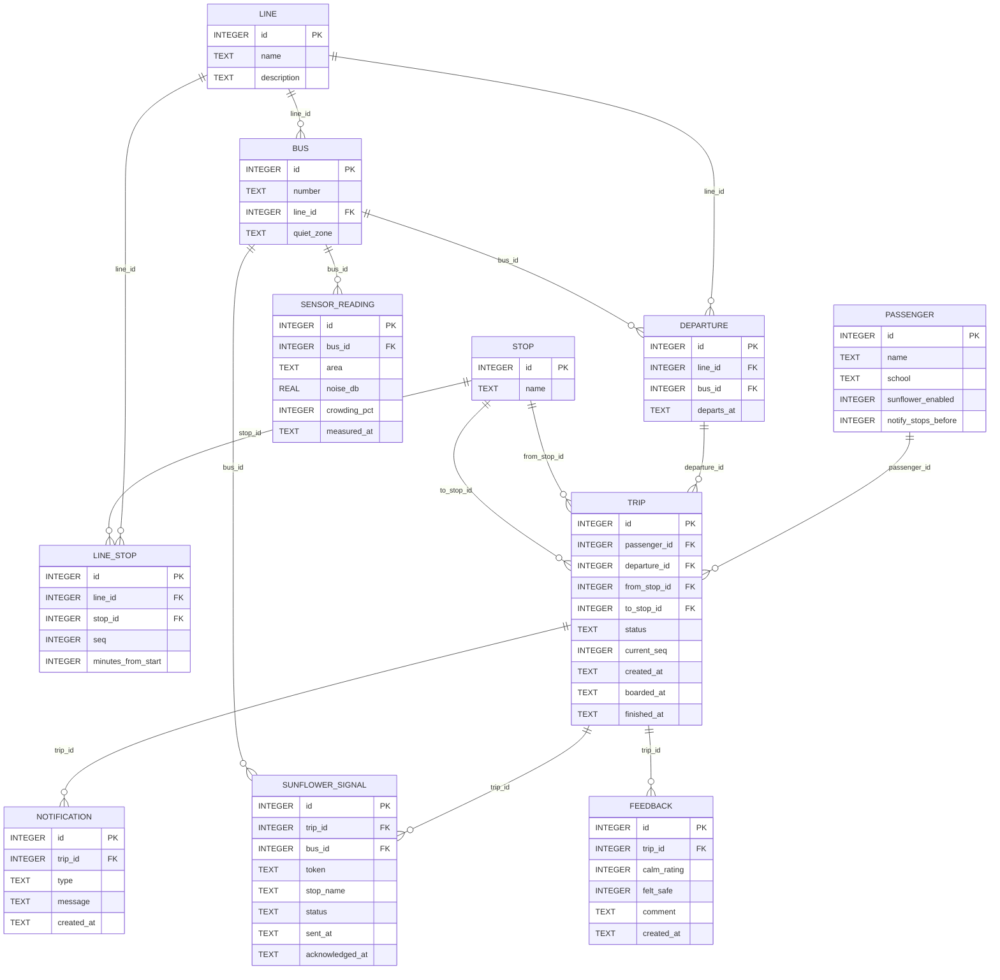
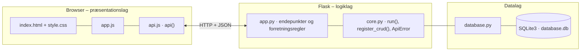

# Movia – Den Forudsigelige Rejse – dokumentation af prototypen

Unge med usynlige handicap får en **forudsigelig og tryg busrejse**. Appen foreslår den **roligste afgang** ud fra støj- og trængselsdata fra bussens sensorer.
Når passageren stiger på, sender den et **digitalt solsikkesignal** til chaufføren, uden at passageren skal sige noget.
En **visuel tidslinje** og **tryghedsnotifikationer** guider rejsen. Appen viser også, om bussen har en fysisk **rolig zone**.

Kravgrundlag: [`Kravspecifikation.md`](Kravspecifikation.md)

## Hvad kan prototypen

| Skærm | Funktion |
|---|---|
| **Planlæg rejse** | Søg fra/til/tidspunkt. De næste afgange vises med rolighed (rolig/middel/travl), rolig zone og ventetid, og den roligste er fremhævet. *Se varmekort* viser støj og trængsel forrest, i midten og bagerst |
| **Min rejse** | Visuel tidslinje med stop og tider. *Jeg er steget på* sender solsikkesignalet, og *Simulér: bussen kører til næste stop* flytter bussen. Notifikationer før passagerens stop og feedback efter rejsen |
| **Chauffør** | Chaufførens skærm med aktive solsikkesignaler (kun kode og stop) og knappen *Set ✓* |
| **Sensordata** | Nøgletal, alle busser med aktuelt varmekort, simulering af nye sensormålinger og manuel registrering af en måling |
| **Profil og feedback** | Solsikkesignal til/fra, hvor mange stop før man vil have besked, og feedback fra rejser |

Passageren vælges i toppen.

## Fra krav til kode

| Krav | Implementering |
|---|---|
| FR1 Roligste rute ud fra realtidsdata | `GET /api/journeys` finder de næste afgange på linjer, der kører mellem stoppene, og markerer den med højeste `expected_score` som `is_calmest` |
| FR2 Sensorisk varmekort | `bus_calm()` tager seneste måling pr. område (`FORREST`, `MIDTEN`, `BAGERST`). `GET /api/departures/<id>/heatmap` |
| FR3 Digitalt solsikkesignal ved boarding | `POST /api/trips/<id>/board` opretter et `sunflower_signal` til afgangens bus |
| FR4 Visuel tidslinje | `trip_view()` giver hvert stop tilstanden `PASSERET`, `HER` eller `KOMMENDE` |
| FR5 Tryghedsnotifikation før stop | `advance_notifications()` sender `STOP_NÆRMER_SIG`, når der er `notify_stops_before` stop tilbage, og `STÅ_AF_NU` ved målet |
| FR6 Slå solsikkesignal til/fra | `passenger.sunflower_enabled` (`PUT /api/passengers/<id>`). Er det slået fra, sendes intet signal |
| FR7 Feedback efter rejsen | `POST /api/trips/<id>/feedback`, kun når rejsen er `AFSLUTTET` |
| FR8 Rolig zone | `bus.quiet_zone` vises i søgeresultatet og på varmekortet. Har bussen en rolig zone, er det zonens rolighed, der vurderes |
| NFR1 Opdateres inden for få sekunder | Hver måling gemmes med tidspunkt, og vurderingen bruger altid den nyeste (`POST /api/sensor-readings`, `POST /api/sensors/simulate`) |
| NFR2/NFR4 Signalet må ikke identificere brugeren | Chaufføren ser kun et tilfældigt token (`SOL-4F2A`) og stoppet, aldrig navn eller diagnose |
| 4.1 Roligt, lav-stimuli udtryk | Afdæmpede farver, store knapper, få ord og ét budskab ad gangen på tidslinjen |

**Rolighed:** Støj (40–80 dB → 0–100 %) og trængsel (0–100 %) vægter lige meget: `score = 100 − (støj % + trængsel %) / 2`.
En score på mindst 65 er *rolig*, 40–64 er *middel*, og under 40 er *travl*.

**Events:** RejseSøgt → RoligRuteForeslået · AfgangValgt → RejseOprettet · BoardingRegistreret → SolsikkeSignalSendt · StopNærmerSig → NotifikationSendt · RejseAfsluttet → FeedbackAnmodet.

## Datamodel



## Eksempel på dataudveksling

Varmekortet for 150S kl. 08:20. Bussen har en rolig zone forrest, så den samlede vurdering er *rolig*, selv om midten og bagenden er mere fyldt:

```bash
curl http://localhost:5201/api/departures/15/heatmap
```

Svar `200` (forkortet):

```json
{
  "line": "150S",
  "departs_at": "08:20",
  "bus_number": "Bus 1503",
  "quiet_zone": "FORREST",
  "average_score": 54,
  "expected_score": 72,
  "level": "ROLIG",
  "areas": [
    { "area": "FORREST", "noise_db": 50.0, "crowding_pct": 30, "score": 72, "level": "ROLIG", "quiet_zone": true },
    { "area": "MIDTEN", "noise_db": 60.0, "crowding_pct": 50, "score": 50, "level": "MIDDEL", "quiet_zone": false },
    { "area": "BAGERST", "noise_db": 64.0, "crowding_pct": 60, "score": 40, "level": "MIDDEL", "quiet_zone": false }
  ]
}
```

## Kør prototypen

```bash
cd backend
python3 -m venv .venv && source .venv/bin/activate   # første gang
pip install -r requirements.txt                       # første gang
python app.py
```

Terminalen skriver ` * Åbn http://localhost:5201`. Åbn adressen i browseren. Flask serverer både API'et (`/api/...`) og frontenden.

- **Port:** Prototypen bruger port **5201** (5200 + projektnummer). Er porten optaget, vælger `run()` i `core.py` selv den næste ledige og skriver fx ` * Port 5201 er optaget – bruger port 5202 i stedet`. Du kan også vælge port selv med `PORT=5300 python app.py`.
- **Stop serveren** med `Ctrl` + `C` i terminalen, hvor den kører.
- **Kodeændringer:** Serveren kører i debug-tilstand og genstarter selv, når du gemmer en `.py`-fil. Den bliver på samme port. Ændringer i `frontend/` kræver kun, at du genindlæser siden.
- **Database:** `backend/database.db` oprettes med testdata ved første start. Nulstil den med `python database.py --reset`, mens serveren er stoppet.
- **Tjek at backenden svarer:** `curl http://localhost:5201/api/health`

### Fejlfinding

| Problem | Årsag | Løsning |
|---|---|---|
| ` * Port 5201 er optaget – bruger port …` | En anden proces, ofte en glemt server, bruger porten | Brug den adresse, der står i terminalen. Se hvad der optager porten med `lsof -nP -iTCP:5201 -sTCP:LISTEN`. En Flask-server i debug-tilstand er to processer, så stop dem begge med `lsof -t -iTCP:5201 -sTCP:LISTEN \| xargs kill` |
| `ModuleNotFoundError: No module named 'flask'` | Det virtuelle miljø er ikke aktiveret, eller Flask er ikke installeret | `source .venv/bin/activate` og `pip install -r requirements.txt` |
| Siden viser "Kan ikke hente data fra backenden" | Serveren kører ikke, eller `index.html` er åbnet direkte fra disken, mens serveren kører på en anden port | Start serveren og åbn adressen fra terminalen i stedet for filen |
| Tallene passer ikke efter mange tests | Databasen indeholder testdata fra tidligere afprøvninger | Stop serveren og kør `python database.py --reset` |
| `no such table …` | `database.db` er tom eller ødelagt | `python database.py --reset` |

## Arkitektur

Prototypen følger holdets fælles tre-lags struktur (se [`../README.md`](../README.md)):



| Fil | Lag | Indhold |
|---|---|---|
| `frontend/index.html` | Præsentation | Skærmbilleder som faneblade og formularer. Projektets farver og `data-api-port` |
| `frontend/app.js` | Præsentation | Henter data med `api()`, tegner dem i DOM'en og sender formularer |
| `frontend/api.js` | Præsentation | Fælles for alle prototyper: `api()` (fetch + JSON), `h()`, `renderTable()`, `fillSelect()`, `formToJson()`, `bindCrudForm()` og `toast()` |
| `frontend/style.css` | Præsentation | Fælles responsivt design |
| `backend/app.py` | Logik | Projektets forretningsregler og endepunkter |
| `backend/core.py` | Logik | Fælles: `create_app()` (Flask, CORS, JSON-fejl), `run()` (start på ledig port), `ApiError` og `register_crud()` |
| `backend/database.py` | Data | Fælles: forbindelse, `query_all/query_one/execute`, `transaction()` og `init_db()` |
| `backend/schema.sql` · `seed.sql` | Data | Tabeller og fiktive testdata |

Alle fejl returneres som JSON (`{"error": "…", "path": "/api/…"}`) med statuskode 400, 401, 403, 404 eller 409 og vises som en rød besked i frontenden.
Nederst på siden kan man åbne **"Seneste JSON-svar fra API'et"** og se den rå dataudveksling.
Den fulde endepunktsliste står i [`backend/README.md`](backend/README.md).

## Design og responsivitet

- Samme stylesheet i alle prototyper. Kun farverne (`--brand`, `--brand-dark`, `--brand-soft`) sættes i `index.html`.
- Layoutet virker fra mobil (375 px) til desktop uden vandret scroll. Kort lægger sig under hinanden på små skærme, og brede tabeller scroller inde i deres kort.
- Formularfelter kan ikke blive bredere end deres kort. En `<select>` med lange valgmuligheder skubber altså ikke formularen ud over kanten.
- Beskeder vises kort i toppen (grøn = gennemført, rød = fejl fra serveren).


## Testdata

3 S-buslinjer (150S, 300S, 350S) med 11 stoppesteder, 9 busser (5 med rolig zone) og afgange hvert 10. minut kl. 06:00–22:00.
Seneste sensormåling pr. bus og område. 3 passagerer: Emil og Sara har solsikkesignalet slået til, Noah har det slået fra.
Prøv fx rejsen Lyngby St. → Østerport St.

## Afgrænsning

Ingen rigtig Bluetooth-forbindelse til chaufføren, GPS eller integration med Rejseplanen. Bussens position flyttes med knappen *Simulér*, og sensormålinger simuleres.
Afgange er en fast daglig køreplan uden forsinkelser. Den fysiske rolige zone er kun registreret som en egenskab ved bussen.
