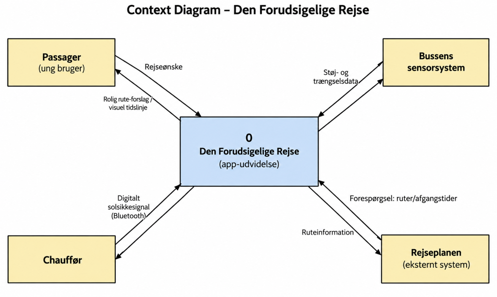
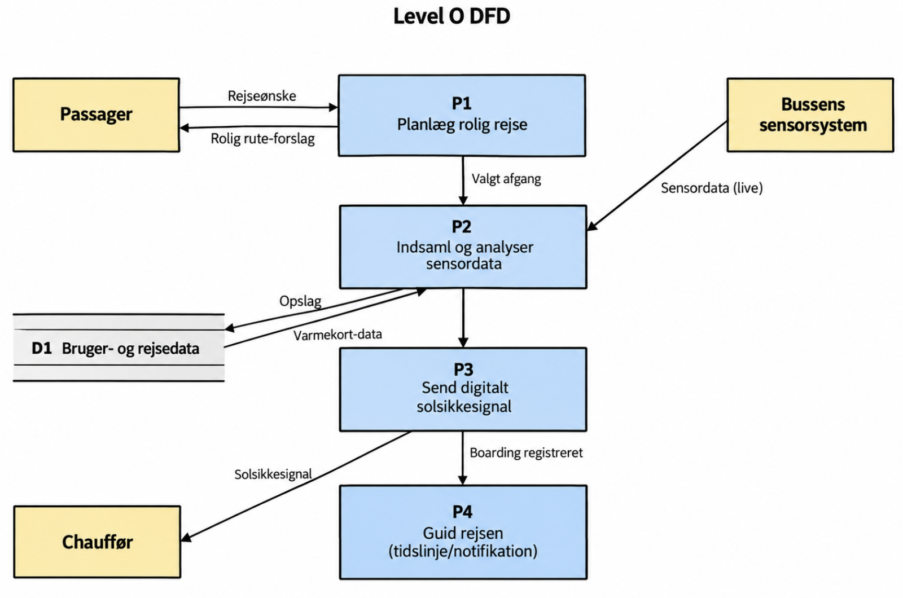
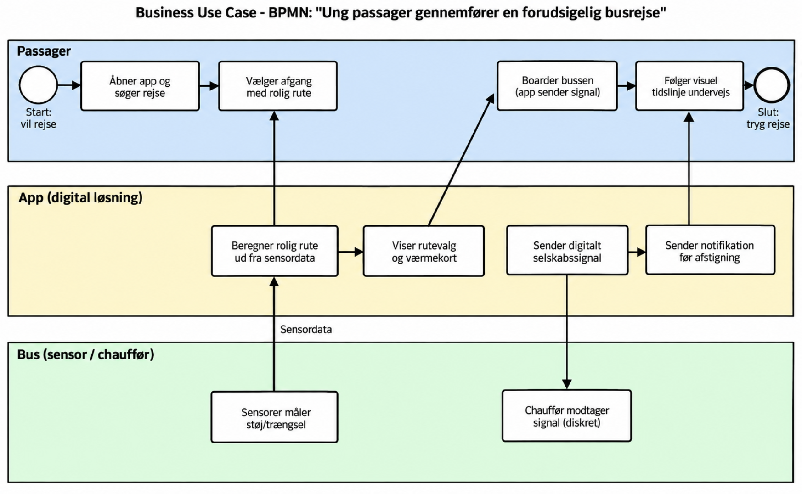
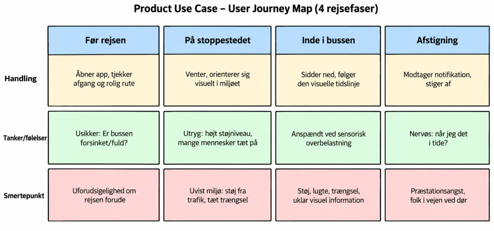
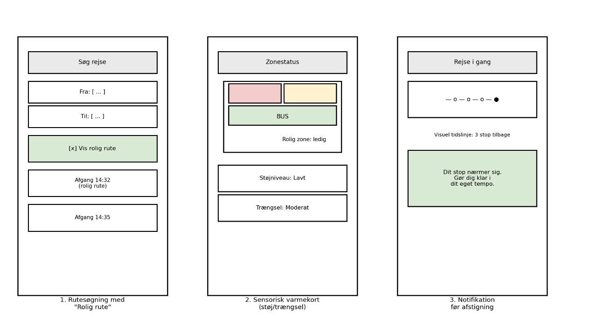
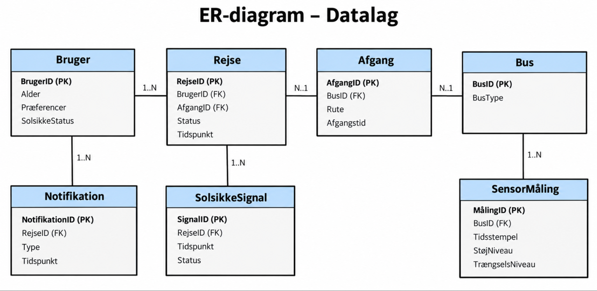

# Kravspecifikation – Den Forudsigelige Rejse (Movia)

> Konverteret til markdown fra `Kravspecifikation denforudsigeligerejse (1).pdf`. Tekst og figurer er gengivet som i originaldokumentet.

*Sirad, Sahra, Veton, Alexander, Joshua og Mathilde*

## 0. Introduktion

Mange unge (15-25 år) med usynlige handicap som autisme, ADHD eller svær angst fravælger i dag bussen til deres ungdomsuddannelse, fordi rejsen er uforudsigelig: de ved ikke, hvor fyldt bussen er, hvor meget støj der vil være, eller hvornår de præcist skal stige af.

"Den Forudsigelige Rejse" er en digital løsning – en udvidelse til den eksisterende rejseplanlægning – der gør busrejsen forudsigelig og tryg gennem tre kernefunktioner: (1) forslag om den "roligste rute" baseret på realtidsdata om støj og trængsel, (2) et digitalt Solsikkesignal, der diskret informerer chaufføren uden at brugeren skal sige noget højt, og (3) en visuel tidslinje med tryghedsnotifikationer, der guider brugeren gennem rejsen.

Som et centralt supplement til de digitale funktioner indgår desuden en fysisk rolig zone i bussen: en afgrænset og rolig zone bagerst eller forrest i Movias busser, særligt indrettet til passagerer med usynlige handicap. Zonen reducerer sensorisk overbelastning gennem mindre støj, begrænset trængsel og tydelig visuel information, og pladserne prioriteres til personer med usynlige handicap, fx via Solsikkeprogrammet. Dermed bliver rejsen forudsigelig og tryg både digitalt og fysisk, uden at brugeren er afhængig af, om den næste bus tilfældigvis er mindre fyldt.

Denne kravspecifikation er struktureret efter Volere-skabelonen ("The Template") og indeholder projektdrivere, projektbegrænsninger, funktionelle og non-funktionelle krav samt øvrige projektforhold.

## 1. Project Drivers

### 1.1 The Purpose of the Project

Formålet er at gøre kollektiv transport tilgængelig og tryg for unge med usynlige handicap, så de kan rejse selvstændigt til deres ungdomsuddannelse uden at være afhængige af tilfældigheder som "hvor fyldt er bussen lige nu". For Movia skaber det forretningsmæssig værdi ved at fastholde og tiltrække en brugergruppe, der ellers fravælger kollektiv transport, og ved at styrke Movias profil som tilgængelig og inkluderende operatør (jf. det eksisterende Solsikkeprogram). Den fysiske rolige zone i bussen er et centralt virkemiddel til at indfri dette formål, da den skaber tryghed uafhængigt af app-brug og af, hvor fyldt den enkelte bus er.

### 1.2 The Client, the Customer, and other Stakeholders

Nedenstående stakeholder-kort viser de centrale interessenter omkring projektet, fra kerneteamet til det bredere miljø (Movia som ejer, regulator, chauffører m.fl.).

- **Ejer/Sponsor:** Movia
- **Kunde:** Movias trafikselskaber og kommuner/regioner, der finansierer den kollektive trafik
- **Interne konsulenter:** Movias IT- og udviklingsafdeling
- **Negative stakeholders:** Passagerer, der oplever appen som forstyrrende eller unødvendig kompleksitet
- **Eksterne stakeholders:** Autismeforeningen, ADHD-foreningen og andre patientforeninger, der repræsenterer målgruppens interesser
- **Vedligeholdelsesansvarlig:** Movias driftsafdeling for sensorudstyr i busser

### 1.3 Users of the Product

Den primære brugergruppe er unge på 15-25 år med usynlige handicap (autisme, ADHD, svær angst), der dagligt eller ugentligt transporterer sig selv til en ungdomsuddannelse via Movias S-buslinjer i myldretiden. Brugerne kendetegnes ved, at de kan have brug for høj grad af forudsigelighed, tydelig (gerne visuel) kommunikation, og at de ikke nødvendigvis ønsker eller kan italesætte deres behov mundtligt over for chaufføren. Sekundære brugere er chauffører, der modtager det digitale solsikkesignal.

## 2. Project Constraints

### 2.1 Requirements Constraints

- Løsningen skal fungere som en udvidelse til eller integration med den eksisterende Rejseplanen-app, ikke som en selvstændig konkurrerende app.
- Prototypen skal kunne udvikles og demonstreres inden for projektets afsatte tidsramme og budget.
- Løsningen må ikke kræve fysisk ombygning af busserne udover installation af sensorudstyr til støj-/trængselsmåling samt indretning af den fysiske rolige zone (afskærmning og prioriterede pladser) i udvalgte busser.

### 2.2 Naming Conventions and Definitions

| Begreb | Definition |
|---|---|
| Usynligt handicap | Et handicap, der ikke er synligt udefra, fx autisme, ADHD eller angst. |
| Solsikkeprogrammet | Movias eksisterende ordning, hvor en solsikkesnor diskret signalerer et usynligt handicap til personalet. |
| Digitalt solsikkesignal | En digital variant af solsikkesnoren: appen sender et signal (fx via Bluetooth) til chaufføren om, at en passager har brug for ro/opmærksomhed. |
| Rolig rute | Den afgang/rute, som appen vurderer har lavest støj- og trængselsniveau, baseret på sensordata. |
| Sensorisk overbelastning | En tilstand, hvor for mange sanseindtryk (støj, trængsel, lys) bliver uoverskuelige for personen. |
| Visuel tidslinje | En grafisk fremstilling i appen af rejsens forløb og resterende stop, som støtte i stedet for/supplement til lydannonceringer. |
| Rolig zone | En afgrænset og rolig zone bagerst eller forrest i bussen, fysisk afskærmet fra den øvrige passagerkabine, med prioriterede pladser til personer med usynlige handicap (fx via Solsikkeprogrammet). |

### 2.3 Relevant Facts and Assumptions

- Movia er allerede en del af Solsikkeprogrammet, men tilbyder i dag ingen digitale værktøjer på selve rejsen.
- Det antages, at et tilstrækkeligt antal busser på de udvalgte S-buslinjer kan udstyres med sensorer til støj- og trængselsmåling.
- Det antages, at målgruppen har adgang til en smartphone og er vant til at bruge apps i hverdagen.
- Det antages, at chaufførerne kan modtage og forstå det digitale solsikkesignal uden yderligere oplæring end en kort introduktion.

## 3. Functional Requirements

### 3.1 The Scope of the Work

Dette afsnit beskriver den forretningsmæssige kontekst, som produktet indgår i, med udgangspunkt i den traditionelle analysetilgang (DFD).

#### 3.1.1 Context Diagram (DFD niveau 0-kontekst)

*Figur 1: Context Diagram for Den Forudsigelige Rejse*

#### 3.1.2 Business Event List

| Event | Input/Output |
|---|---|
| Passager søger en rejse | Rejseønske (ind) |
| Sensor sender måling | Støj-/trængselsdata (ind) |
| Passager vælger afgang med rolig rute | Valgt afgang (ind) |
| Passager boarder bussen | Digitalt solsikkesignal (ud) |
| Tid til at sende tryghedsnotifikation | Notifikation (ud) |

#### 3.1.3 Level 0 DFD

*Figur 2: Level 0 DFD*

For denne prototype er detaljeringsniveauet i Level 0-diagrammet vurderet tilstrækkeligt. Yderligere nedbrydning (Level 1-3) kan tilføjes for enkeltprocesser, fx "P2 Indsaml og analyser sensordata", i den videre udvikling.

#### 3.1.4 Procesbeskrivelser

| Proces-ID | Navn | Beskrivelse |
|---|---|---|
| P1 | Planlæg rolig rejse | Brugeren søger en rejse i appen, og systemet foreslår den afgang, der vurderes at give den roligste rejseoplevelse. |
| P2 | Indsaml og analyser sensordata | Systemet modtager løbende støj- og trængselsdata fra bussens sensorer og omsætter dem til et sensorisk varmekort. |
| P3 | Send digitalt solsikkesignal | Når brugeren boarder bussen, sender appen automatisk et diskret signal (Bluetooth) til chaufføren. |
| P4 | Guid rejsen | Systemet viser en visuel tidslinje under rejsen og sender en tryghedsnotifikation, før brugeren skal stige af. |

#### 3.1.5 Data Flow Definitioner

| Data flow | Fra | Til | Indhold |
|---|---|---|---|
| Rejseønske | Passager | P1 | Afgangssted, ankomststed, ønsket tidspunkt |
| Sensordata | Bussens sensorsystem | P2 | BusID, tidsstempel, støjniveau, trængselsniveau |
| Solsikkesignal | P3 | Chauffør | RejseID, tidspunkt, status |
| Tryghedsnotifikation | P4 | Passager | Type (fx "stop nærmer sig"), tidspunkt |

#### 3.1.6 Business Use Case (BPMN)

Nedenstående BPMN-diagram viser forretningsprocessen "Ung passager gennemfører en forudsigelig busrejse" på tværs af passageren, den digitale løsning og bussen.

*Figur 3: BPMN-diagram for forretningsprocessen*

### 3.2 The Scope of the Product

Produktets scope er afgrænset til den digitale løsning: app-udvidelsen med rolig rute-forslag, sensorisk varmekort, digitalt solsikkesignal og visuel tidslinje. Den fysiske installation af sensorer i busserne samt Rejseplanens eksisterende kernefunktionalitet er uden for produktets scope, men produktet er afhængigt af data herfra.

Som centralt element hertil hører desuden den fysiske rolige zone i bussen: en afgrænset zone bagerst eller forrest, adskilt fra den øvrige passagerkabine, med prioriterede pladser til personer med usynlige handicap. Zonen indgår i produktets scope som en fysisk pendant til de digitale funktioner, og appen kan med fordel oplyse, om en given afgang har en rolig zone tilgængelig.

Produktets brug er beskrevet nedenfor som en user journey map i fire faser: før rejsen, på stoppestedet, inde i bussen og ved afstigning.

*Figur 4: Product Use Case – User Journey Map*

De vigtigste indsigter er, at utrygheden er størst i planlægningsfasen (uforudsigelighed) og på stoppestedet (uvist miljø), mens produktets visuelle tidslinje og notifikationer især skal afhjælpe præstationsangsten i afstigningsfasen.

### 3.3 Functional and Data Requirements

#### 3.3.1 Tre-lags arkitektur

Systemet er struktureret i tre lag: præsentationslag, logiklag og datalag.

**Præsentationslaget (visuelt design)**

Præsentationslaget er udviklet med udgangspunkt i lav-fi wireframes af de tre centrale skærmbilleder i appen:

*Figur 5: Wireframes – rutesøgning, sensorisk varmekort og notifikation*

*[ Indsæt evt. resultater fra Lightning Demos og Crazy 8's-øvelser, der ligger til grund for disse skærmbilleder. ]*

**Logiklaget (forretningslogik)**

Logiklaget er beskrevet ovenfor via Level 0 DFD (afsnit 3.1.3). Nedenstående event-tabel viser de centrale domain events i systemet.

| Event | Trigger | Aktør | Resultat / næste event |
|---|---|---|---|
| RejseSøgt | Bruger søger rejse i app | Passager | RoligRuteForeslået |
| SensorDataModtaget | Sensor sender måling | Sensorsystem | VarmekortOpdateret |
| AfgangValgt | Bruger vælger afgang | Passager | RejseOprettet |
| BoardingRegistreret | Bruger tjekker ind ved boarding | Passager/app | SolsikkeSignalSendt |
| StopNærmerSig | Bussen nærmer sig brugerens stop | System | NotifikationSendt |
| RejseAfsluttet | Passager stiger af | Passager | FeedbackAnmodet |

*[ Indsæt evt. billede af jeres event storming-øvelse (post-its/oversigt over domain events). ]*

**Datalaget (datastrukturer)**

*Figur 6: ER-diagram for datalaget*

#### 3.3.2 Funktionelle krav

| ID | Krav | Prioritet |
|---|---|---|
| FR1 | Systemet skal kunne foreslå den "roligste rute" for en søgt rejse, baseret på realtidsdata om støj og trængsel. | Must |
| FR2 | Systemet skal vise et sensorisk varmekort med aktuelt støj- og trængselsniveau for en given afgang. | Must |
| FR3 | Systemet skal automatisk sende et digitalt solsikkesignal til chaufføren, når brugeren boarder bussen. | Must |
| FR4 | Systemet skal vise en visuel tidslinje, der opdateres løbende under rejsen. | Should |
| FR5 | Systemet skal sende en tryghedsnotifikation til brugeren, før vedkommendes stop nås. | Should |
| FR6 | Brugeren skal kunne slå det digitale solsikkesignal fra og til efter behov. | Should |
| FR7 | Brugeren skal kunne give feedback efter endt rejse. | Could |
| FR8 | Systemet skal i appen kunne vise, om den valgte afgang har en fysisk rolig zone tilgængelig. | Should |

## 4. Non-functional Requirements

### 4.1 Look and Feel Requirements

Appen skal have et roligt, enkelt og lav-stimuli visuelt udtryk: afdæmpede farver, minimal tekst, tydelige ikoner og god plads mellem elementer, så den ikke i sig selv bidrager til sensorisk overbelastning.

### 4.2 Usability and Humanity Requirements

Appen skal kunne bruges selvstændigt af unge med kognitive eller psykiske udfordringer uden forudgående oplæring. Sprog og ikoner skal være konkrete og utvetydige, og funktioner som solsikkesignalet skal kunne bruges uden at brugeren skal tale højt eller forklare sig over for andre.

### 4.3 Performance Requirements

Sensordata skal opdateres og afspejles i appens varmekort med minimal forsinkelse (sekunder, ikke minutter), så "rolig rute"-forslaget er retvisende på beslutningstidspunktet.

### 4.4 Operational and Environmental Requirements

Løsningen skal fungere i de miljøer, hvor målgruppen faktisk rejser: udendørs på stoppesteder med varierende mobildækning, samt om bord i bussen. Bluetooth-signalet til chaufføren skal fungere pålideligt inden for en bus' typiske dimensioner.

### 4.5 Maintainability and Support Requirements

Sensorudstyret og den tilhørende dataopsamling skal kunne vedligeholdes og udskiftes af Movias driftsafdeling uden at kræve ændringer i selve appen. Appens indhold (fx tekster, ikoner) skal kunne opdateres uden ny godkendelsesproces i app-butikkerne, hvor det er muligt.

### 4.6 Security Requirements

Brugerens data (herunder eventuel information om handicap/solsikkestatus) skal behandles fortroligt og i overensstemmelse med GDPR. Det digitale solsikkesignal må ikke kunne opsnappes eller identificere brugeren for udenforstående.

### 4.7 Cultural Requirements

Løsningen skal udformes, så den ikke stigmatiserer eller synligt udpeger brugeren over for øvrige passagerer – solsikkesignalet skal netop erstatte behovet for at italesætte handicappet højt.

### 4.8 Legal Requirements

Løsningen skal overholde gældende lovgivning om databeskyttelse (GDPR) samt tilgængelighedskrav (fx WCAG-principper for digital tilgængelighed).

### 4.9 Oversigt over non-funktionelle krav

| ID | Krav | Kategori |
|---|---|---|
| NFR1 | Varmekort skal opdateres inden for få sekunder efter ny sensordata. | Performance |
| NFR2 | Brugerdata og solsikkestatus krypteres og deles ikke med uvedkommende. | Security |
| NFR3 | Interface skal være enkelt og lav-stimuli, testet med målgruppen. | Usability |
| NFR4 | Solsikkesignal må ikke være synligt/hørbart for andre passagerer. | Cultural |
| NFR5 | Løsningen skal overholde relevante WCAG 2.1-kriterier. | Legal/Tilgængelighed |
| NFR6 | Den fysiske rolige zone skal reducere støj og trængsel og have tydelig visuel afmærkning. | Usability/Fysisk indretning |

## 5. Project Issues

### 5.1 Open Issues

- Hvor mange busser/linjer skal udstyres med sensorer i en første pilotfase?
- Hvordan verificeres det, at kun berettigede brugere kan aktivere det digitale solsikkesignal (fx via Solsikkeprogrammet)?

### 5.2 Off-the-Shelf Solutions

Eksisterende støjmålings- og Bluetooth beacon-teknologi kan potentielt genbruges frem for at udvikle sensorhardware fra bunden. Integration til Rejseplanens API bør undersøges frem for at bygge rutesøgning fra bunden.

### 5.3 New Problems

Indførelsen af løsningen kan skabe et nyt behov hos chaufførerne for en kort oplæring i at forstå og reagere på det digitale solsikkesignal.

### 5.4 Tasks

- Udvikle og teste sensordataopsamling i et udvalgt antal busser
- Udvikle app-udvidelsen (rolig rute, varmekort, solsikkesignal, tidslinje)
- Gennemføre brugertest med målgruppen

### 5.5 Migration to the New Product

Løsningen lanceres som en udvidelse til den eksisterende Rejseplanen-app og kræver ingen migrering af eksisterende brugerdata, men kræver onboarding af nye brugere til de nye funktioner.

### 5.6 Risks

| ID | Risiko | Konsekvens |
|---|---|---|
| R1 | Sensordata er ikke retvisende nok til at forudsige et roligt rejsemiljø. | Brugerne mister tilliden til "rolig rute"-forslaget. |
| R2 | Chauffører reagerer ikke konsekvent på det digitale solsikkesignal. | Løsningens kerneværdi (tryghed) udhules. |
| R3 | Integration med Rejseplanen viser sig mere kompleks end antaget. | Forsinkelse af projektet eller reduceret funktionalitet. |

### 5.7 Costs

*[ Indsæt jeres økonomiske estimat: udviklingsomkostninger til app, sensorhardware pr. bus, integrationsomkostninger til Rejseplanen, samt løbende drift/vedligehold. ]*

### 5.8 User Documentation

Der udarbejdes en kort, visuel guide til, hvordan man bruger "rolig rute"-funktionen og det digitale solsikkesignal, målrettet både brugere og chauffører.

### 5.9 Waiting Room

Mulige fremtidige udvidelser: gruppefunktion, hvor pårørende kan følge rejsen; integration med andre transportformer (tog, metro); personaliserede sensoriske profiler, der lærer brugerens præferencer over tid.

### 5.10 Ideas for Solutions

Idéer, der ikke må gå tabt: brug af farvekodede lys i selve bussen synkroniseret med varmekortet; mulighed for at booke en fast "stille plads" i god tid; gamification af trygge rejser for at motivere brug.
