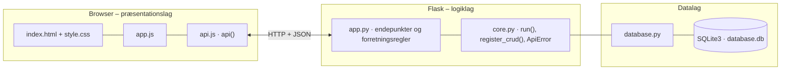

# Læringsrum 2.0 – Elevevaluering – dokumentation af prototypen

En platform, hvor **elever** på en nem og tryg måde fortæller om deres **trivsel, læring og klasselokalet** (møbler, larm og miljø).
Svarene **gemmes og behandles**, så **lærere** ser resultaterne samlet med **gennemsnit og procenttal** og kan **sammenligne over tid**.
Eleven får **personlig feedback** med konkrete forslag, kan følge sin egen udvikling og ser, hvad læreren gør ved klassens svar.
**Læringsrum 2.0** (administrator) har overblik over alle skoler og klasser.

Kravgrundlag: [`Kravspecifikation.md`](Kravspecifikation.md)

## Hvad kan prototypen

| Skærm | Rolle | Funktion |
|---|---|---|
| **Log ind** | Alle | Brugernavn eller et klik på en testbruger |
| **Spørgeskema** | Elev | Den åbne måling med 10 korte spørgsmål og en smiley-skala 1–5, tæller og valgfri kommentar. Kan kun besvares én gang pr. måling |
| **Min udvikling** | Elev | Personlig feedback pr. kategori (ændring siden sidst og tip, hvis den er lav), lærerens opfølgning ("Det gør vi nu") og egen udvikling over målingerne |
| **Klassens resultater** | Lærer, administrator | Deltagelse, andel positive/negative pr. kategori, fordeling 1–5 pr. spørgsmål, anonyme kommentarer og *Del med klassen* |
| **Udvikling over tid** | Lærer, administrator | Andel positive svar pr. kategori for hver måling og ændringen i procentpoint |
| **Overblik** | Administrator | Alle skoler, klasser og målinger med deltagelse og andel positive |
| **Spørgsmål og målinger** | Administrator | CRUD for spørgsmål (kategori, emoji, aktiv) og målinger (periode) |

## Fra krav til kode

| Krav | Implementering |
|---|---|
| Eleven skal kunne logge ind | `POST /api/login` (brugernavn, simuleret). Derefter `X-User-Id` |
| Besvare spørgsmål om trivsel og møbler | `GET /api/my/survey` og `POST /api/my/responses`. Kategorierne er `TRIVSEL`, `LÆRING`, `MØBLER` og `MILJØ` (larm) |
| Gemme besvarelser | `response` (elev + måling) → `answer` (spørgsmål + værdi), jf. ER-diagrammet Elev → Besvarelse → Spørgsmål → Resultat |
| Læreren ser resultaterne samlet | `GET /api/classes/<id>/results?round_id=` |
| Statistiske procenttal | `summarise()`: gennemsnit, andel positive (4–5), andel negative (1–2) og fordeling i procent |
| Sammenligne svar over tid | Målinger (`survey_round`) og `GET /api/classes/<id>/trend` med ændring i procentpoint |
| Behov: personlig feedback og konkrete forslag | `my_development()` giver pr. kategori ændring siden sidst og `FEEDBACK`-tip, når gennemsnittet er under 3 |
| Behov: at blive hørt og se opfølgning | `follow_up`: læreren deler, hvad der gøres, og eleven ser det under "Det gør vi nu" |
| Problem: nervøs for at være ærlig | Læreren ser kun klassens samlede svar. Resultater vises først ved mindst 3 svar (`MIN_RESPONDENTS`), og kommentarer er uden navn |
| Problem: lange eller svære spørgsmål | 10 korte spørgsmål med emoji og smiley-skala |
| Styrer brugerrettigheder | `current_user(*roles)` og `check_class_access()`: elev = egne svar, lærer = egen klasse, administrator = alle (403 ellers) |
| Virksomheden har adgang til elevernes svar | `GET /api/overview` for Læringsrum 2.0 (samlet, ikke pr. elev) |
| Computer og tablet, nem at bruge | Store trykflader på skalaen og responsivt fælles stylesheet |

## Datamodel

```mermaid
erDiagram
    SCHOOL ||--o{ CLASS : "school_id"
    CLASS ||--o{ APP_USER : "class_id"
    SCHOOL ||--o{ APP_USER : "school_id"
    APP_USER ||--o{ RESPONSE : "student_id"
    SURVEY_ROUND ||--o{ RESPONSE : "round_id"
    RESPONSE ||--o{ ANSWER : "response_id"
    QUESTION ||--o{ ANSWER : "question_id"
    CLASS ||--o{ FOLLOW_UP : "class_id"
    APP_USER ||--o{ FOLLOW_UP : "teacher_id"
    SCHOOL {
        INTEGER id PK
        TEXT name
        TEXT city
    }
    CLASS {
        INTEGER id PK
        INTEGER school_id FK
        TEXT name
        INTEGER grade
    }
    APP_USER {
        INTEGER id PK
        TEXT name
        TEXT username
        TEXT role
        INTEGER class_id FK
        INTEGER school_id FK
    }
    QUESTION {
        INTEGER id PK
        TEXT text
        TEXT category
        TEXT emoji
        INTEGER active
        INTEGER sort
    }
    SURVEY_ROUND {
        INTEGER id PK
        TEXT name
        TEXT opens_on
        TEXT closes_on
    }
    RESPONSE {
        INTEGER id PK
        INTEGER student_id FK
        INTEGER round_id FK
        TEXT comment
        TEXT submitted_at
    }
    ANSWER {
        INTEGER id PK
        INTEGER response_id FK
        INTEGER question_id FK
        INTEGER value
    }
    FOLLOW_UP {
        INTEGER id PK
        INTEGER class_id FK
        INTEGER teacher_id FK
        TEXT category
        TEXT text
        TEXT created_at
    }
```

## Eksempel på dataudveksling

Læreren Hanne henter 7.A's resultater for måling 2 (forkortet til én kategori og ét spørgsmål):

```bash
curl "http://localhost:5210/api/classes/1/results?round_id=2" -H 'X-User-Id: 2'
```

Svar `200`:

```json
{
  "class": { "id": 1, "name": "7.A", "grade": 7 },
  "students": 6,
  "respondents": 6,
  "participation_pct": 100,
  "hidden": false,
  "categories": [
    { "category": "MØBLER", "label": "Møbler", "answers": 12, "average": 3.0, "positive_pct": 33, "negative_pct": 33,
      "distribution": { "1": 0, "2": 33, "3": 33, "4": 33, "5": 0 } }
  ],
  "questions": [
    { "text": "Der er ro i klassen, når vi arbejder", "category": "MILJØ", "emoji": "🔇", "answers": 6, "average": 3.0,
      "positive_pct": 33, "negative_pct": 33, "distribution": { "1": 0, "2": 33, "3": 33, "4": 33, "5": 0 } }
  ],
  "comments": ["De nye stole er meget bedre!"]
}
```

## Kør prototypen

```bash
cd backend
python3 -m venv .venv && source .venv/bin/activate   # første gang
pip install -r requirements.txt                       # første gang
python app.py
```

Terminalen skriver ` * Åbn http://localhost:5210`. Åbn adressen i browseren. Flask serverer både API'et (`/api/...`) og frontenden.

- **Port:** Prototypen bruger port **5210** (5200 + projektnummer). Er porten optaget, vælger `run()` i `core.py` selv den næste ledige og skriver fx ` * Port 5210 er optaget – bruger port 5211 i stedet`. Du kan også vælge port selv med `PORT=5300 python app.py`.
- **Stop serveren** med `Ctrl` + `C` i terminalen, hvor den kører.
- **Kodeændringer:** Serveren kører i debug-tilstand og genstarter selv, når du gemmer en `.py`-fil. Den bliver på samme port. Ændringer i `frontend/` kræver kun, at du genindlæser siden.
- **Database:** `backend/database.db` oprettes med testdata ved første start. Nulstil den med `python database.py --reset`, mens serveren er stoppet.
- **Tjek at backenden svarer:** `curl http://localhost:5210/api/health`

### Fejlfinding

| Problem | Årsag | Løsning |
|---|---|---|
| ` * Port 5210 er optaget – bruger port …` | En anden proces, ofte en glemt server, bruger porten | Brug den adresse, der står i terminalen. Se hvad der optager porten med `lsof -nP -iTCP:5210 -sTCP:LISTEN`. En Flask-server i debug-tilstand er to processer, så stop dem begge med `lsof -t -iTCP:5210 -sTCP:LISTEN \| xargs kill` |
| `ModuleNotFoundError: No module named 'flask'` | Det virtuelle miljø er ikke aktiveret, eller Flask er ikke installeret | `source .venv/bin/activate` og `pip install -r requirements.txt` |
| Siden viser "Kan ikke hente data fra backenden" | Serveren kører ikke, eller `index.html` er åbnet direkte fra disken, mens serveren kører på en anden port | Start serveren og åbn adressen fra terminalen i stedet for filen |
| Tallene passer ikke efter mange tests | Databasen indeholder testdata fra tidligere afprøvninger | Stop serveren og kør `python database.py --reset` |
| `no such table …` | `database.db` er tom eller ødelagt | `python database.py --reset` |

## Arkitektur

Prototypen følger holdets fælles tre-lags struktur (se [`../README.md`](../README.md)):



| Fil | Lag | Indhold |
|---|---|---|
| `frontend/index.html` | Præsentation | Skærmbilleder som faneblade og formularer. Projektets farver og `data-api-port` |
| `frontend/app.js` | Præsentation | Henter data med `api()`, tegner dem i DOM'en og sender formularer |
| `frontend/api.js` | Præsentation | Fælles for alle prototyper: `api()` (fetch + JSON), `h()`, `renderTable()`, `fillSelect()`, `formToJson()`, `bindCrudForm()` og `toast()` |
| `frontend/style.css` | Præsentation | Fælles responsivt design |
| `backend/app.py` | Logik | Projektets forretningsregler og endepunkter |
| `backend/core.py` | Logik | Fælles: `create_app()` (Flask, CORS, JSON-fejl), `run()` (start på ledig port), `ApiError` og `register_crud()` |
| `backend/database.py` | Data | Fælles: forbindelse, `query_all/query_one/execute`, `transaction()` og `init_db()` |
| `backend/schema.sql` · `seed.sql` | Data | Tabeller og fiktive testdata |

Alle fejl returneres som JSON (`{"error": "…", "path": "/api/…"}`) med statuskode 400, 401, 403, 404 eller 409 og vises som en rød besked i frontenden.
Nederst på siden kan man åbne **"Seneste JSON-svar fra API'et"** og se den rå dataudveksling.
Den fulde endepunktsliste står i [`backend/README.md`](backend/README.md).

## Design og responsivitet

- Samme stylesheet i alle prototyper. Kun farverne (`--brand`, `--brand-dark`, `--brand-soft`) sættes i `index.html`.
- Layoutet virker fra mobil (375 px) til desktop uden vandret scroll. Kort lægger sig under hinanden på små skærme, og brede tabeller scroller inde i deres kort.
- Formularfelter kan ikke blive bredere end deres kort. En `<select>` med lange valgmuligheder skubber altså ikke formularen ud over kanten.
- Beskeder vises kort i toppen (grøn = gennemført, rød = fejl fra serveren).


## Testdata og testbrugere

| Brugernavn | Rolle | Klasse |
|---|---|---|
| `admin` | Administrator (Læringsrum 2.0) | Alle |
| `hanne`, `jens`, `birgit` | Lærer | 7.A, 7.B, 8.A |
| `asta` … `frederik` | Elev | 7.A (6 elever) |
| `gustav` … `jonas` | Elev | 7.B (4 elever) |
| `karla`, `lukas`, `mira` | Elev | 8.A (3 elever) |

Tre målinger dateret i forhold til i dag: to afsluttede ("før" og "efter nye møbler", hvor møbler og miljø bliver bedre) og én åben.
I den åbne måling har kun nogle elever svaret. 8.A har kun 2 svar og vises derfor ikke. Log ind som fx `frederik` for at besvare den åbne måling.

## Afgrænsning

Intet rigtigt login (UNI-Login eller adgangskode). Ingen rapport-eksport til PDF. Spørgsmål og skala er eksempler, som skal testes med eleverne.
