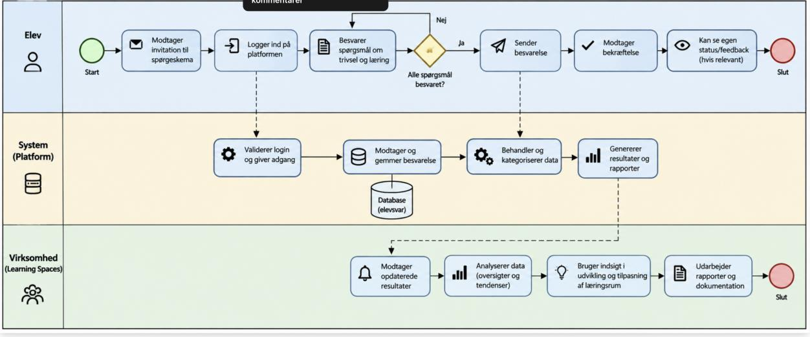
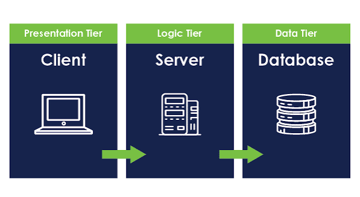
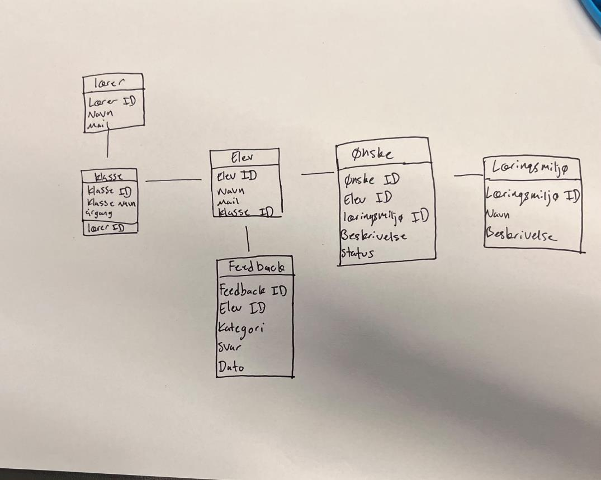

# Kravspecifikation – Elevevaluering (Læringsrum 2.0)

> Konverteret til markdown fra `Opret et dokument med udgangspunkt i ‘The Template’ for indh.pdf`. Tekst og figurer er gengivet som i originaldokumentet.

Opret et dokument med udgangspunkt i ‘The Template’ for indhold i kravspecifikationer.

## 1. Business use case (BPMN diagrammer) – Malalai

*Figur 1. BPMN diagram for Elev Evaluering Proces. Kilde: Genereret med ChatGPT baseret på Bilag 1, 2 og 3*

### Elev (Bilag 1)

| | | | | |
|---|---|---|---|---|
| Elev besvarer spørgsmål → | svar gemmes → | data behandles → | lærer får overblik → | lærer kan reagere på elevernes behov. |

### System (Bilag 2)

| | | | |
|---|---|---|---|
| Validerer login og giver adgang → | Modtager og gemmer besvarelsen → | Behandler og kategoriserer data → | Generer resultater og rapport ↓ |

### Virksomhed: Læringsrum 2.0 (Bilag 3)

| | | | | |
|---|---|---|---|---|
| Modtager opdaterede resultater → | Analyserer data (oversigter og tendenser) → | Bruger indsigt i udvikling og tilpasningen af læringsrum 2.0 → | Udarbejder rapporter og dokumentation → | Slut |

## 2. Product use case (User journey map)

- Eleverne har problemer med trivsel og læring, da der er meget larm og miljøet i klasseværelset er kedeligt og ikke læringsvenligt.
- Eleverne kan have svært ved selv at sætte ord på, hvad der påvirker deres læring og trivsel.
- Eleverne oplever, at undervisningsmiljøet ikke altid understøtter koncentration og læring.
- Eleverne kan føle frustration, hvis de ikke kan følge med resten af klassen.

**Behov:**

- Eleverne har behov for en nem og tryg måde at fortælle om deres oplevelse af undervisningen.
- Eleverne har behov for at føle, at deres mening bliver hørt og taget seriøst.
- Eleverne har behov for personlig feedback og konkrete forslag til forbedringer.
- Eleverne har behov for at kunne følge deres egen udvikling over tid.

**Problemer:**

- Eleverne kan være usikre på, om deres svar bliver taget alvorligt.
- Eleverne kan være nervøse for at være ærlige omkring deres trivsel.
- Hvis spørgsmålene er for lange eller svære, kan eleverne miste motivationen for at bruge platformen.
- Eleverne kan opleve, at feedback ikke hjælper, hvis der ikke bliver fulgt op efterfølgende.

**Følelser:**

- Før brug: Frustreret, overset, usikker.
- Under brug: Nysgerrig, håbefuld, måske usikker.
- Efter brug: Lettelse, større forståelse for egne udfordringer, følelsen af at blive hørt.

## 3. Tre-lags arkitektur

*Figur 2: Fremstilling af tre lags arkitektur. Kilde: <https://dk.linkedin.com/pulse/lets-explore-what-three-tier-architecture-devops-rohit-kumar-cajvc?tl=da>*

### Præsentationslaget (Front end)

Præsentationslaget tager udgangspunkt i de forskellige brugere af elevplatformen. Eleverne skal have en enkelt brugeroverflade, hvor de kan besvare spørgsmål om læring og trivsel: lærere og læringsrum 2.0 skal derimod kunne få et overskueligt indblik i de samlede reslutater. Her arbejder med crazy 8’s lightning, demos og wireframes for at udvikle platoformens design ud fra brugerens behov.

Brugere:

- Elever
- Lærere
- Virksomheder/skoler (administrator)

Funktioner:

- Login og brugerprofil
- Besvarelse af trivsels- og læringsspørgsmål
- Visning af feedback og resultater
- Dashboard med overblik over trivsel og udvikling

Designmetoder:

- Lightning demos → inspiration fra eksisterende løsninger
- Crazy 8’s → udvikling af idéer til funktioner og design
- Wireframes → skitsering af platformens opbygning

### Logiklaget (Backend)

Logiklaget (Backend), står for det der sker bag platformen. Når eleverne har besvaret spørgeskema, så skal systemet kunne modtage og behandle svarene og samle dem, så der kan findes tendenser i elevernes besparelser, det gøre det muligt for omdanne elevernes svar til information som lærerne kan anvende. Her kan vi bruge dataflow- diagrammer, events og eventstabeller til at vise processerne i systemet.

Funktioner:

- Behandler svar fra elever
- Sender relevante resultater til lærere og virksomheder
- Styrer brugerrettigehder

### Datalaget (datastore)

Datalaget skal beskrives hvordan platformen skal gemmes og struktures. Det glæder blandt andet spørgsmål, besvarelser og resultater. Et ER diagram kan bruges til at vise relationerne mellem de forskellige data og danne grundlag for opbygnning af databasen.

Eksempler på data:

- Elevoplysninger
- Klassetrin
- Trivselsmålinger
- Feedback
- Resultater
- Virksomheds-/skoleinformation

Elev → Besvarelse → Spørgsmål → Resultat

*Figure 3: Egen fremstilling af ER-diagram*

## 4. Funktionelle krav

- Eleven skal kunne logge ind.
- Eleven skal kunne besvare spørgsmål om trivsel og møbler.
- Systemet skal kunne gemme besvarelser.
- Læreren skal kunne se resultaterne samlet.
- Hjemmesiden skal kunne give statistisk procenttal
- Hjemmesiden skal kunne sammenligne svar over tid
- Eleverne skal kunne bruge dele af hjemmesiden som et *(sætningen er ufuldstændig i originaldokumentet)*

## 5. Non-funktionelle krav

- Platformen skal være nem at bruge.
- Platformen skal fungere på både computer og tablet.
- Elevernes data skal behandles sikkert.
- Siderne skal indlæses hurtigt.
- Designet skal være overskueligt og forståeligt for målgruppen.
- Virksomheden skal have adgang til elevernes svar.

## Litteraturliste

Kumar, R. (2023) ‘Let’s Explore What Three-Tier Architecture is: A DevOps Perspective’, LinkedIn, 31 December. Available at: <https://dk.linkedin.com/pulse/lets-explore-what-three-tier-architecture-devops-rohit-kumar-cajvc> (Accessed: 24 September 2026).
