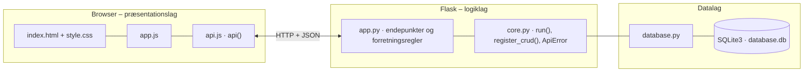

# Hovedstadens Letbane – rejseassistent – dokumentation af prototypen

En **mobil-først web-app** (*Hovedstadens Letbane*, PendlerKids), der gør Letbanen til et **forudsigeligt** transportvalg.
Den viser **afgange** i begge retninger med planlagt og forventet tid, **forsinkelser og aflysninger** (farve **og** tekst). Den finder **rejser** mellem to stationer med rejsetid og **skift** til S-tog og bus.
Aktive **driftsmeddelelser** vises med **alternativ rejse**. Pendleren kan gemme **favoritrejser uden konto** og få **besked** ved kritiske forstyrrelser.
Passageren kan **købe billet** til den planlagte rejse, **følge letbanen live** på kort og optjene **point**, der kan bruges på **belønninger**.
Appen er kun til passagerer. Personalets funktioner (driftsmeddelelser og feedbackrapport) findes stadig i API'et, men har ingen skærm i appen.

Kravgrundlag: [`kravspec.md`](kravspec.md). Navne, id'er, typer og JSON-felter følger **data dictionary** (afsnit 5), og endepunkterne i **afsnit 9.2** findes med præcis de navne.

## Hvad kan prototypen

| Skærm | Funktion |
|---|---|
| **Forside** | Rejseplanlægger øverst (fra, til, tidspunkt – som hos DSB og Rejseplanen), samlede point med fremskridtslinje mod næste belønning, to kort (standard og satellit) med egen placering, stationer og tog i drift, gyldige billetter, favoritrejser med næste afgang og status og aktive driftsmeddelelser (KRITISK først) |
| **Afgange** | Vælg station → næste afgange mod Ishøj og mod Lyngby med tid, status (✓ til tiden / ⚠ +n min / ✕ aflyst), minutter til afgang og 📡 *følg live*, elevator og cykelparkering, skiftemuligheder med gangtid og "Opdateret kl." (hentes igen hvert 30. sekund) |
| **Rejse** | Fra, til og tidspunkt → afgang og ankomst med status, rejsetid, aflyste afgange, alternativ rejse, skift ved ankomststationen, *Køb billet*, *Følg letbanen live* og *Gem som favorit* |
| **Billetter** | Købte billetter med status (gyldig, brugt, udløbet), gyldighed og kontrolkode. *Afslut rejse* giver 10 point og beskeden "+10 point – godt gået!" |
| **Live** | Stort kort (standard eller satellit), der viser alle letbanetog i drift. Positionerne hentes hvert 5. sekund. Listen viser næste station, ankomst og status for hvert tog |
| **Belønninger** | Point og fremskridtslinje, belønninger (250 point → gratis billet, 500 → rejsekredit på 50 kr., 1.000 → gratis rejser i en uge), indløste belønninger og de seneste point |
| **Feedback** | Vurdering 1–5, emne (punktlighed, information, plads, skift, andet) og kommentar |
| **Indstillinger** | Dansk/engelsk, stor tekst, samtykke til notifikationer, *Mine data* (hvad gemmes og hvorfor) og *Slet mine data* |

Knapperne *English/Dansk* og *A+* i toppen skifter sprog og tekststørrelse. *⭐ point* i toppen åbner belønningerne.

## Ændringer efter ønske fra gruppen

| Ønske | Implementering |
|---|---|
| Forside som DSB og Rejseplanen med to kort (satellit og standard), der viser egen placering og kan zoomes | Rejseplanlæggeren `#home-trip-form` øverst. Kortene tegnes med Leaflet (`createMap()` i `app.js`): OpenStreetMap som standardkort og Esri World Imagery som satellitkort. `locate()` henter enhedens placering og centrerer begge kort på den. Tryk på en station åbner dens afgangstavle |
| Grønt farvetema | `--brand: #00843d`, `--brand-dark` og `--brand-soft` i `index.html` |
| Overskriften "Hovedstadens Letbane" | `<h1>` og `<title>` i `index.html` |
| Køb billet efter planlagt rejse | Knappen *Køb billet* i rejseresultatet. `GET /api/billetpris` og `POST /api/billetter`. Betaling med kort eller MobilePay er simuleret. Rejsekredit og gratis billetter fra belønningerne kan også bruges |
| Point og belønninger | `POST /api/billetter/{id}/afslut` giver 10 point (`point_transaktion`). `GET /api/brugere/{id}/point` giver saldo, næste belønning og `fremskridt_pct`. `POST /api/brugere/{id}/indloesninger` bruger point |
| Live tracker | `GET /api/live` beregner hvert togs position mellem forrige og næste stop ud fra `forventet_ankomst`. Kortene henter positionerne hvert 5. sekund |
| Ingen personalefane | Fanen og dens kode er fjernet fra `index.html` og `app.js`. Endepunkterne for personale er bevaret til en separat platform |

**Forretningsregler for billetter og point:** Prisen er 12 kr. pr. zone for voksne (halv pris for børn) og mindst 2 zoner: 2 zoner for de første 3 stop og derefter én zone pr. 3 stop. Billetten gælder i 60 minutter plus 15 minutter pr. zone.
En billet giver point én gang, når rejsen afsluttes, og kun mens den er gyldig. En gratis billet gælder for én person. Rejsekredit skal dække hele prisen. Point trækkes, når en belønning indløses.

## Fra krav til kode

| Krav | Implementering |
|---|---|
| F-1 Næste afgange i begge retninger | `GET /api/stationer/{station_id}/afgange` → `Afgangstavle` (`station_id`, `opdateret_tid`, `afgange`) |
| F-2 Planlagt tid, forventet tid og forsinkelse | `Afgangslinje` med `planlagt_afgang`, `forventet_afgang` og `forsinkelse_min` (BR-1) |
| F-3 Aflyste afgange tydeligt markeret | `status = AFLYST` og `stoptid.er_aflyst`. Frontenden viser "✕ Aflyst" og overstreget tid (LF-2) |
| F-4 Rejse fra A til B med rejsetid | `GET /api/rejse?fra=&til=&tid=` → `Rejseforslag` med `rejseben` og `samlet_rejsetid_min` (BR-3) |
| F-5 Aktive driftsmeddelelser på forsiden | `GET /api/driftsmeddelelser?aktive=true` |
| F-6 Alternativ rejse ved aflysning | Rejseforslaget springer aflyste afgange over (`aflyste_afgange`) og giver `alternativ_rejse` fra driftsmeddelelsen |
| F-7 Skifteforbindelser og gangtid | `GET /api/stationer/{station_id}/skift` og `Skifteben` i rejseforslaget |
| F-8 Favoritrejser uden konto | Anonym `bruger` (UUID, gemt i browseren) og `POST /api/favoritter`. `GET /api/brugere/{id}/favoritter` giver næste afgang pr. favorit |
| F-9 Notifikation ved forstyrrelser på favoritrejser | BR-5: `GET /api/brugere/{id}/notifikationer` finder KRITISKE meddelelser, hvis berørte stationer ligger på favoritrejsen. Kræver `notifikationer_til` |
| F-10 Feedback | `POST /api/feedback` (`Feedbackindsendelse`) og `GET /api/feedback/rapport` (BE-8) |
| F-11 Personale opretter/afslutter driftsmeddelelser | `POST /api/driftsmeddelelser` og `PUT /api/driftsmeddelelser/{id}/afslut`. `AFLYSNING` markerer stoptider i tidsrummet på de berørte stationer som aflyst og gemmer `beroerte_afgange` |
| F-12 Elevator og cykelparkering | `station.har_elevator` og `station.cykelparkering` (booleans som `true`/`false`) |
| F-13 Dansk og engelsk | `bruger.sprog`, `titel_en`/`tekst_en` og `TEXT.da/en` i `app.js` |
| BR-2 Forsinket ved ≥ 2 min | `DELAY_LIMIT_MIN = 2` (antagelse A-2) |
| BR-6 ISO 8601 med tidszone, vist som HH:MM | Alle tider gemmes som fx `2026-09-30T16:01:00+02:00` (`Europe/Copenhagen`) og vises som `16:01` |
| D-3 Kun anonymt bruger_id | `bruger` har ingen navn eller e-mail |
| D-4 Personalenavne ikke i det offentlige API | `GET /api/personale` giver kun id og rolle, og `oprettet_af` fjernes fra driftsmeddelelser |
| D-5 Driftsdata i en separat seed-fil | `seed.sql` (SQLite i stedet for `data/seed.json`, jf. C-4). Afgange og stoptider for driftsdøgnet oprettes ud fra `rute` + `rutestop` |
| S-2 Personale-adgang | Header `X-Personale-Id`. Kun `TRAFIKLEDER` og `KUNDESERVICE` kan udsende (401/403) |
| S-4 Se hvilke data der gemmes og hvorfor | `GET /api/brugere/{id}/data` og `DELETE /api/brugere/{id}` |
| U-3/U-4 Stor tekst og knapper ≥ 44 px | Klassen `large` på `body` og `min-height: 44px` |
| P-2/P-3 Opdatering hvert 30. sekund med tidsstempel | `setInterval(…, 30000)` og `opdateret_tid` |

**Simulerede driftsdata (C-5):** For hvert driftsdøgn oprettes afgange hvert 5. minut kl. 6–19 og ellers hvert 10. minut kl. 05–24 (`ensure_day()`).
Et simuleret realtidssystem forsinker ca. 12 % af afgangene 2–7 minutter fra et tilfældigt stop og aflyser ca. 2 % (`simulated_realtime()`, deterministisk pr. `afgang_id`).
Driftsmeddelelser af typen `AFLYSNING` lægges ovenpå (`recompute()`).

**Afvigelser fra core-mønstret:** Data dictionary kræver string-id'er (fx `"HER"`, `"L-SYD"`, `"A-20260930-S-0712"`). `register_crud()` i `core.py` bruger heltals-id'er, så projektet har egne endepunkter. `core.py` og `database.py` er stadig uændrede og ens med de andre prototyper.
Feltet `sædvanlig_tid` hedder `saedvanlig_tid` jf. navnekonventionen i afsnit 5.7. **Data dictionary bør opdateres** med det og med de ekstra felter `mod`, `antal_beroerte_afgange` og `kan_gennemfoeres` (jf. tjeklisten "Vedligeholdelse af dokumentet").

## Datamodel

```mermaid
erDiagram
    STATION ||--o{ RUTE : "start_station_id"
    STATION ||--o{ RUTE : "slut_station_id"
    RUTE ||--o{ RUTESTOP : "rute_id"
    STATION ||--o{ RUTESTOP : "station_id"
    STATION ||--o{ SKINNESTRAEKNING : "fra_station_id"
    STATION ||--o{ SKINNESTRAEKNING : "til_station_id"
    RUTE ||--o{ AFGANG : "rute_id"
    KOERETOEJ ||--o{ AFGANG : "koeretoej_id"
    AFGANG ||--o{ STOPTID : "afgang_id"
    STATION ||--o{ STOPTID : "station_id"
    PERSONALE ||--o{ VAGT : "personale_id"
    PERSONALE ||--o{ DRIFTSMEDDELELSE : "oprettet_af"
    DRIFTSMEDDELELSE ||--o{ DRIFTSMEDDELELSE_STATION : "meddelelse_id"
    STATION ||--o{ DRIFTSMEDDELELSE_STATION : "station_id"
    DRIFTSMEDDELELSE ||--o{ DRIFTSMEDDELELSE_AFGANG : "meddelelse_id"
    STATION ||--o{ SKIFTEFORBINDELSE : "station_id"
    TRANSPORTMIDDEL ||--o{ SKIFTEFORBINDELSE : "transportmiddel_id"
    BRUGER ||--o{ FAVORITREJSE : "bruger_id"
    STATION ||--o{ FAVORITREJSE : "fra_station_id"
    STATION ||--o{ FAVORITREJSE : "til_station_id"
    BRUGER ||--o{ FEEDBACK : "bruger_id"
    BRUGER ||--o{ BILLET : "bruger_id"
    STATION ||--o{ BILLET : "fra_station_id"
    STATION ||--o{ BILLET : "til_station_id"
    BRUGER ||--o{ INDLOESNING : "bruger_id"
    BELOENNING ||--o{ INDLOESNING : "beloenning_id"
    BRUGER ||--o{ POINT_TRANSAKTION : "bruger_id"
    BILLET ||--o{ POINT_TRANSAKTION : "billet_id"
    INDLOESNING ||--o{ POINT_TRANSAKTION : "indloesning_id"
    STATION {
        TEXT station_id PK
        TEXT navn
        TEXT kommune
        REAL latitude
        REAL longitude
        INTEGER er_skiftestation
        INTEGER har_elevator
        INTEGER cykelparkering
    }
    RUTE {
        TEXT rute_id PK
        TEXT navn
        TEXT retning
        TEXT start_station_id FK
        TEXT slut_station_id FK
        INTEGER frekvens_min
        INTEGER samlet_rejsetid_min
    }
    RUTESTOP {
        TEXT rute_id FK
        TEXT station_id FK
        INTEGER raekkefoelge
        INTEGER holdetid_sek
        INTEGER koeretid_fra_forrige_sek
    }
    SKINNESTRAEKNING {
        TEXT straekning_id PK
        TEXT fra_station_id FK
        TEXT til_station_id FK
        INTEGER laengde_m
        INTEGER planlagt_koeretid_sek
        TEXT status
    }
    KOERETOEJ {
        TEXT koeretoej_id PK
        INTEGER kapacitet
        INTEGER cykelpladser
    }
    AFGANG {
        TEXT afgang_id PK
        TEXT rute_id FK
        TEXT koeretoej_id FK
        TEXT dato
        TEXT planlagt_afgang
        TEXT status
    }
    STOPTID {
        TEXT afgang_id FK
        TEXT station_id FK
        INTEGER raekkefoelge
        TEXT planlagt_ankomst
        TEXT forventet_ankomst
        TEXT faktisk_ankomst
        INTEGER forsinkelse_min
        INTEGER er_aflyst
    }
    PERSONALE {
        TEXT personale_id PK
        TEXT rolle
        TEXT navn
    }
    VAGT {
        TEXT vagt_id PK
        TEXT personale_id FK
        TEXT afgang_id
        TEXT start_tid
        TEXT slut_tid
    }
    DRIFTSMEDDELELSE {
        TEXT meddelelse_id PK
        TEXT type
        TEXT alvorlighed
        TEXT titel_da
        TEXT tekst_da
        TEXT titel_en
        TEXT tekst_en
        TEXT start_tid
        TEXT forventet_slut_tid
        TEXT alternativ_rejse
        TEXT oprettet_af FK
    }
    DRIFTSMEDDELELSE_STATION {
        TEXT meddelelse_id FK
        TEXT station_id FK
    }
    DRIFTSMEDDELELSE_AFGANG {
        TEXT meddelelse_id FK
        TEXT afgang_id
    }
    TRANSPORTMIDDEL {
        TEXT transportmiddel_id PK
        TEXT type
        TEXT linje
        TEXT operatoer
    }
    SKIFTEFORBINDELSE {
        TEXT skifte_id PK
        TEXT station_id FK
        TEXT transportmiddel_id FK
        INTEGER gangtid_min
        TEXT beskrivelse
    }
    BRUGER {
        TEXT bruger_id PK
        TEXT sprog
        INTEGER stor_tekst
        INTEGER notifikationer_til
        INTEGER rejsekredit_kr
        INTEGER gratis_billetter
        TEXT oprettet
    }
    BILLET {
        TEXT billet_id PK
        TEXT bruger_id FK
        TEXT fra_station_id FK
        TEXT til_station_id FK
        TEXT afgang_id
        TEXT billettype
        INTEGER antal
        INTEGER zoner
        INTEGER pris_kr
        TEXT betalingsmetode
        TEXT kontrolkode
        TEXT koebt_tid
        TEXT gyldig_til
        TEXT brugt_tid
    }
    BELOENNING {
        TEXT beloenning_id PK
        TEXT type
        TEXT navn_da
        TEXT navn_en
        TEXT beskrivelse_da
        TEXT beskrivelse_en
        INTEGER pris_point
        INTEGER vaerdi_kr
    }
    INDLOESNING {
        TEXT indloesning_id PK
        TEXT bruger_id FK
        TEXT beloenning_id FK
        TEXT kode
        TEXT tidspunkt
    }
    POINT_TRANSAKTION {
        TEXT transaktion_id PK
        TEXT bruger_id FK
        INTEGER point
        TEXT type
        TEXT billet_id FK
        TEXT indloesning_id FK
        TEXT tidspunkt
    }
    FAVORITREJSE {
        TEXT favorit_id PK
        TEXT bruger_id FK
        TEXT fra_station_id FK
        TEXT til_station_id FK
        TEXT navn
        TEXT saedvanlig_tid
    }
    FEEDBACK {
        TEXT feedback_id PK
        TEXT bruger_id FK
        TEXT afgang_id
        INTEGER vurdering
        TEXT kategori
        TEXT kommentar
        TEXT tidspunkt
    }
```



## Eksempel på dataudveksling

Afgangstavlen for Buddinge St. med 2 afgange pr. retning (sammenlign med eksemplet i kravspec.md afsnit 9.2):

```bash
curl "http://localhost:5211/api/stationer/BUD/afgange?antal=2"
```

Svar `200` (forkortet):

```json
{
  "station_id": "BUD",
  "opdateret_tid": "2026-09-30T15:54:33+02:00",
  "afgange": [
    {
      "afgang_id": "A-20260930-S-1545",
      "rute_id": "L-SYD",
      "retning": "SYD",
      "mod": "Ishøj St.",
      "planlagt_afgang": "2026-09-30T16:01:00+02:00",
      "forventet_afgang": "2026-09-30T16:02:00+02:00",
      "forsinkelse_min": 1,
      "status": "I_DRIFT"
    },
    {
      "afgang_id": "A-20260930-N-1525",
      "rute_id": "L-NORD",
      "retning": "NORD",
      "mod": "Lyngby St.",
      "planlagt_afgang": "2026-09-30T16:01:20+02:00",
      "forventet_afgang": "2026-09-30T16:01:20+02:00",
      "forsinkelse_min": 0,
      "status": "I_DRIFT"
    }
  ],
  "driftsmeddelelser": [
    { "meddelelse_id": "M-8790", "type": "SPORARBEJDE", "alvorlighed": "INFO", "titel_da": "Sporarbejde ved Gladsaxe Trafikplads" }
  ]
}
```

## Kør prototypen

```bash
cd backend
python3 -m venv .venv && source .venv/bin/activate   # første gang
pip install -r requirements.txt                       # første gang
python app.py
```

Terminalen skriver ` * Åbn http://localhost:5211`. Åbn adressen i browseren. Flask serverer både API'et (`/api/...`) og frontenden.

- **Port:** Prototypen bruger port **5211** (5200 + projektnummer). Er porten optaget, vælger `run()` i `core.py` selv den næste ledige og skriver fx ` * Port 5211 er optaget – bruger port 5212 i stedet`. Du kan også vælge port selv med `PORT=5300 python app.py`.
- **Stop serveren** med `Ctrl` + `C` i terminalen, hvor den kører.
- **Kodeændringer:** Serveren kører i debug-tilstand og genstarter selv, når du gemmer en `.py`-fil. Den bliver på samme port. Ændringer i `frontend/` kræver kun, at du genindlæser siden.
- **Database:** `backend/database.db` oprettes med testdata ved første start. Nulstil den med `python database.py --reset`, mens serveren er stoppet.
- **Tjek at backenden svarer:** `curl http://localhost:5211/api/health`

### Fejlfinding

| Problem | Årsag | Løsning |
|---|---|---|
| ` * Port 5211 er optaget – bruger port …` | En anden proces, ofte en glemt server, bruger porten | Brug den adresse, der står i terminalen. Se hvad der optager porten med `lsof -nP -iTCP:5211 -sTCP:LISTEN`. En Flask-server i debug-tilstand er to processer, så stop dem begge med `lsof -t -iTCP:5211 -sTCP:LISTEN \| xargs kill` |
| `ModuleNotFoundError: No module named 'flask'` | Det virtuelle miljø er ikke aktiveret, eller Flask er ikke installeret | `source .venv/bin/activate` og `pip install -r requirements.txt` |
| Siden viser "Kan ikke hente data fra backenden" | Serveren kører ikke, eller `index.html` er åbnet direkte fra disken, mens serveren kører på en anden port | Start serveren og åbn adressen fra terminalen i stedet for filen |
| `no such column: rejsekredit_kr` eller `no such table: billet` | `database.db` er oprettet før billetter, point og belønninger blev tilføjet | Stop serveren og kør `python database.py --reset` |
| Kortene er tomme eller grå | Kortene henter Leaflet og kortfliser fra internettet | Tjek internetforbindelsen. Resten af appen virker uden |
| Kortene viser Herlev St. som placering | Browseren har ikke fået lov til at bruge placeringen | Tillad placering for siden og tryk *Min placering* |
| Tallene passer ikke efter mange tests | Databasen indeholder testdata fra tidligere afprøvninger | Stop serveren og kør `python database.py --reset` |
| `no such table …` | `database.db` er tom eller ødelagt | `python database.py --reset` |

## Arkitektur

Prototypen følger holdets fælles tre-lags struktur (se [`../README.md`](../README.md)):



| Fil | Lag | Indhold |
|---|---|---|
| `frontend/index.html` | Præsentation | Skærmbilleder som faneblade og formularer. Projektets farver og `data-api-port` |
| `frontend/app.js` | Præsentation | Henter data med `api()`, tegner dem i DOM'en og sender formularer. Tegner kortene med Leaflet (hentes fra unpkg.com) |
| `frontend/api.js` | Præsentation | Fælles for alle prototyper: `api()` (fetch + JSON), `h()`, `renderTable()`, `fillSelect()`, `formToJson()`, `bindCrudForm()` og `toast()` |
| `frontend/style.css` | Præsentation | Fælles responsivt design |
| `backend/app.py` | Logik | Projektets forretningsregler og endepunkter |
| `backend/core.py` | Logik | Fælles: `create_app()` (Flask, CORS, JSON-fejl), `run()` (start på ledig port), `ApiError` og `register_crud()` |
| `backend/database.py` | Data | Fælles: forbindelse, `query_all/query_one/execute`, `transaction()` og `init_db()` |
| `backend/schema.sql` · `seed.sql` | Data | Tabeller og fiktive testdata |

Alle fejl returneres som JSON (`{"error": "…", "path": "/api/…"}`) med statuskode 400, 401, 403, 404 eller 409 og vises som en rød besked i frontenden.
Nederst på siden kan man åbne **"Seneste JSON-svar fra API'et"** og se den rå dataudveksling.
Den fulde endepunktsliste står i [`backend/README.md`](backend/README.md).

## Design og responsivitet

- Samme stylesheet i alle prototyper. Kun farverne (`--brand`, `--brand-dark`, `--brand-soft`) sættes i `index.html`.
- Layoutet virker fra mobil (375 px) til desktop uden vandret scroll. Kort lægger sig under hinanden på små skærme, og brede tabeller scroller inde i deres kort.
- Formularfelter kan ikke blive bredere end deres kort. En `<select>` med lange valgmuligheder skubber altså ikke formularen ud over kanten.
- Beskeder vises kort i toppen (grøn = gennemført, rød = fejl fra serveren).


## Testdata og testbrugere

12 stationer fra Lyngby St. til Ishøj St. (fiktive koder og koordinater, antagelse A-3), 2 ruter (`L-SYD` og `L-NORD`, ca. 55 min), 12 letbanetog og 13 skifteforbindelser til S-tog A/B/C/E, bus og regionaltog.
Driftsmeddelelser dateret i forhold til nu: **M-8812** (KRITISK aflysning Herlev–Glostrup de næste 90 min med alternativ rejse), **M-8790** (INFO sporarbejde) og en afsluttet fra i går.
Demo-brugeren "Joan" har stor tekst, notifikationer, favoritten "Til arbejde" (Lyngby St. → Glostrup St.) og **240 point**, så den næste afsluttede rejse giver point nok til en gratis billet. Tre belønninger: `B-250`, `B-500` og `B-1000`.
Personale (kun i API'et): `P-044` trafikleder, `P-101` kundeservice og `P-012` togfører (må ikke udsende meddelelser).

## Afgrænsning

Ingen live-integration med Rejseplanen, GTFS-RT eller DOT (C-5). Skifteforbindelser har gangtid, men ingen afgangstider for S-tog og bus (BR-4 kan derfor ikke beregnes).
Ingen push-tjeneste (notifikationer vises i appen) og intet MitID-login (uden for scope).
Billetkøbet er simuleret: der er ingen rigtig betaling, takster og zoner er fiktive, og billetten kan ikke bruges i den rigtige trafik. Appen kan ikke kontrollere, at rejsen faktisk er gennemført, så point gives, når brugeren trykker *Afslut rejse*.
Live-positionerne er beregnet ud fra den simulerede køreplan og ikke hentet fra togenes GPS. Stationernes koordinater er fiktive (antagelse A-3), så linjen ligger ikke præcist på kortet.
Den grønne farve er valgt efter øjemål og er ikke hentet fra Hovedstadens Letbanes designmanual. Appen har ingen personalefane. Driftsmeddelelser oprettes via API'et.
