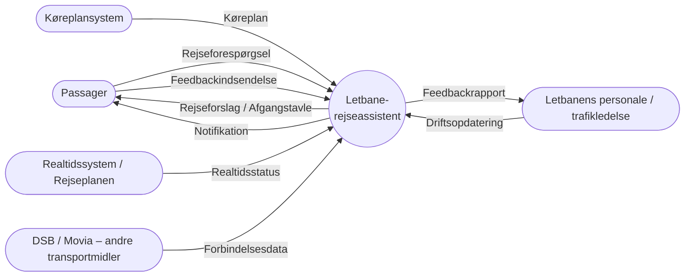
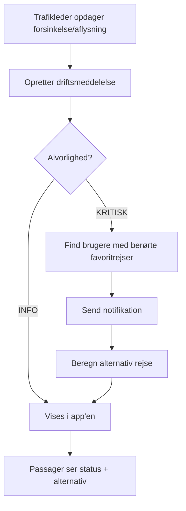
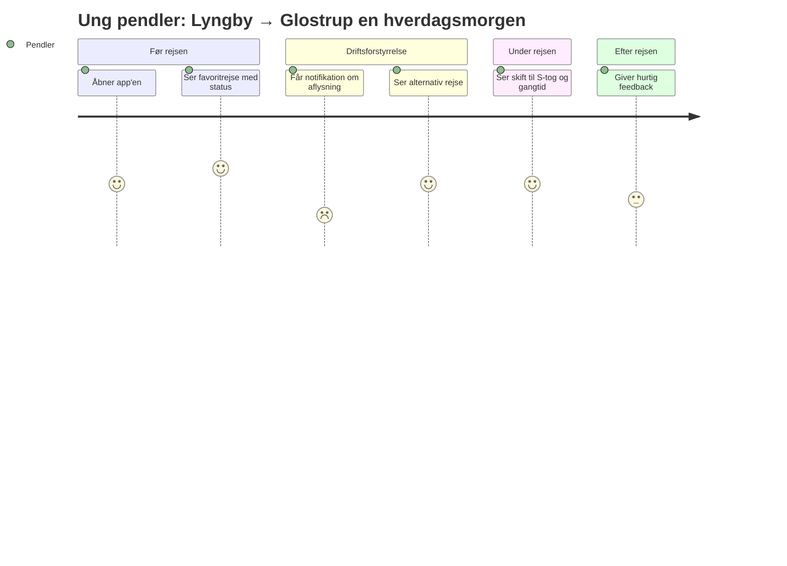
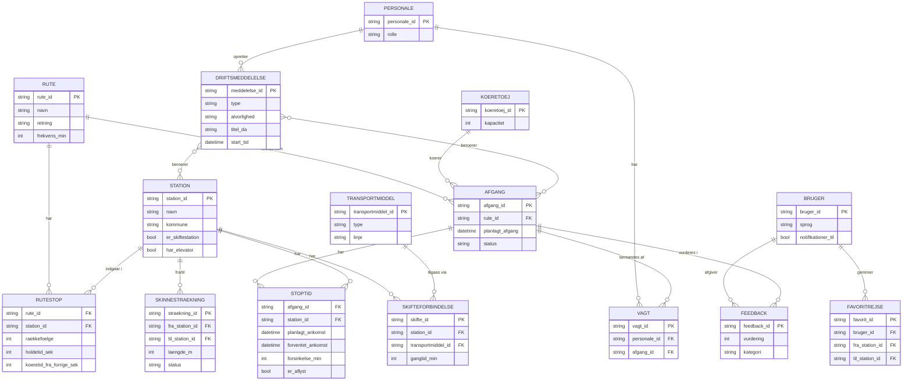

# Kravspecifikation – Prototype for Hovedstadens Letbane

> **Arbejdstitel:** Letbane-rejseassistent (PendlerKids)
> **Struktur:** Volere "The Template" (Robertson & Robertson, *Mastering the Requirements Process*)
> **Status:** Udkast v0.1 – sidst opdateret 2026-09-25
> **Kilder:** `Eksamensforudsætning 2.docx`, `Kravspecifikation for vores prototype.docx`, `Opbygning af vores spørgeskema (Hovedstadens letbane).docx`, `T-Shirt Sign Up.csv` (spørgeskemasvar, n = 29), `Ideudvikling med teknologi og data.pdf`

> ⚠️ **Levende dokument.** Data dictionary (afsnit 5 og 9.4) skal opdateres, **hver gang** vi tilføjer/ændrer en entitet, en attribut, et JSON-felt eller et krav. Se tjeklisten i [Vedligeholdelse](#vedligeholdelse-af-dokumentet).

---

## Indhold

- **Project Drivers:** 1. Formål · 2. Interessenter · 3. Brugere
- **Project Constraints:** 4. Begrænsninger · 5. Begreber og **data dictionary** · 6. Fakta og antagelser
- **Functional Requirements:** 7. Arbejdets omfang · 8. Produktets omfang · 9. Funktionelle krav og datakrav
- **Non-functional Requirements:** 10–17
- **Project Issues:** 18–27
- **Bilag:** Vedligeholdelse · Ændringslog

---

# Project Drivers

## 1. Formålet med projektet

**Problemstilling:** Hovedstadens Letbane er etableret for at skabe en attraktiv og effektiv kollektiv forbindelse på tværs af hovedstadsområdet, men passagertallet lever ikke op til forventningerne. Letbanen matcher ikke i tilstrækkelig grad borgernes transportbehov eller opleves ikke som et attraktivt alternativ til bil, bus og andre transportformer.

**Hvad vores data siger (spørgeskema, n = 29):**

| Fund | Andel |
|---|---|
| Største udfordring: **aflysninger** | 38 % |
| Største udfordring: **forsinkelser** | 21 % |
| Oplever forsinkelser **ofte / meget ofte** | 41 % |
| Vigtigst for en god rejse: **at toget kommer til tiden** | 48 % |
| Vigtigst for en god rejse: **god information** | 24 % |
| Vigtigst for en god rejse: **nemt at skifte** til andre transportmidler | 21 % |
| Info ved forsinkelse er **hverken nemt eller svært / svært / meget svært** | 62 % |

**Formål:**
- Løsningen skal forbedre kundeoplevelsen hos Hovedstadens Letbane.
- Løsningen skal understøtte, at Letbanen opleves som et attraktivt og **forudsigeligt** transportvalg.
- Løsningen skal tage udgangspunkt i dokumenterede behov: pålidelighed, klar information ved driftsforstyrrelser og nemme skift.

**Mål (målbare):**
| ID | Mål | Måling |
|---|---|---|
| G-1 | Brugeren kan se, om sin afgang er forsinket/aflyst | ≤ 2 tryk fra forsiden |
| G-2 | Brugeren kan se alternativ rejse ved aflysning | Vises automatisk ved aflysning |
| G-3 | Brugeren kan se skifteforbindelse (S-tog/regionaltog/bus) | Vises på alle skiftestationer |
| G-4 | Andel der oplever info ved forsinkelse som "svært" falder | Genmåles i opfølgende spørgeskema |

## 2. Kunde, klient og øvrige interessenter

| Interessent | Rolle (Stakeholder Map) | Interesse / indflydelse |
|---|---|---|
| Hovedstadens Letbane I/S | Klient / ejer af produktet | Flere passagerer, bedre kundeoplevelse, drift på forretningsmæssigt grundlag |
| Region Hovedstaden + 11 kommuner | Ejere / finansiel & politisk begunstiget | Offentligt ejerskab, finansiering, byudvikling langs Ring 3 |
| Passagerer (nuværende og potentielle) | Kunder / brugere | Pålidelig, nem og behagelig rejse |
| Letbanens personale (drift, trafikledelse, kundeservice) | Operationel support / vedligehold | Skal kunne udsende driftsmeddelelser |
| Rejseplanen, DOT, DSB (S-tog, regionaltog), Movia | Tilgrænsende systemer | Leverer data om forbindelser og billetter |
| Trafikstyrelsen / myndigheder | Regulator | Sikkerhed, lov om letbane på Ring 3 |
| Projektgruppen (PendlerKids) | Core team | Udvikler prototypen |
| Undervisere / censorer | Evaluerende | Vurderer kravspec og prototype |

## 3. Brugere af produktet

Baseret på SMP-analysen og spørgeskemaet fokuserer vi på **pendlere** i to aldersgrupper:

| Persona | Beskrivelse | Behov | Digital erfaring |
|---|---|---|---|
| **Ung pendler** (18–26 år, fx studerende i Lyngby/Herlev) | Bruger Letbanen dagligt, vil have det nemt og hurtigt | Hurtig status på afgang, skift, kort rejsetid | Høj |
| **Ældre pendler** ("Joan", 55–78 år) | Kombinerer cykel og Letbane, skal være fremme til tiden | Forudsigelighed, tydelig information, cykelplads, store knapper/tekst | Varierende |

- Løsningen skal kunne bruges af både nuværende og potentielle kunder (10 % af respondenterne har aldrig brugt Letbanen).
- Løsningen skal dække behov **før** (planlægning), **under** (status, skift) og **efter** rejsen (feedback).

---

# Project Constraints

## 4. Begrænsninger (Requirements Constraints)

| ID | Begrænsning |
|---|---|
| C-1 | Løsningen skal fungere inden for Hovedstadens Letbanes eksisterende rammer (drift, billetsystem, brand). |
| C-2 | Løsningen skal være realistisk at implementere som prototype inden for projektperioden. |
| C-3 | Arkitektur: **tre-lags** (præsentation – logik – data). Frontend og backend kommunikerer via **REST API med JSON**. |
| C-4 | Teknologi (forslag): Frontend i HTML/CSS/JavaScript (evt. React); backend i Python/Flask eller Node.js; data i JSON-filer eller SQLite i prototypen. |
| C-5 | Prototypen bruger **simulerede driftsdata** (ikke live-integration). |
| C-6 | Løsningen må ikke gøre det nødvendigt at have smartphone for at bruge Letbanen. |
| C-7 | Løsningen skal så vidt muligt kunne spille sammen med eksisterende løsninger (Rejseplanen, DOT Billetter). |

## 5. Begreber og definitioner – Data Dictionary

> Dette er projektets **fælles ordforråd**. Alle entiteter, attributter, JSON-felter og dataflows **skal** være defineret her, før de bruges i kode, diagrammer eller krav.
> Notation for sammensatte dataflows (Robertson/DeMarco): `=` består af, `+` og, `{ }` gentages 0..n, `( )` valgfri, `[ a | b ]` enten/eller.

### 5.1 Domænebegreber (ordliste)

| Begreb | Definition |
|---|---|
| Letbane | Hovedstadens Letbane langs Ring 3 mellem Lyngby og Ishøj. |
| Rute / Strækning | En samlet linje, som letbanetog kører på, fra endestation til endestation i én retning. |
| Station | Et stoppested på Letbanen, hvor passagerer kan stige på/af. |
| Skinnestrækning | Den fysiske skinneforbindelse mellem to nabostationer. |
| Afgang / Tur | Én konkret kørsel af et tog på en rute på et bestemt tidspunkt. |
| Holdetid | Tid (sek.) toget holder stille ved en station. |
| Rejsetid | Tid fra afgang på én station til ankomst på en anden. |
| Skiftestation | Station med forbindelse til andet transportmiddel (S-tog, regionaltog, bus, metro). |
| Skifteforbindelse | Mulighed for at skifte fra Letbanen til et andet transportmiddel på en skiftestation. |
| Driftsmeddelelse | Besked om forsinkelse, aflysning, sporarbejde eller anden driftsforstyrrelse. |
| Forsinkelse | Forskel mellem planlagt og forventet/faktisk tid > 0 min. |
| Aflysning | En planlagt afgang, som ikke gennemføres (helt eller delvist). |
| Punktlighed | Andel afgange der ankommer ≤ 2 min efter planlagt tid (**antagelse – verificeres med Letbanen**). |
| Personale | Medarbejdere tilknyttet driften (fx togfører, trafikleder, kundeservice). |
| Bruger | Person der anvender app'en. Kan være anonym. |
| Favoritrejse | En rejse (fra-station → til-station) som brugeren har gemt. |

### 5.2 Entiteter

| Entitet | Beskrivelse | Primærnøgle | Kilde |
|---|---|---|---|
| `Rute` | Linje/strækning i én retning | `rute_id` | Letbanens køreplan |
| `Station` | Stoppested | `station_id` | Letbanen / Rejseplanen |
| `RuteStop` | En station's placering og holdetid på en rute | `rute_id` + `raekkefoelge` | Køreplan |
| `Skinnestraekning` | Forbindelse mellem to nabostationer | `straekning_id` | Letbanen |
| `Koeretoej` | Et letbanetog | `koeretoej_id` | Letbanen |
| `Afgang` | En konkret tur på en rute | `afgang_id` | Køreplan |
| `Stoptid` | Planlagt/faktisk tid for en afgang ved én station | `afgang_id` + `station_id` | Køreplan + realtid |
| `Driftsmeddelelse` | Forsinkelse, aflysning m.m. | `meddelelse_id` | Trafikledelse (personale) |
| `Transportmiddel` | Andet transportmiddel (S-tog, regionaltog, bus, metro) | `transportmiddel_id` | Rejseplanen / DSB / Movia |
| `Skifteforbindelse` | Forbindelse fra station til transportmiddel | `skifte_id` | Rejseplanen |
| `Personale` | Medarbejder i driften | `personale_id` | Letbanen (intern) |
| `Vagt` | Personale tilknyttet afgang/kørsel | `vagt_id` | Letbanen (intern) |
| `Bruger` | App-bruger (anonym som udgangspunkt) | `bruger_id` | App |
| `Favoritrejse` | Gemt rejse | `favorit_id` | App |
| `Feedback` | Brugerens vurdering af en rejse | `feedback_id` | App |

### 5.3 Attributter (pr. entitet)

Kolonner: **Navn** · **Type** · **Format / domæne** · **Påkrævet** · **Beskrivelse** · **Eksempel**

#### `Rute`
| Navn | Type | Format / domæne | Påkr. | Beskrivelse | Eksempel |
|---|---|---|---|---|---|
| `rute_id` | string | `L-[A-Z0-9]+` | ✓ | Unik ID | `"L-NORD"` |
| `navn` | string | 1–60 tegn | ✓ | Visningsnavn | `"Lyngby → Ishøj"` |
| `retning` | enum | `SYD` \| `NORD` | ✓ | Kørselsretning | `"SYD"` |
| `start_station_id` | string | FK → Station | ✓ | Første station | `"LYN"` |
| `slut_station_id` | string | FK → Station | ✓ | Sidste station | `"ISH"` |
| `frekvens_min` | integer | 1–60 | ✓ | Minutter mellem afgange i dagtimer | `5` |
| `samlet_rejsetid_min` | integer | > 0 | ✓ | Rejsetid endestation → endestation | `55` *(verificeres)* |

#### `Station`
| Navn | Type | Format / domæne | Påkr. | Beskrivelse | Eksempel |
|---|---|---|---|---|---|
| `station_id` | string | 3 bogstaver, store | ✓ | Unik stationskode | `"HER"` |
| `navn` | string | 1–60 tegn | ✓ | Stationsnavn | `"Herlev St."` |
| `kommune` | string | 1–40 tegn | ✓ | Kommune | `"Herlev"` |
| `latitude` | decimal | −90..90, 6 dec. | ✓ | Breddegrad | `55.7190` |
| `longitude` | decimal | −180..180, 6 dec. | ✓ | Længdegrad | `12.4430` |
| `er_skiftestation` | boolean | true/false | ✓ | Har skifteforbindelse | `true` |
| `har_elevator` | boolean | true/false | ✓ | Tilgængelighed | `true` |
| `cykelparkering` | boolean | true/false | – | Cykelparkering ved station | `true` |

#### `RuteStop`
| Navn | Type | Format / domæne | Påkr. | Beskrivelse | Eksempel |
|---|---|---|---|---|---|
| `rute_id` | string | FK → Rute | ✓ | Rute | `"L-NORD"` |
| `station_id` | string | FK → Station | ✓ | Station | `"HER"` |
| `raekkefoelge` | integer | 1..n | ✓ | Stationens nummer på ruten | `7` |
| `holdetid_sek` | integer | 0–300 | ✓ | Planlagt holdetid ved station | `20` |
| `koeretid_fra_forrige_sek` | integer | ≥ 0 | ✓ | Køretid fra forrige station (0 ved start) | `120` |

#### `Skinnestraekning`
| Navn | Type | Format / domæne | Påkr. | Beskrivelse | Eksempel |
|---|---|---|---|---|---|
| `straekning_id` | string | `FRA-TIL` | ✓ | Unik ID | `"HER-GLO"` |
| `fra_station_id` | string | FK → Station | ✓ | Startstation | `"HER"` |
| `til_station_id` | string | FK → Station | ✓ | Slutstation | `"GLO"` |
| `laengde_m` | integer | > 0 | ✓ | Længde i meter | `1200` |
| `planlagt_koeretid_sek` | integer | > 0 | ✓ | Normal køretid | `120` |
| `status` | enum | `AABEN` \| `SPORARBEJDE` \| `LUKKET` | ✓ | Driftsstatus | `"AABEN"` |

#### `Koeretoej`
| Navn | Type | Format / domæne | Påkr. | Beskrivelse | Eksempel |
|---|---|---|---|---|---|
| `koeretoej_id` | string | 1–10 tegn | ✓ | Tognummer | `"LT-12"` |
| `kapacitet` | integer | > 0 | ✓ | Antal passagerer | `210` *(verificeres)* |
| `cykelpladser` | integer | ≥ 0 | – | Antal cykelpladser | `4` *(antagelse)* |

#### `Afgang`
| Navn | Type | Format / domæne | Påkr. | Beskrivelse | Eksempel |
|---|---|---|---|---|---|
| `afgang_id` | string | UUID eller løbenr. | ✓ | Unik ID | `"A-20260925-0712"` |
| `rute_id` | string | FK → Rute | ✓ | Rute | `"L-SYD"` |
| `koeretoej_id` | string | FK → Koeretoej | – | Tildelt tog | `"LT-12"` |
| `dato` | date | ISO 8601 `YYYY-MM-DD` | ✓ | Driftsdøgn | `"2026-09-25"` |
| `planlagt_afgang` | datetime | ISO 8601 m. tidszone | ✓ | Afgang fra første station | `"2026-09-25T07:12:00+02:00"` |
| `status` | enum | `PLANLAGT` \| `I_DRIFT` \| `FORSINKET` \| `AFLYST` \| `DELVIST_AFLYST` \| `GENNEMFOERT` | ✓ | Aktuel status | `"FORSINKET"` |

#### `Stoptid`
| Navn | Type | Format / domæne | Påkr. | Beskrivelse | Eksempel |
|---|---|---|---|---|---|
| `afgang_id` | string | FK → Afgang | ✓ | Afgang | `"A-20260925-0712"` |
| `station_id` | string | FK → Station | ✓ | Station | `"HER"` |
| `planlagt_ankomst` | datetime | ISO 8601 | ✓ | Køreplanstid | `"…T07:26:00+02:00"` |
| `forventet_ankomst` | datetime | ISO 8601 | – | Realtidsestimat | `"…T07:30:00+02:00"` |
| `faktisk_ankomst` | datetime | ISO 8601 | – | Registreret ankomst | `null` |
| `forsinkelse_min` | integer | **afledt:** `forventet − planlagt` | ✓ | Forsinkelse i minutter (0 = til tiden) | `4` |
| `er_aflyst` | boolean | true/false | ✓ | Stoppet er aflyst | `false` |

#### `Driftsmeddelelse`
| Navn | Type | Format / domæne | Påkr. | Beskrivelse | Eksempel |
|---|---|---|---|---|---|
| `meddelelse_id` | string | UUID | ✓ | Unik ID | `"M-8812"` |
| `type` | enum | `FORSINKELSE` \| `AFLYSNING` \| `SPORARBEJDE` \| `TEKNISK_FEJL` \| `ANDET` | ✓ | Kategori | `"AFLYSNING"` |
| `alvorlighed` | enum | `INFO` \| `ADVARSEL` \| `KRITISK` | ✓ | Hvor meget det påvirker rejsen | `"KRITISK"` |
| `titel_da` | string | 1–80 tegn | ✓ | Kort overskrift (dansk) | `"Aflysninger Herlev–Glostrup"` |
| `tekst_da` | string | 1–500 tegn | ✓ | Beskrivelse i klart sprog (dansk) | `"Tag bus 400S …"` |
| `titel_en` / `tekst_en` | string | som ovenfor | – | Engelsk version | |
| `start_tid` | datetime | ISO 8601 | ✓ | Gælder fra | |
| `forventet_slut_tid` | datetime | ISO 8601 | – | Forventet ophør | |
| `beroerte_stationer` | array\<string\> | FK → Station | – | Berørte stationer | `["HER","GLO"]` |
| `beroerte_afgange` | array\<string\> | FK → Afgang | – | Berørte afgange | |
| `alternativ_rejse` | string | 0–300 tegn | – | Forslag til alternativ | `"Tag S-tog linje C"` |
| `oprettet_af` | string | FK → Personale | ✓ | Hvem udsendte beskeden | `"P-044"` |

#### `Transportmiddel`
| Navn | Type | Format / domæne | Påkr. | Beskrivelse | Eksempel |
|---|---|---|---|---|---|
| `transportmiddel_id` | string | 1–20 tegn | ✓ | Unik ID | `"STOG-C"` |
| `type` | enum | `S_TOG` \| `REGIONALTOG` \| `BUS` \| `METRO` | ✓ | Type | `"S_TOG"` |
| `linje` | string | 1–10 tegn | ✓ | Linjebetegnelse | `"C"` |
| `operatoer` | string | 1–40 tegn | ✓ | Operatør | `"DSB"` |

#### `Skifteforbindelse`
| Navn | Type | Format / domæne | Påkr. | Beskrivelse | Eksempel |
|---|---|---|---|---|---|
| `skifte_id` | string | 1–20 tegn | ✓ | Unik ID | `"SK-HER-C"` |
| `station_id` | string | FK → Station | ✓ | Skiftestation | `"HER"` |
| `transportmiddel_id` | string | FK → Transportmiddel | ✓ | Transportmiddel | `"STOG-C"` |
| `gangtid_min` | integer | 0–20 | ✓ | Gangtid mellem perroner | `3` |
| `beskrivelse` | string | 0–200 tegn | – | Vejvisning | `"Følg skilte mod S-tog, spor 1"` |

#### `Personale`
| Navn | Type | Format / domæne | Påkr. | Beskrivelse | Eksempel |
|---|---|---|---|---|---|
| `personale_id` | string | `P-[0-9]{3}` | ✓ | Medarbejdernr. | `"P-044"` |
| `rolle` | enum | `TOGFOERER` \| `TRAFIKLEDER` \| `KUNDESERVICE` \| `TEKNIKER` | ✓ | Rolle | `"TRAFIKLEDER"` |
| `navn` | string | 1–80 tegn | ✓ | Navn (**persondata – kun intern visning**) | |

#### `Vagt`
| Navn | Type | Format / domæne | Påkr. | Beskrivelse | Eksempel |
|---|---|---|---|---|---|
| `vagt_id` | string | UUID | ✓ | Unik ID | |
| `personale_id` | string | FK → Personale | ✓ | Medarbejder | `"P-012"` |
| `afgang_id` | string | FK → Afgang | – | Tildelt afgang (togfører) | |
| `start_tid` / `slut_tid` | datetime | ISO 8601 | ✓ | Vagtens tidsrum | |

#### `Bruger`
| Navn | Type | Format / domæne | Påkr. | Beskrivelse | Eksempel |
|---|---|---|---|---|---|
| `bruger_id` | string | UUID (anonymt, genereret på enheden) | ✓ | Unik ID – **ingen navn/e-mail krævet** | |
| `sprog` | enum | `da` \| `en` | ✓ | Foretrukket sprog | `"da"` |
| `stor_tekst` | boolean | true/false | ✓ | Tilgængelighedsindstilling | `false` |
| `notifikationer_til` | boolean | true/false | ✓ | Samtykke til push-beskeder | `true` |
| `oprettet` | datetime | ISO 8601 | ✓ | Oprettelsestidspunkt | |

#### `Favoritrejse`
| Navn | Type | Format / domæne | Påkr. | Beskrivelse | Eksempel |
|---|---|---|---|---|---|
| `favorit_id` | string | UUID | ✓ | Unik ID | |
| `bruger_id` | string | FK → Bruger | ✓ | Ejer | |
| `fra_station_id` | string | FK → Station | ✓ | Fra | `"LYN"` |
| `til_station_id` | string | FK → Station | ✓ | Til | `"GLO"` |
| `navn` | string | 0–30 tegn | – | Brugerens navn for rejsen | `"Til arbejde"` |
| `sædvanlig_tid` | time | `HH:MM` | – | Typisk afgangstidspunkt | `"07:10"` |

#### `Feedback`
| Navn | Type | Format / domæne | Påkr. | Beskrivelse | Eksempel |
|---|---|---|---|---|---|
| `feedback_id` | string | UUID | ✓ | Unik ID | |
| `bruger_id` | string | FK → Bruger | – | Kan være anonym | |
| `afgang_id` | string | FK → Afgang | – | Relateret afgang | |
| `vurdering` | integer | 1–5 | ✓ | Tilfredshed (samme skala som spørgeskema) | `2` |
| `kategori` | enum | `PUNKTLIGHED` \| `INFORMATION` \| `PLADS` \| `SKIFT` \| `ANDET` | ✓ | Emne (afledt af spørgeskemaets svarkategorier) | `"INFORMATION"` |
| `kommentar` | string | 0–300 tegn | – | Fritekst | |
| `tidspunkt` | datetime | ISO 8601 | ✓ | Afgivet | |

### 5.4 Relationer (kardinalitet)

| Fra | Relation | Til | Kardinalitet |
|---|---|---|---|
| Rute | har stop | RuteStop | 1 : N |
| Station | indgår i | RuteStop | 1 : N |
| Station | forbindes af | Skinnestraekning | 2 : N (fra/til) |
| Rute | køres som | Afgang | 1 : N |
| Koeretoej | kører | Afgang | 1 : N |
| Afgang | har | Stoptid | 1 : N |
| Station | har | Stoptid | 1 : N |
| Station | har | Skifteforbindelse | 1 : N |
| Transportmiddel | tilgås via | Skifteforbindelse | 1 : N |
| Driftsmeddelelse | berører | Station / Afgang | N : M |
| Personale | opretter | Driftsmeddelelse | 1 : N |
| Personale | har | Vagt | 1 : N |
| Bruger | gemmer | Favoritrejse | 1 : N |
| Bruger | afgiver | Feedback | 1 : N |

### 5.5 Sammensatte dataflows (til DFD og API)

```text
Rejseforespørgsel     = fra_station_id + til_station_id + (ønsket_tidspunkt) + [afgang | ankomst]
Rejseforslag          = { Rejseben } + samlet_rejsetid_min + (Driftsmeddelelse)
Rejseben              = [Letbaneben | Skifteben]
Letbaneben            = afgang_id + fra_station_id + til_station_id + planlagt_afgang
                        + forventet_afgang + forsinkelse_min + status
Skifteben             = station_id + transportmiddel_id + gangtid_min + (beskrivelse)
Afgangstavle          = station_id + opdateret_tid + { Afgangslinje }
Afgangslinje          = afgang_id + rute_id + retning + planlagt_afgang + forventet_afgang
                        + forsinkelse_min + status
Driftsopdatering      = meddelelse_id + type + alvorlighed + titel_da + tekst_da
                        + { station_id } + (alternativ_rejse)
Notifikation          = bruger_id + meddelelse_id + titel_da + (favorit_id)
Feedbackindsendelse   = (bruger_id) + (afgang_id) + vurdering + kategori + (kommentar)
```

### 5.6 Afledte værdier og forretningsregler

| ID | Regel |
|---|---|
| BR-1 | `forsinkelse_min = round((forventet_ankomst − planlagt_ankomst) / 60)`; negativ værdi vises som 0. |
| BR-2 | Afgang får status `FORSINKET` hvis `forsinkelse_min ≥ 2` på mindst ét stop *(grænse er antagelse)*. |
| BR-3 | Rejsetid mellem station A og B = Σ `koeretid_fra_forrige_sek` + Σ `holdetid_sek` for mellemliggende stop. |
| BR-4 | Et skift er "muligt" hvis `ankomst_letbane + gangtid_min ≤ afgang_andet_transportmiddel`. |
| BR-5 | Driftsmeddelelser med `alvorlighed = KRITISK` udløser notifikation til brugere med berørte favoritrejser. |
| BR-6 | Tider gemmes i ISO 8601 med tidszone (`Europe/Copenhagen`) og vises som `HH:MM`. |

### 5.7 Navnekonventioner

- Database/JSON-felter: `snake_case`, danske ord uden æ/ø/å (`ae`, `oe`, `aa`).
- Enum-værdier: `STORE_BOGSTAVER`.
- ID'er: string (ikke tal), så de kan bruges direkte i URL'er.
- Fremmednøgler slutter på `_id`.

## 6. Relevante fakta og antagelser

**Fakta (fra vores analyser):**
- Letbanen kører langs Ring 3 mellem Lyngby og Ishøj, hvert 5. minut i dagtimerne.
- Ca. 5.600 passagerer pr. hverdag i starten af 2025/26 – ca. 60 % over den første forventning; langsigtet forventning er ca. 38.000 daglige passagerer / 14 mio. årligt i 2030.
- Cykler kan medtages gratis.
- Letbanen er ejet af Region Hovedstaden og 11 kommuner og reguleret af lov om letbane på Ring 3.
- Letbanen skal fungere sammen med S-tog, regionaltog og busser.

**Antagelser (skal verificeres):**
- A-1: Der findes eller kan skabes adgang til realtidsdata (fx via Rejseplanens API / GTFS-RT).
- A-2: Punktlighedsgrænse = 2 min.
- A-3: Stationskoder, koordinater, køretider og kapacitet i eksempeldata er fiktive, indtil de er verificeret.
- A-4: Brugerne vil installere/benytte en web-app, hvis den giver klar merværdi i forhold til Rejseplanen.

---

# Functional Requirements

## 7. Arbejdets omfang (Scope of the Work)

**Kontekstdiagram (DFD niveau 0 – context):**



**Business Event List:**

| # | Hændelse | Input / Output |
|---|---|---|
| BE-1 | Passager vil planlægge en rejse | Rejseforespørgsel (in) → Rejseforslag (out) |
| BE-2 | Passager vil se afgange fra en station | Stationsvalg (in) → Afgangstavle (out) |
| BE-3 | Trafikledelsen registrerer forsinkelse/aflysning | Driftsopdatering (in) → Notifikation (out) |
| BE-4 | Realtidssystemet sender ny status | Realtidsstatus (in) |
| BE-5 | Ny køreplan udgives | Køreplan (in) |
| BE-6 | Passager ankommer til skiftestation | Skifteinfo (out) |
| BE-7 | Passager giver feedback efter rejsen | Feedbackindsendelse (in) |
| BE-8 | Tid til ugentlig feedbackrapport | Feedbackrapport (out) |

**Business Use Case – BUC-3: Driftsforstyrrelse (BPMN-lignende):**



## 8. Produktets omfang (Scope of the Product)

Produktet er en **web-app (mobil-først)** med tre lag:

| Lag | Indhold | Artefakter |
|---|---|---|
| **Præsentationslag** | Forside med favoritrejser, afgangstavle, rejsesøgning, driftsmeddelelser, skifteinfo, feedback | Wireframes, crazy 8's, lightning demos *(tilføjes)* |
| **Logiklag** | REST API; beregning af rejsetid, forsinkelse, skift; håndtering af driftsmeddelelser og notifikationer | DFD, event-tabel (afsnit 7), forretningsregler (5.6) |
| **Datalag** | Database/JSON med entiteterne i afsnit 5 | ER-diagram (9.3), data dictionary (5) |

**Product Use Case – PUC-1: "Er mit tog til tiden?" (User journey, ung pendler):**



**Uden for scope (prototype):** billetkøb, betaling, login med MitID, live-integration med Rejseplanen, administrationsgrænseflade med fuld brugerstyring.

## 9. Funktionelle krav og datakrav

### 9.1 Funktionelle krav

Prioritet: **M** = Must, **S** = Should, **C** = Could (MoSCoW).

| ID | Krav | Begrundelse (data) | Prio | Data (se afsnit 5) |
|---|---|---|---|---|
| F-1 | Brugeren skal kunne vælge en station og se de næste afgange i begge retninger. | 48 % vil have toget til tiden | M | Station, Afgang, Stoptid |
| F-2 | For hver afgang skal planlagt tid, forventet tid og forsinkelse vises. | 41 % oplever ofte forsinkelser | M | Stoptid.`forsinkelse_min` |
| F-3 | Aflyste afgange skal vises tydeligt markeret som aflyst. | Aflysninger = største udfordring (38 %) | M | Afgang.`status` |
| F-4 | Brugeren skal kunne søge en rejse fra station A til B og få rejsetid. | Nemhed vigtigste valgkriterie | M | Rejseforespørgsel, BR-3 |
| F-5 | Aktive driftsmeddelelser skal vises på forsiden. | 62 % finder info ved forsinkelse ikke nem | M | Driftsmeddelelse |
| F-6 | Ved aflysning skal der vises et alternativt rejseforslag. | Aflysninger | S | Driftsmeddelelse.`alternativ_rejse` |
| F-7 | På skiftestationer skal forbindelser til S-tog/regionaltog/bus og gangtid vises. | 21 % prioriterer nemme skift | M | Skifteforbindelse |
| F-8 | Brugeren skal kunne gemme favoritrejser uden at oprette konto. | Pendlere kører samme rute dagligt | S | Favoritrejse, Bruger |
| F-9 | Brugeren skal kunne modtage notifikation ved forstyrrelser på favoritrejser. | Proaktiv info | S | BR-5, Notifikation |
| F-10 | Brugeren skal kunne give feedback (1–5 + kategori) på en rejse. | Letbanen mangler kundedata (VRIO "?") | C | Feedback |
| F-11 | Personale skal kunne oprette/afslutte en driftsmeddelelse. | Kilde til information | S | Driftsmeddelelse, Personale |
| F-12 | Brugeren skal kunne se, om stationen har elevator og cykelparkering. | Ældre persona / cykel + letbane | C | Station |
| F-13 | Brugeren skal kunne skifte mellem dansk og engelsk. | Kulturelle krav | S | Bruger.`sprog` |

### 9.2 API (frontend ↔ backend, JSON)

| Metode | Endpoint | Returnerer | Krav |
|---|---|---|---|
| GET | `/api/stationer` | Liste af `Station` | F-1 |
| GET | `/api/stationer/{station_id}/afgange` | `Afgangstavle` | F-1, F-2, F-3 |
| GET | `/api/rejse?fra={id}&til={id}&tid={iso}` | `Rejseforslag` | F-4, F-7 |
| GET | `/api/driftsmeddelelser?aktive=true` | Liste af `Driftsmeddelelse` | F-5, F-6 |
| GET | `/api/stationer/{station_id}/skift` | Liste af `Skifteforbindelse` | F-7 |
| POST | `/api/favoritter` | Oprettet `Favoritrejse` | F-8 |
| POST | `/api/feedback` | Oprettet `Feedback` | F-10 |
| POST | `/api/driftsmeddelelser` | Oprettet `Driftsmeddelelse` (personale) | F-11 |

**Eksempel – `GET /api/stationer/HER/afgange`:**

```json
{
  "station_id": "HER",
  "opdateret_tid": "2026-09-25T07:20:05+02:00",
  "afgange": [
    {
      "afgang_id": "A-20260925-0712",
      "rute_id": "L-SYD",
      "retning": "SYD",
      "planlagt_afgang": "2026-09-25T07:26:00+02:00",
      "forventet_afgang": "2026-09-25T07:30:00+02:00",
      "forsinkelse_min": 4,
      "status": "FORSINKET"
    },
    {
      "afgang_id": "A-20260925-0717",
      "rute_id": "L-SYD",
      "retning": "SYD",
      "planlagt_afgang": "2026-09-25T07:31:00+02:00",
      "forventet_afgang": null,
      "forsinkelse_min": 0,
      "status": "AFLYST"
    }
  ]
}
```

### 9.3 ER-diagram (datalag)



### 9.4 Datakrav

| ID | Krav |
|---|---|
| D-1 | Alle data, der udveksles mellem frontend og backend, skal følge navne og typer i data dictionary (afsnit 5). |
| D-2 | Alle tidspunkter skal gemmes i ISO 8601 med tidszone. |
| D-3 | Personoplysninger om brugere skal begrænses til anonymt `bruger_id` og indstillinger. |
| D-4 | Personaleoplysninger (`navn`) må ikke eksponeres i det offentlige API. |
| D-5 | Driftsdata i prototypen skal ligge i en separat seed-fil (fx `data/seed.json`), så de kan udskiftes med rigtige data. |

---

# Non-functional Requirements

## 10. Look and Feel

| ID | Krav |
|---|---|
| LF-1 | Designet skal følge Hovedstadens Letbanes visuelle identitet (farver, logo). |
| LF-2 | Status skal kodes med både farve **og** tekst/ikon (til tiden / forsinket / aflyst). |
| LF-3 | Layoutet skal være mobil-først og fungere fra 360 px bredde. |

## 11. Usability and Humanity

| ID | Krav | Pasform-kriterie |
|---|---|---|
| U-1 | Løsningen skal kunne bruges uden vejledning. | 8 ud af 10 testpersoner kan finde næste afgang uden hjælp. |
| U-2 | Centrale funktioner skal kunne nås med få handlinger. | Status på favoritrejse ≤ 2 tryk. |
| U-3 | Understøtte brugere med funktionsnedsættelser. | WCAG 2.1 AA; mulighed for stor tekst. |
| U-4 | Tekst, knapper og elementer skal være tydelige. | Kontrast ≥ 4.5:1; knapper ≥ 44×44 px. |
| U-5 | Skal kunne bruges af både unge og ældre pendlere. | Testes med mindst én fra hver persona-gruppe. |

## 12. Performance

| ID | Krav |
|---|---|
| P-1 | API-svar skal returneres på under 1 sekund i prototypen. |
| P-2 | Afgangstavle skal opdateres automatisk mindst hvert 30. sekund. |
| P-3 | Viste data skal have et synligt "opdateret kl."-tidsstempel. |

## 13. Operational and Environmental

- Skal virke i nyeste versioner af Chrome, Safari og Firefox på mobil og desktop.
- Skal kunne bruges udendørs på perron (høj kontrast, læsbarhed i sollys).

## 14. Maintainability and Support

- Koden skal ligge i Git med README og brugervejledning.
- Data dictionary opdateres ved hver ændring af datamodellen (se [Vedligeholdelse](#vedligeholdelse-af-dokumentet)).

## 15. Security

| ID | Krav |
|---|---|
| S-1 | Personoplysninger skal behandles sikkert; der indsamles kun data, der er nødvendige. |
| S-2 | Oprettelse af driftsmeddelelser (F-11) kræver personale-adgang. |
| S-3 | Kommunikation skal ske over HTTPS ved udrulning. |
| S-4 | Brugeren skal kunne se, hvilke data der gemmes, og hvorfor. |

## 16. Cultural

- Dansk er hovedsprog; engelsk skal være tilgængeligt.
- Enkelt, letforståeligt sprog – undgå fagudtryk (fx "aflyst" frem for "indstillet").

## 17. Legal

- Løsningen skal overholde GDPR, hvis der behandles personoplysninger.
- Løsningen skal overholde webtilgængelighedsloven (offentligt ejet selskab).
- Brugere skal informeres om behandling af personoplysninger.

---

# Project Issues

## 18. Åbne spørgsmål

- Kan vi få adgang til Letbanens drifts- og realtidsdata? (VRIO: "Drifts- og passagerdata = ?")
- Er en selvstændig app den rigtige løsning, eller bør funktionerne integreres i Rejseplanen / DOT?
- Hvordan adskiller løsningen sig fra eksisterende transport-apps?
- Svar fra Hovedstadens Letbane på vores interviewspørgsmål mangler.

## 19. Off-the-Shelf-løsninger

- Rejseplanen (rejsesøgning, realtid), DOT Billetter (billetter), Letbanens hjemmeside (driftsinfo).
- Rejseplanens API / GTFS-data kan evt. genbruges frem for egen køreplansmodel.

## 20. Nye problemer

- Løsningen må ikke gøre rejseoplevelsen mere kompliceret.
- Risiko for "app-træthed" – kunderne ønsker måske ikke endnu en app.
- Kunder må ikke blive afhængige af smartphone.
- Ingen unødvendig indsamling af persondata.

## 21. Opgaver

1. Færdiggør wireframes (præsentationslag).
2. Opret seed-data for stationer, ruter og afgange.
3. Implementér API (afsnit 9.2).
4. Implementér frontend.
5. Brugertest med begge personaer.
6. Skriv README + brugervejledning.

## 22. Migration

Ikke relevant for prototypen (ingen eksisterende system erstattes).

## 23. Risici

| Risiko | Konsekvens | Håndtering |
|---|---|---|
| Kunderne oplever ikke behov | Lav brug | Brugertest tidligt |
| Overlap med Rejseplanen | Ingen merværdi | Fokus på Letbane-specifik driftsinfo og skift |
| Data/integrationer ikke tilgængelige | Prototype kan ikke bruge rigtige data | Simulerede data (C-5) |
| Løsningen bliver for omfattende | Mister fokus | MoSCoW-prioritering |
| Lille stikprøve (n = 29) | Svag generaliserbarhed | Suppler med interview |

## 24. Omkostninger

Prototype udvikles af projektgruppen med gratis værktøjer (VS Code/Cursor, GitHub, Vercel/lokal server). Ingen direkte omkostninger.

## 25. Brugerdokumentation

- `README.md` med installation og opstart.
- Kort brugervejledning (guide-system i app'en: 3 introskærme ved første opstart).

## 26. Venteværelse (fremtidige krav)

- Belægningsgrad pr. tog ("plads i toget" – 10 % nævner det).
- Cykelpladser ledige i toget.
- Integration med billetkøb.
- Personaliserede pendlerstatistikker.

## 27. Løsningsidéer

- "Min morgenrejse"-widget på forsiden.
- Push-besked 10 min før sædvanlig afgang, hvis der er forstyrrelser.
- Kort over stationer med skiftemuligheder.

---

## Vedligeholdelse af dokumentet

**Opdatér data dictionary, når du:**
- [ ] tilføjer, omdøber eller sletter en entitet → afsnit 5.2 + ER-diagram 9.3
- [ ] tilføjer eller ændrer en attribut/type → afsnit 5.3
- [ ] tilføjer et JSON-felt eller endpoint → afsnit 5.5 + 9.2
- [ ] ændrer en beregning → afsnit 5.6
- [ ] tilføjer et nyt krav → afsnit 9.1 (husk kolonnen "Data")
- [ ] verificerer en antagelse → fjern *(verificeres)* og opdatér afsnit 6

## Ændringslog

| Dato | Version | Ændring |
|---|---|---|
| 2026-09-25 | 0.1 | Første udkast baseret på docs-mappen; data dictionary med 15 entiteter. |
