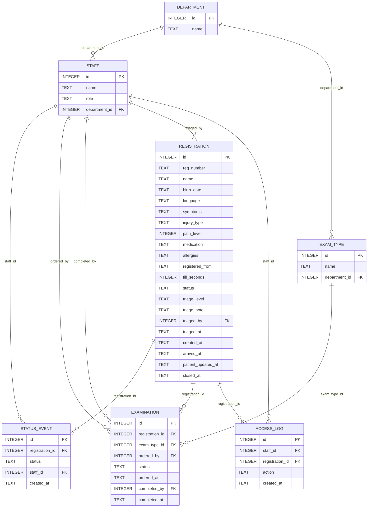
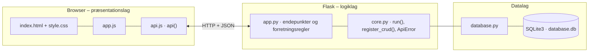

# Bispebjerg Akutmodtagelse – Digital registrering – dokumentation af prototypen

En **webbaseret registrering** til patienter på Bispebjerg Akutmodtagelse. Patienten **indtaster symptomer, skadetype, smertegrad, medicin og allergier** før eller ved ankomst og får et **unikt registreringsnummer**.
Sygeplejersker og læger **ser oplysningerne før den første samtale**, sætter **triage** og **bestiller undersøgelser**, som sendes til den afdeling, der udfører dem.
Patienten kan **følge sin status** i forløbet og **opdatere sine oplysninger**. Systemet foreslår aldrig selv triage, diagnose eller undersøgelser – det er altid personalets faglige vurdering.

Kravgrundlag: [`Kravspecifikation.md`](Kravspecifikation.md)

## Hvad kan prototypen

| Skærm | Funktion |
|---|---|
| **Patient: Registrér** | Formular på dansk eller engelsk med store felter og knapper: navn, fødselsdato, symptomer, skadetype, smertegrad (0–10), medicin, allergier og samtykke. Patienten vælger, om registreringen sker hjemmefra eller på akutmodtagelsen, og får et registreringsnummer (fx `BBH-4821`) |
| **Patient: Min status** | Opslag med registreringsnummer og fødselsdato. Viser status som trin (Registreret → Venter på sygeplejerske → Undersøgelse bestilt → Venter på læge → Afsluttet), ventetid, bestilte undersøgelser og forløb. Knappen *Jeg er ankommet* for dem, der har registreret sig hjemmefra. Oplysningerne kan rettes, indtil forløbet er afsluttet |
| **Patientkø** | For sygeplejersker og læger. Køen viser triage, skadetype, smertegrad, status og ventetid. Ikke-vurderede patienter står øverst, derefter sorteres efter triage og ventetid. *Åbn* viser patientprofilen med symptomer, medicin, allergier, forløb og tidligere besøg. Her sættes triage, bestilles undersøgelser, sendes til læge og afsluttes (kun læger) |
| **Undersøgelser** | Bestillinger sendt til afdelingerne. Afdelingspersonale ser kun deres egen afdeling og markerer undersøgelsen som udført |
| **Overblik** | Nøgletal (aktive forløb, ikke vurderet, ikke ankommet, åbne undersøgelser, ventetid, udfyldelsestid), patienter pr. status og log over adgang til patientdata |
| **Opsætning** | CRUD for undersøgelser og afdelinger |

Personalet vælges i toppen (simuleret login). Patientsiderne kræver ikke login.

## Fra krav til kode

| Krav | Implementering |
|---|---|
| FR1: Indtaste symptomer, skadetype, smertegrad, medicin og allergier | `POST /api/patient/registrations`. `clean_patient_data()` validerer skadetype og smertegrad (0–10) |
| FR2: Unikt registreringsnummer | `new_reg_number()` trækker et tilfældigt nummer (`BBH-` + fire cifre), til det er ledigt. Kolonnen `reg_number` er `UNIQUE` |
| FR3 og FR4: Sygeplejersker og læger ser oplysningerne | `GET /api/registrations` (køen) og `GET /api/registrations/<id>` (patientprofilen) |
| FR5: Gemme patientdata sikkert | Kun rollerne sygeplejerske og læge kan slå patienter op (401/403 ellers). Patienten skal bruge både nummer og fødselsdato. Opslag og ændringer logges i `access_log` |
| FR6: Sende information videre til relevante afdelinger | Hver undersøgelse hører til en afdeling (`exam_type.department_id`). `GET /api/examinations` er afdelingens indbakke og viser kun det, undersøgelsen kræver |
| FR7: Markere behov for røntgen, blodprøver og CT-scanning | `POST /api/registrations/<id>/examinations` med `exam_type_ids`. Status bliver *Undersøgelse bestilt* |
| FR8: Patienten kan opdatere oplysninger | `PUT /api/patient/registrations/<nr>`. `patient_updated_at` giver mærket *opdateret af patient* i køen, indtil patienten er vurderet igen |
| FR9: Vise patientens status i forløbet | `registration.status` og historikken i `status_event`. Vises som trin og forløb på *Min status* |
| Afsnit 3: Registrering før eller ved ankomst | `registered_from`. Hjemmefra giver status *Registreret*, indtil patienten trykker *Jeg er ankommet* (`POST …/arrive`) |
| Afsnit 3: Læger får adgang til symptomer og historik | `history` i patientprofilen: tidligere registreringer med samme navn og fødselsdato |
| Afsnit 4 og 7: Må ikke erstatte faglig vurdering, ingen diagnose eller AI-rådgivning | Triage vælges altid af personalet (`POST …/triage`). Køen sorterer kun efter det niveau, personalet har sat |
| Afsnit 10: Simpelt design, store knapper, hospitalets farver, letlæselig tekst | Patientsiderne har én kolonne, større skrift og store knapper (`.patient` i `index.html`). Blå farver sat i `:root` |
| Afsnit 11: Uden oplæring, højst 5 minutter, dansk og engelsk | Én formular med hjælpetekster. `fill_seconds` måles i browseren og vises i overblikket. Sprogvalg i `TEXT` i `app.js` |
| Afsnit 13: Mobil, tablet og computer | Fælles responsivt stylesheet |
| Afsnit 14: Fejl kan spores via logning | `access_log` og `GET /api/access-log` |
| Afsnit 15: Login til sundhedspersonale og rollebaseret adgang | `current_user(*roller)`: sygeplejerske og læge ser alt, afdelingspersonale kun egne bestillinger, og kun læger kan afslutte et forløb |

## Forretningsregler

- Triage og undersøgelser kræver, at patienten er ankommet og ikke afsluttet (409 ellers).
- En patient skal være vurderet (triage), før forløbet kan sendes til lægen eller afsluttes.
- Samme undersøgelse kan ikke bestilles to gange, mens den første er åben.
- Når den sidste bestilte undersøgelse er udført, skifter status selv til *Venter på læge*.
- Et forløb kan ikke afsluttes, mens der er åbne undersøgelser. Kun en læge kan afslutte.
- Et afsluttet forløb kan ikke ændres af patienten.

## Datamodel



## Eksempel på dataudveksling

En patient registrerer sig på akutmodtagelsen og kommer direkte i kø til sygeplejersken:

```bash
curl -X POST http://localhost:5212/api/patient/registrations \
  -H 'Content-Type: application/json' \
  -d '{"name": "Jens Jensen", "birth_date": "1984-02-17", "symptoms": "Faldt på trappen og har ondt i skulderen.", "injury_type": "FALD", "pain_level": 7, "allergies": "Penicillin", "registered_from": "VED_ANKOMST", "consent": true}'
```

Svar `201` (forkortet – registreringsnummeret er tilfældigt):

```json
{
  "reg_number": "BBH-5318",
  "name": "Jens Jensen",
  "birth_date": "1984-02-17",
  "symptoms": "Faldt på trappen og har ondt i skulderen.",
  "injury_type": "FALD",
  "pain_level": 7,
  "medication": "",
  "allergies": "Penicillin",
  "registered_from": "VED_ANKOMST",
  "status": "VENTER_PÅ_SYGEPLEJERSKE",
  "waited_minutes": 0,
  "timeline": [
    { "status": "REGISTRERET", "created_at": "2026-10-01 10:04:37" },
    { "status": "VENTER_PÅ_SYGEPLEJERSKE", "created_at": "2026-10-01 10:04:37" }
  ],
  "examinations": []
}
```

Sygeplejersken Sanne (id 1) bestiller derefter røntgen til patienten med id 6:

```bash
curl -X POST http://localhost:5212/api/registrations/6/examinations \
  -H 'Content-Type: application/json' -H 'X-User-Id: 1' \
  -d '{"exam_type_ids": [1]}'
```

## Kør prototypen

```bash
cd backend
python3 -m venv .venv && source .venv/bin/activate   # første gang
pip install -r requirements.txt                       # første gang
python app.py
```

Terminalen skriver ` * Åbn http://localhost:5212`. Åbn adressen i browseren. Flask serverer både API'et (`/api/...`) og frontenden.

- **Port:** Prototypen bruger port **5212** (5200 + projektnummer). Er porten optaget, vælger `run()` i `core.py` selv den næste ledige og skriver fx ` * Port 5212 er optaget – bruger port 5213 i stedet`. Du kan også vælge port selv med `PORT=5300 python app.py`.
- **Stop serveren** med `Ctrl` + `C` i terminalen, hvor den kører.
- **Kodeændringer:** Serveren kører i debug-tilstand og genstarter selv, når du gemmer en `.py`-fil. Den bliver på samme port. Ændringer i `frontend/` kræver kun, at du genindlæser siden.
- **Database:** `backend/database.db` oprettes med testdata ved første start. Nulstil den med `python database.py --reset`, mens serveren er stoppet.
- **Tjek at backenden svarer:** `curl http://localhost:5212/api/health`

### Fejlfinding

| Problem | Årsag | Løsning |
|---|---|---|
| ` * Port 5212 er optaget – bruger port …` | En anden proces, ofte en glemt server, bruger porten | Brug den adresse, der står i terminalen. Se hvad der optager porten med `lsof -nP -iTCP:5212 -sTCP:LISTEN`. En Flask-server i debug-tilstand er to processer, så stop dem begge med `lsof -t -iTCP:5212 -sTCP:LISTEN \| xargs kill` |
| `ModuleNotFoundError: No module named 'flask'` | Det virtuelle miljø er ikke aktiveret, eller Flask er ikke installeret | `source .venv/bin/activate` og `pip install -r requirements.txt` |
| Siden viser "Kan ikke hente data fra backenden" | Serveren kører ikke, eller `index.html` er åbnet direkte fra disken, mens serveren kører på en anden port | Start serveren og åbn adressen fra terminalen i stedet for filen |
| Ventetiderne er meget lange | Testdataenes tidspunkter regnes ud fra det øjeblik, databasen blev oprettet | Stop serveren og kør `python database.py --reset` |
| `no such table …` | `database.db` er tom eller ødelagt | `python database.py --reset` |

## Arkitektur

Prototypen følger holdets fælles tre-lags struktur (se [`../README.md`](../README.md)):



| Fil | Lag | Indhold |
|---|---|---|
| `frontend/index.html` | Præsentation | Skærmbilleder som faneblade og formularer. Projektets farver og `data-api-port` |
| `frontend/app.js` | Præsentation | Henter data med `api()`, tegner dem i DOM'en og sender formularer. Tekster på dansk og engelsk |
| `frontend/api.js` | Præsentation | Fælles for alle prototyper: `api()` (fetch + JSON), `h()`, `renderTable()`, `fillSelect()`, `formToJson()`, `bindCrudForm()` og `toast()` |
| `frontend/style.css` | Præsentation | Fælles responsivt design |
| `backend/app.py` | Logik | Projektets forretningsregler og endepunkter |
| `backend/core.py` | Logik | Fælles: `create_app()` (Flask, CORS, JSON-fejl), `run()` (start på ledig port), `ApiError` og `register_crud()` |
| `backend/database.py` | Data | Fælles: forbindelse, `query_all/query_one/execute`, `transaction()` og `init_db()` |
| `backend/schema.sql` · `seed.sql` | Data | Tabeller og fiktive testdata |

Alle fejl returneres som JSON (`{"error": "…", "path": "/api/…"}`) med statuskode 400, 401, 403, 404 eller 409 og vises som en rød besked i frontenden.
Nederst på siden kan man åbne **"Seneste JSON-svar fra API'et"** og se den rå dataudveksling.
Den fulde endepunktsliste står i [`backend/README.md`](backend/README.md).

## Design og responsivitet

- Samme stylesheet i alle prototyper. Kun farverne (`--brand`, `--brand-dark`, `--brand-soft`) sættes i `index.html`.
- Patientsiderne har ekstra stor tekst, store felter og store knapper, så de kan bruges uden oplæring og med begrænset digital erfaring.
- Layoutet virker fra mobil (375 px) til desktop uden vandret scroll. Kort lægger sig under hinanden på små skærme, og brede tabeller scroller inde i deres kort.
- Beskeder vises kort i toppen (grøn = gennemført, rød = fejl fra serveren).

## Testdata og testbrugere

| Medarbejder | Rolle | Kan |
|---|---|---|
| Sanne | Sygeplejerske | Se køen, sætte triage, bestille undersøgelser, sende til læge |
| Karim | Sygeplejerske | Som Sanne |
| Lise | Læge | Som sygeplejerskerne og desuden afslutte forløb |
| Per | Afdeling (Røntgenafdelingen) | Se og udføre røntgenbestillinger |
| Ida | Afdeling (Laboratoriet) | Se og udføre blodprøvebestillinger |

| Registreringsnummer | Fødselsdato | Patient | Status |
|---|---|---|---|
| `BBH-1001` | 1958-03-14 | Anders Testesen | Undersøgelse bestilt (røntgen), triage gul. Har et tidligere besøg |
| `BBH-1002` | 1991-11-02 | Fatima Prøve | Venter på læge, triage orange |
| `BBH-1003` | 1975-06-21 | John Sample (engelsk) | Venter på sygeplejerske, ikke vurderet |
| `BBH-1004` | 2003-01-30 | Maja Eksempel | Registreret hjemmefra, ikke ankommet |
| `BBH-0907` | 1958-03-14 | Anders Testesen | Afsluttet besøg fra august |

Brug et registreringsnummer og den tilhørende fødselsdato på *Patient: Min status*.

## Afgrænsning

Login er simuleret, og patienten identificeres kun med registreringsnummer og fødselsdato – ikke MitID. Der er ingen rigtig integration med hospitalets IT, 1813 eller afdelingernes systemer: videresendelsen vises som bestillinger på fanen *Undersøgelser*.
Data ligger ukrypteret i en lokal SQLite-fil, og serveren kører uden HTTPS, så kravene om krypteret transmission, 500 samtidige brugere og 99 % oppetid er ikke afprøvet.
Tidligere besøg findes ved at sammenligne navn og fødselsdato. Siden *Opsætning* har ingen rollekontrol.
De åbne spørgsmål i kravspecifikationen er håndteret sådan: registrering hjemmefra er med, integration med 1813 er ikke med, og systemet foreslår ikke undersøgelser automatisk.
