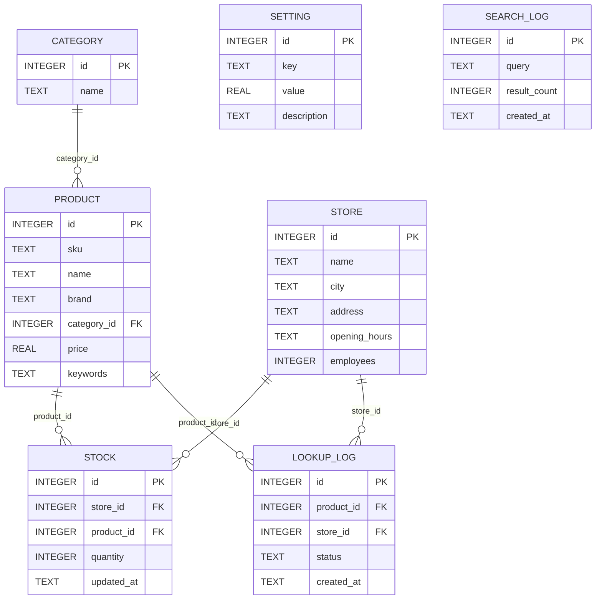
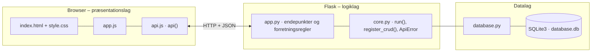

# NORMAL – Er varen på lager? – dokumentation af prototypen

En ny funktion til NORMALs hjemmeside, hvor kunden kan se, om et bestemt produkt er på lager i en bestemt butik, **før** butiksbesøget.
Kunden **søger** efter produktet, **vælger** det rigtige produkt, **vælger butik** og får vist **lagerstatus**.
Er varen ikke på lager, foreslår prototypen andre butikker, hvor den er, så kunden nemt kan vælge en anden butik.

Kravgrundlag: [`kravspec.md`](kravspec.md)

## Hvad kan prototypen

| Skærm | Funktion |
|---|---|
| **Find vare i butik** | Fire trin: søg → vælg produkt → vælg butik → se lagerstatus (grøn *På lager*, gul *Få tilbage*, rød *Ikke på lager*). Ved udsolgt vises butikker med varen på lager, først i samme by, med knappen *Vælg butik* |
| **Medarbejder: lager** | Lageret i den valgte butik med status pr. produkt. Antallet kan rettes, og listen kan filtreres på *Få tilbage* og *Udsolgt* |
| **Nøgletal** | Søgninger, søgninger uden resultat, lageropslag, opslag på udsolgte varer, butikker og medarbejdere samt tal pr. butik |
| **Sortiment og butikker** | CRUD for produkter og butikker |

Kundens butik vælges i toppen.

## Fra krav til kode

| Krav | Implementering |
|---|---|
| Søg efter et produkt og vis relevante resultater | `GET /api/search?q=` søger i navn, mærke, kategori, varenummer og søgeord |
| Vælg produkt og derefter butik | Frontenden gemmer det valgte produkt og bruger butikken fra toppen eller fra vælgeren på resultatkortet |
| Vis produktets lagerstatus | `GET /api/products/<id>/availability?store_id=` → `stock_status()` |
| Ikke tilgængelig → vælg en anden butik | Samme svar indeholder `alternatives`: butikker med varen på lager, sorteret efter samme by og antal |
| Begreb: Lagerstatus | Tabellen `stock` (antal pr. produkt pr. butik). Grænsen for *Få tilbage* står i `setting` (`low_stock_limit`) og kan ændres uden ny kode |
| Begreber: Nøgletal, Medarbejdere, Butik | `GET /api/stats` og `store.employees` |
| Afgrænsning: intet køb, reservation, Click & Collect eller levering | Der findes ingen kurv eller ordre i datamodellen |
| Begrænsning: ingen adgang til NORMALs lagerdata | Lageret er fiktive testdata, som medarbejdere kan rette (`PUT /api/stores/<id>/stock/<product_id>`) |

**Lagerstatus:** 0 stk. = `UDSOLGT`, 1–3 stk. = `FÅ_TILBAGE`, 4 stk. og derover = `PÅ_LAGER`.
Kunden ser kun status og ikke det præcise antal, fordi antallet kan ændre sig inden besøget.

## Datamodel



## Eksempel på dataudveksling

Mascara er udsolgt i Lyngby Storcenter, så svaret foreslår andre butikker:

```bash
curl "http://localhost:5202/api/products/8/availability?store_id=3"
```

Svar `200` (forkortet):

```json
{
  "product": { "id": 8, "name": "Mascara Lash Sensational", "brand": "Maybelline", "category": "Makeup", "price": 59.0 },
  "store": { "id": 3, "name": "NORMAL Lyngby Storcenter", "city": "Kgs. Lyngby" },
  "status": "UDSOLGT",
  "status_text": "Ikke på lager i denne butik",
  "message": "Mascara Lash Sensational er ikke på lager i NORMAL Lyngby Storcenter. Vælg en anden butik.",
  "alternatives": [
    { "store_id": 2, "name": "NORMAL Fisketorvet", "city": "København", "status": "PÅ_LAGER", "same_city": false },
    { "store_id": 6, "name": "NORMAL Odense", "city": "Odense", "status": "PÅ_LAGER", "same_city": false }
  ]
}
```

## Kør prototypen

```bash
cd backend
python3 -m venv .venv && source .venv/bin/activate   # første gang
pip install -r requirements.txt                       # første gang
python app.py
```

Terminalen skriver ` * Åbn http://localhost:5202`. Åbn adressen i browseren. Flask serverer både API'et (`/api/...`) og frontenden.

- **Port:** Prototypen bruger port **5202** (5200 + projektnummer). Er porten optaget, vælger `run()` i `core.py` selv den næste ledige og skriver fx ` * Port 5202 er optaget – bruger port 5203 i stedet`. Du kan også vælge port selv med `PORT=5300 python app.py`.
- **Stop serveren** med `Ctrl` + `C` i terminalen, hvor den kører.
- **Kodeændringer:** Serveren kører i debug-tilstand og genstarter selv, når du gemmer en `.py`-fil. Den bliver på samme port. Ændringer i `frontend/` kræver kun, at du genindlæser siden.
- **Database:** `backend/database.db` oprettes med testdata ved første start. Nulstil den med `python database.py --reset`, mens serveren er stoppet.
- **Tjek at backenden svarer:** `curl http://localhost:5202/api/health`

### Fejlfinding

| Problem | Årsag | Løsning |
|---|---|---|
| ` * Port 5202 er optaget – bruger port …` | En anden proces, ofte en glemt server, bruger porten | Brug den adresse, der står i terminalen. Se hvad der optager porten med `lsof -nP -iTCP:5202 -sTCP:LISTEN`. En Flask-server i debug-tilstand er to processer, så stop dem begge med `lsof -t -iTCP:5202 -sTCP:LISTEN \| xargs kill` |
| `ModuleNotFoundError: No module named 'flask'` | Det virtuelle miljø er ikke aktiveret, eller Flask er ikke installeret | `source .venv/bin/activate` og `pip install -r requirements.txt` |
| Siden viser "Kan ikke hente data fra backenden" | Serveren kører ikke, eller `index.html` er åbnet direkte fra disken, mens serveren kører på en anden port | Start serveren og åbn adressen fra terminalen i stedet for filen |
| Tallene passer ikke efter mange tests | Databasen indeholder testdata fra tidligere afprøvninger | Stop serveren og kør `python database.py --reset` |
| `no such table …` | `database.db` er tom eller ødelagt | `python database.py --reset` |

## Arkitektur

Prototypen følger holdets fælles tre-lags struktur (se [`../README.md`](../README.md)):



| Fil | Lag | Indhold |
|---|---|---|
| `frontend/index.html` | Præsentation | Skærmbilleder som faneblade og formularer. Projektets farver og `data-api-port` |
| `frontend/app.js` | Præsentation | Henter data med `api()`, tegner dem i DOM'en og sender formularer |
| `frontend/api.js` | Præsentation | Fælles for alle prototyper: `api()` (fetch + JSON), `h()`, `renderTable()`, `fillSelect()`, `formToJson()`, `bindCrudForm()` og `toast()` |
| `frontend/style.css` | Præsentation | Fælles responsivt design |
| `backend/app.py` | Logik | Projektets forretningsregler og endepunkter |
| `backend/core.py` | Logik | Fælles: `create_app()` (Flask, CORS, JSON-fejl), `run()` (start på ledig port), `ApiError` og `register_crud()` |
| `backend/database.py` | Data | Fælles: forbindelse, `query_all/query_one/execute`, `transaction()` og `init_db()` |
| `backend/schema.sql` · `seed.sql` | Data | Tabeller og fiktive testdata |

Alle fejl returneres som JSON (`{"error": "…", "path": "/api/…"}`) med statuskode 400, 401, 403, 404 eller 409 og vises som en rød besked i frontenden.
Nederst på siden kan man åbne **"Seneste JSON-svar fra API'et"** og se den rå dataudveksling.
Den fulde endepunktsliste står i [`backend/README.md`](backend/README.md).

## Design og responsivitet

- Samme stylesheet i alle prototyper. Kun farverne (`--brand`, `--brand-dark`, `--brand-soft`) sættes i `index.html`.
- Layoutet virker fra mobil (375 px) til desktop uden vandret scroll. Kort lægger sig under hinanden på små skærme, og brede tabeller scroller inde i deres kort.
- Formularfelter kan ikke blive bredere end deres kort. En `<select>` med lange valgmuligheder skubber altså ikke formularen ud over kanten.
- Beskeder vises kort i toppen (grøn = gennemført, rød = fejl fra serveren).


## Testdata

6 butikker i København, Kgs. Lyngby, Aarhus og Odense, 6 kategorier og 12 produkter. Lageret er fordelt, så nogle produkter er udsolgt eller næsten udsolgt i nogle butikker.
Prøv fx at søge efter *mascara* med butikken NORMAL Lyngby Storcenter.

## Afgrænsning

Intet køb, ingen reservation, Click & Collect eller levering (jf. kravspecifikationen). Ingen integration med NORMALs rigtige produktdatabase eller lagersystem.
Medarbejdersiden har intet login.
