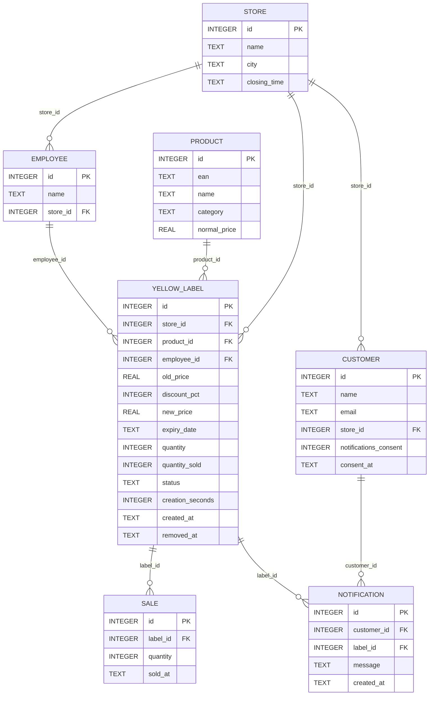
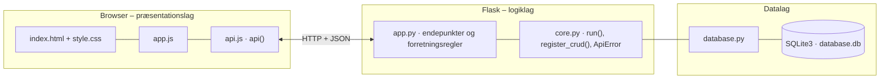

# Coop – Grønne Besparelser – dokumentation af prototypen

En ny feature i Coop-appen, der viser **SuperBrugsen Sorøs gule mærker live** for den butik, kunden selv har valgt.
Medarbejderen opretter mærket på **håndterminalen** som i dag: scan varen og vælg rabat. Mærket vises straks i appen.
Når varen er **udsolgt** eller **udløbet**, forsvinder mærket af sig selv. Kunder, der har givet **samtykke**, får besked, når deres butik nedsætter en vare.

Kravgrundlag: [`Kravspecifikation.md`](Kravspecifikation.md)

## Hvad kan prototypen

| Skærm | Funktion |
|---|---|
| **Coop-appen** | Vælg din butik, slå beskeder til/fra (samtykke gemmes med tidspunkt), feed med gule mærker (vare, ny pris, førpris, rabat, sidste dag og antal på hylden) og beskeder. Feedet opdateres automatisk hvert 5. sekund |
| **Håndterminal (medarbejder)** | Scan stregkode, eller klik på en vare for at "scanne". Vælg rabat (-25/-40/-50/-70 %), ret evt. antal og dato, og tryk *Opret mærke*. Oversigt over butikkens mærker med *Sælg 1* (simuleret kassesalg) og *Fjern* |
| **Nøgletal** | Solgt med gult mærke, andel solgt før udløb, gns. tid pr. mærke, andel oprettet på højst 20 sek., beskeder og tal pr. butik inkl. spild |
| **Varer og kunder** | CRUD for varer (EAN, navn, kategori, normalpris) og kunder |

Kunden vælges i toppen, og medarbejderen vælges på håndterminalen.

## Fra krav til kode

| Krav | Implementering |
|---|---|
| F1 Kunden ser kun mærker fra sin egen butik | `GET /api/stores/<id>/feed` filtrerer på `store_id`. Kundens butik gemmes i `customer.store_id` |
| F2 Vare, ny pris, førpris, dato og antal | Feedet returnerer `product_name`, `new_price`, `old_price`, `expiry_date` og `quantity_left` for hvert mærke |
| F3 Opret mærke ved scanning + rabat, højst 3 tryk | `GET /api/products/ean/<ean>` → rabatknap → *Opret mærke* (`POST /api/labels`). Antal er 1 og dato i morgen som standard |
| F4 Udsolgte og udløbne mærker forsvinder | `sell()` sætter status `UDSOLGT` ved sidste salg. `expire_labels()` sætter `UDLØBET`, når datoen er passeret eller butikken har lukket på sidste dag (`store.closing_time`). Kaldes før hver læsning |
| F5 Besked når butikken nedsætter en vare | `create_label()` opretter en `notification` til kunder med `store_id` = butikken og `notifications_consent = 1` |
| Performance: nyt mærke vises inden for 5 sek. | Appen henter feedet hvert 5. sekund. Mærket er synligt, så snart `POST /api/labels` er gennemført |
| Usability: mærke oprettet på højst 20 sek. | Frontenden måler tiden fra scanning til oprettelse (`creation_seconds`) og viser andelen under 20 sek. i nøgletallene |
| Lovgivning: passeret sidste anvendelsesdato kan ikke vises | `create_label()` afviser datoer før i dag (400), og `expire_labels()` fjerner mærker efter datoen |
| Lovgivning: notifikationer kræver samtykke (GDPR) | `PUT /api/customers/<id>/preferences` gemmer `notifications_consent` og `consent_at`. Kan slås fra igen |
| Bygger på Coop One og håndterminaler | Varer slås op på EAN som i Coop One. Salg registreres som i kassen (`POST /api/labels/<id>/sell`) |

**Pris:** `new_price = normal_price × (100 − rabat) / 100`, afrundet til øre. Der kan kun være ét aktivt mærke pr. vare og dato i en butik (409).

**Events:** Vare scannet → Mærke oprettet → Kunder notificeret → Vare solgt → Mærke udsolgt / Mærke udløbet (fjernet fra appen).

## Datamodel



## Eksempel på dataudveksling

Hanne i SuperBrugsen Sorø nedsætter leverpostej med 50 %. Ingrid har valgt Sorø og sagt ja til beskeder, så hun får besked med det samme:

```bash
curl -X POST http://localhost:5203/api/labels \
  -H 'Content-Type: application/json' \
  -d '{"employee_id": 2, "ean": "5701234000080", "discount_pct": 50, "quantity": 2, "expiry_date": "2026-10-01", "creation_seconds": 12}'
```

Svar `201` (forkortet):

```json
{
  "label": {
    "id": 8,
    "product_name": "Leverpostej 500 g",
    "store_name": "SuperBrugsen Sorø",
    "old_price": 21.95,
    "discount_pct": 50,
    "new_price": 10.97,
    "expiry_date": "2026-10-01",
    "quantity": 2,
    "quantity_left": 2,
    "status": "AKTIV"
  },
  "notified_customers": 1
}
```

## Kør prototypen

```bash
cd backend
python3 -m venv .venv && source .venv/bin/activate   # første gang
pip install -r requirements.txt                       # første gang
python app.py
```

Terminalen skriver ` * Åbn http://localhost:5203`. Åbn adressen i browseren. Flask serverer både API'et (`/api/...`) og frontenden.

- **Port:** Prototypen bruger port **5203** (5200 + projektnummer). Er porten optaget, vælger `run()` i `core.py` selv den næste ledige og skriver fx ` * Port 5203 er optaget – bruger port 5204 i stedet`. Du kan også vælge port selv med `PORT=5300 python app.py`.
- **Stop serveren** med `Ctrl` + `C` i terminalen, hvor den kører.
- **Kodeændringer:** Serveren kører i debug-tilstand og genstarter selv, når du gemmer en `.py`-fil. Den bliver på samme port. Ændringer i `frontend/` kræver kun, at du genindlæser siden.
- **Database:** `backend/database.db` oprettes med testdata ved første start. Nulstil den med `python database.py --reset`, mens serveren er stoppet.
- **Tjek at backenden svarer:** `curl http://localhost:5203/api/health`

### Fejlfinding

| Problem | Årsag | Løsning |
|---|---|---|
| ` * Port 5203 er optaget – bruger port …` | En anden proces, ofte en glemt server, bruger porten | Brug den adresse, der står i terminalen. Se hvad der optager porten med `lsof -nP -iTCP:5203 -sTCP:LISTEN`. En Flask-server i debug-tilstand er to processer, så stop dem begge med `lsof -t -iTCP:5203 -sTCP:LISTEN \| xargs kill` |
| `ModuleNotFoundError: No module named 'flask'` | Det virtuelle miljø er ikke aktiveret, eller Flask er ikke installeret | `source .venv/bin/activate` og `pip install -r requirements.txt` |
| Siden viser "Kan ikke hente data fra backenden" | Serveren kører ikke, eller `index.html` er åbnet direkte fra disken, mens serveren kører på en anden port | Start serveren og åbn adressen fra terminalen i stedet for filen |
| Tallene passer ikke efter mange tests | Databasen indeholder testdata fra tidligere afprøvninger | Stop serveren og kør `python database.py --reset` |
| `no such table …` | `database.db` er tom eller ødelagt | `python database.py --reset` |

## Arkitektur

Prototypen følger holdets fælles tre-lags struktur (se [`../README.md`](../README.md)):



| Fil | Lag | Indhold |
|---|---|---|
| `frontend/index.html` | Præsentation | Skærmbilleder som faneblade og formularer. Projektets farver og `data-api-port` |
| `frontend/app.js` | Præsentation | Henter data med `api()`, tegner dem i DOM'en og sender formularer |
| `frontend/api.js` | Præsentation | Fælles for alle prototyper: `api()` (fetch + JSON), `h()`, `renderTable()`, `fillSelect()`, `formToJson()`, `bindCrudForm()` og `toast()` |
| `frontend/style.css` | Præsentation | Fælles responsivt design |
| `backend/app.py` | Logik | Projektets forretningsregler og endepunkter |
| `backend/core.py` | Logik | Fælles: `create_app()` (Flask, CORS, JSON-fejl), `run()` (start på ledig port), `ApiError` og `register_crud()` |
| `backend/database.py` | Data | Fælles: forbindelse, `query_all/query_one/execute`, `transaction()` og `init_db()` |
| `backend/schema.sql` · `seed.sql` | Data | Tabeller og fiktive testdata |

Alle fejl returneres som JSON (`{"error": "…", "path": "/api/…"}`) med statuskode 400, 401, 403, 404 eller 409 og vises som en rød besked i frontenden.
Nederst på siden kan man åbne **"Seneste JSON-svar fra API'et"** og se den rå dataudveksling.
Den fulde endepunktsliste står i [`backend/README.md`](backend/README.md).

## Design og responsivitet

- Samme stylesheet i alle prototyper. Kun farverne (`--brand`, `--brand-dark`, `--brand-soft`) sættes i `index.html`.
- Layoutet virker fra mobil (375 px) til desktop uden vandret scroll. Kort lægger sig under hinanden på små skærme, og brede tabeller scroller inde i deres kort.
- Formularfelter kan ikke blive bredere end deres kort. En `<select>` med lange valgmuligheder skubber altså ikke formularen ud over kanten.
- Beskeder vises kort i toppen (grøn = gennemført, rød = fejl fra serveren).


## Testdata

5 SuperBrugsen-butikker (F1-testen med 5 butikker), 10 varer, 5 medarbejdere og 3 kunder. Ingrid (Sorø) har samtykke, Peter (Sorø) har ikke, og Amira har valgt Ringsted.
Mærkernes datoer sættes i forhold til dagens dato, når databasen oprettes, så der altid er aktive, udsolgte og udløbne mærker at se.

## Afgrænsning

Ingen rigtig integration med Coop One (SAP), håndterminal, kasse eller push-notifikationer. Beskeder vises i appens beskedliste.
Ingen reservation af varer (fravalgt i kravspecifikationen), og intet login.
