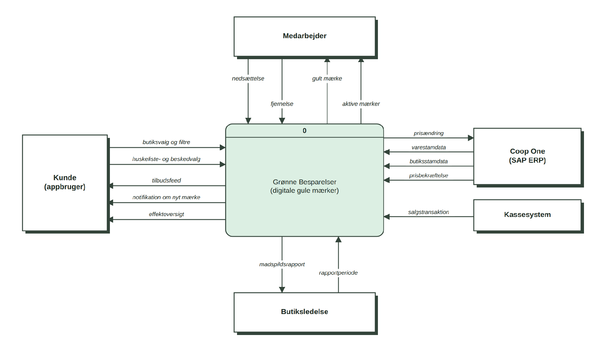
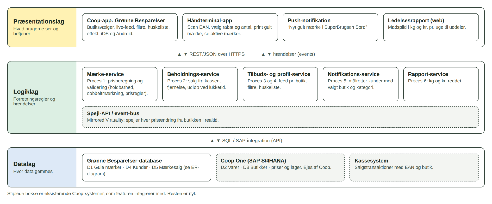
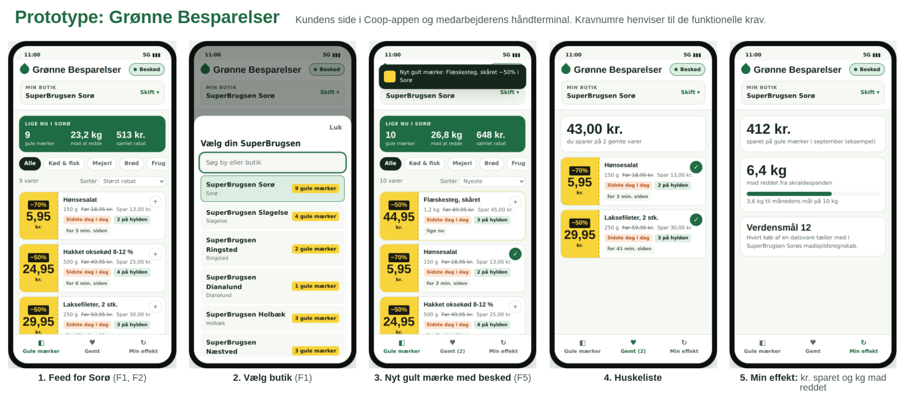
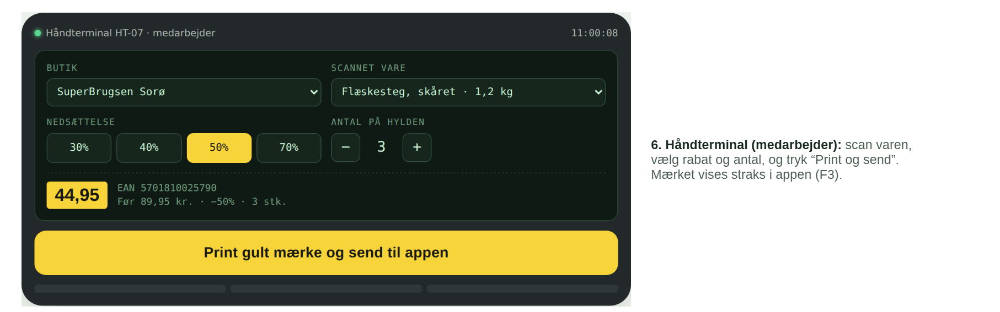

# Kravspecifikation: Grønne Besparelser

> Konverteret til markdown fra `Kravspecifikation Aflevering.docx`. Tekst og figurer er gengivet som i originaldokumentet.

Digitale gule mærker i Coop-appen · SuperBrugsen Sorø · Nizar, Jacob, Otto og Mads · Økonomi og IT, EK · 25. september 2026

Vi har ikke udfyldt hele “The Template". Vi har valgt de punkter, der afgør, om Grønne Besparelser virker: at kunden ser de rigtige tilbud fra sin egen butik, at data er korrekte i realtid, og at medarbejderne faktisk bruger løsningen. Fravalgende står sidst.

## 1. Formål og brugere (Template 1 og 3)

Grønne Besparelser er en ny feature i Coop-appen, der viser SuperBrugsen Sorøs gule mærker live for den butik, kunden selv har valgt. I dag ser kunden kun de gule mærker, hvis hun står ved køledisken. Målet er at få flere datovarer solgt før udløb og at give prisbevidste kunder en grund til at vælge SuperBrugsen frem for discount.

Der er to brugere, og begge skal have gavn af løsningen. Ingrid, 47 år, er prisbevidst, travl og bruger telefonen dagligt. Hun vil have overblik og ikke gå forgæves. Medarbejderen nedsætter varer på håndterminalen. Mange af de faste medarbejdere er over 50, så arbejdsgangen må ikke blive sværere end i dag.

## 2. Begrænsninger og fakta (Template 4 og 6)

Vi har valgt dette afsnit, fordi det viser, at løsningen kan lade sig gøre, og at der er brug for den:

- Bygger på det, der findes: Søren fortæller, at priser allerede sættes ned via håndterminal og elektroniske hyldeforkanter. Løsningen skal derfor bruge Coop One (SAP) og de eksisterende håndterminaler, ikke et nyt system.
- Butikken skal kunne vælges: 84 % af respondenterne lægger stor vægt på, at tilbud er tilpasset deres egen butik.
- Kanalen er appen: 50 % foretrækker tilbud direkte i Coop-appen, og 63,6 % er positive over for funktionen.
- Antagelse: Coop giver API-adgang til priser, lager og salg i Coop One.

## 3. Arbejdets omfang (Template 7)

Kontekstdiagrammet viser, hvor løsningen starter og slutter. Den vigtigste pointe er forbindelsen fra medarbejderen gennem systemet til kunden. Den forbindelse findes ikke i dag.

**Figur 1:** *Kontekstdiagram for Grønne Besparelser*

## 4. De vigtigste funktionelle krav (Template 9)

Vi har udvalgt de fem krav, som løsningen ikke giver mening uden. Hvert krav har et fit criterion, så det kan testes.

| ID | Krav | Hvorfor | Fit criterion |
|---|---|---|---|
| F1 | Kunden vælger sin SuperBrugsen og ser kun gule mærker fra den butik | 84 % vil have butikstilpassede tilbud | 0 mærker fra andre butikker i test med 5 butikker |
| F2 | Hvert mærke viser vare, ny pris, førpris, dato og antal på hylden | Kunden skal kunne beslutte sig uden at gå forgæves | Alle felter vises for alle mærker |
| F3 | Medarbejderen opretter et mærke ved at scanne og vælge rabat | Samme arbejdsgang som i dag | Højst 3 tryk efter scanning |
| F4 | Udsolgte og udløbne mærker forsvinder automatisk | Ellers mister kunden tilliden til feedet | Fjernet senest 10 sek. efter sidste salg eller ved lukketid |
| F5 | Kunden kan få besked, når hendes butik nedsætter en vare | Over 66 % vil have tilbud i appen eller som notifikation | Besked inden for 60 sek.; kan slås fra |

## 5. De vigtigste non-funktionelle krav (Template 11, 12 og 17)

| Type | Krav og fit criterion | Hvorfor den er valgt |
|---|---|---|
| Performance (12) | Et nyt mærke vises i appen inden for 5 sek. | Kernen i Mirrored Virtuality: appen skal spejle hylden |
| Usability (11) | Medarbejderen opretter et mærke på højst 20 sek. | Uden medarbejderne er der ingen data |
| Lovgivning (17) | Varer med passeret sidste anvendelsesdato kan ikke vises. Notifikationer kræver samtykke (GDPR) | Fødevareregler og GDPR er tvungne |

## 6. Tre-lags arkitektur

Præsentationslaget er Coop-appen og håndterminalen. Logiklaget validerer mærker, opdaterer beholdningen og sender beskeder. Datalaget består af gule mærker, kunder og salg i vores egen database og priser, varer og butikker i Coop One. Opdelingen gør det muligt at ændre appen uden at ændre Coop One.

**Figur 2:** *Tre-lags arkitektur. Stiplede bokse er eksisterende Coop-systemer*

## 7. Største risiko og strategi (Template 23)

Den største risiko er, at medarbejderne ikke scanner alle nedsættelser. Så bliver feedet ufuldstændigt, og kunden går forgæves. Derfor beholder vi den arbejdsgang, medarbejderne kender. Vi bruger en iterativ kravstrategi: vi “tester” prototypen med kunder og medarbejdere i Sorø og justerer kravene, før løsningen bygges færdig.

## Fravalgt og hvorfor

| Punkt i The Template | Hvorfor fravalgt |
|---|---|
| 10 Look and feel, 16 Kulturelle krav | Styres af Coop-appens eksisterende design og sprog |
| 13 Operationelle, 14 Vedligehold, 15 Sikkerhed | Håndteres af Coops IT, som butikken betaler for gennem kædebidraget |
| 22 Migration | Der er intet gammelt system at flytte data fra |
| 24 Omkostninger, 25 Brugerdokumentation | Afhænger af Coops udviklingspris; featuren skal kunne bruges uden vejledning |
| Reservation af varer | Kræver manuel pakning, og Søren fortæller, at udbringning “slet ikke var rentabelt” |

## 7. Nuværende Prototype

