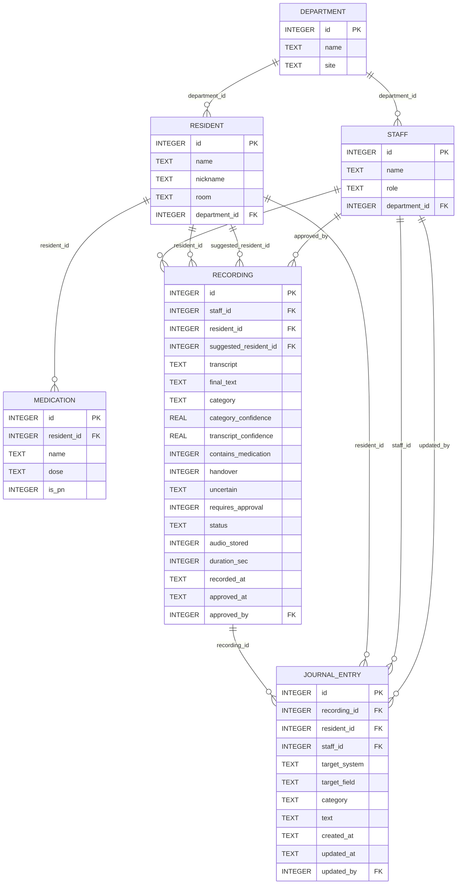
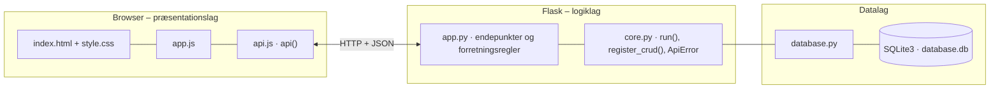

# Habitus – Tale til dokumentation – dokumentation af prototypen

Et **tale-til-tekst-værktøj** til pædagoger og medhjælpere på Habitus' botilbud. Medarbejderen **starter og stopper** optagelsen selv, og talen bliver til tekst.
Systemet **kategoriserer** teksten (observation, udvikling eller medicin), **foreslår beboeren** og **markerer usikkerhed** i stedet for at gætte.
**Medicin** kræver altid manuel bekræftelse. Den godkendte tekst **overføres** til det rette felt i journalsystemet (Sofus) og til Outlook, hvis den er en besked til næste vagt. Lydfilen **slettes**, når teksten er behandlet.

Kravgrundlag: [`Kravspecifikation.md`](Kravspecifikation.md)

## Hvad kan prototypen

| Skærm | Funktion |
|---|---|
| **Optag** | Stor *Start/Stop*-knap med tydelig status (KLAR → OPTAGER → BEHANDLER → GEMT/AFVENTER). Dansk talegenkendelse i browseren (Web Speech API), hvor den findes, ellers skrives teksten. Beboeren kan vælges før optagelsen. Resultatet viser kategori, beboer, felt, sikkerhed og advarsler. Eksempelknapper udfylder teksten |
| **Til godkendelse** | Udkast, der kræver godkendelse. Medarbejderen kan rette tekst, beboer og kategori, bekræfte medicin og vælge *Godkend og overfør* eller *Forkast* |
| **Journal** | Beboerens medicinliste og alle poster overført til Sofus og Outlook. Poster kan rettes (hvem og hvornår gemmes) og slettes |
| **Overblik** | Nøgletal (optagelser, gemt uden gennemsyn, afventer, medicin, lydfiler ikke slettet, anslået sparet tid) og alle optagelser i afdelingen |
| **Beboere og medicin** | CRUD for beboere og medicinlister |

Medarbejderen vælges i toppen (simuleret login). Man ser kun beboere fra sin egen afdeling, men lederen ser alle.

## Fra krav til kode

| Krav | Implementering |
|---|---|
| Start/stop via brugerinitieret handling med tydelig bekræftelse | *Start/Stop*-knappen i `app.js`. Rød, pulserende knap og statusmærket *OPTAGER* |
| Omdanne tale til tekst (dansk) | `SpeechRecognition` med `lang = "da-DK"` i browseren. Backenden modtager tekst og `transcript_confidence` |
| Kategorisere automatisk | `analyse()` tæller nøgleord pr. kategori og beboerens medicinnavne. Ved lige mange træffere vinder medicin, derefter udvikling |
| Identificere beboeren | Valgt før optagelsen eller foreslået ud fra navn/kaldenavn i talen (`suggested_resident_id`) til efterfølgende bekræftelse |
| Genkende medicin og kræve godkendelse | `contains_medication` → altid `AFVENTER_GODKENDELSE`. `approve()` afviser uden `medication_confirmed` |
| Struktureret udkast til journalsystemets felter | `TARGET_FIELD`: observation → *Døgnrapport*, udvikling → *Handleplan*, medicin → *Medicinmodul – PN-registrering* |
| Øvrigt gemmes med lettere gennemsyn og kan rettes/slettes bagefter | Uden medicin og usikkerhed gemmes posten straks. `PUT`/`DELETE /api/journal/<id>` |
| Overførsel til det relevante system (dobbelt dokumentation) | `save_journal()` skriver til Sofus og desuden til Outlook, når teksten er en besked til næste vagt (*næste vagt*, *husk*, *aftale* …) |
| Markere usikkerhed i stedet for at gætte | `uncertain`: lav talegenkendelse (< 75 %), usikker kategori, ukendt beboer, en anden beboer nævnt, medicin der ikke står på beboerens liste, manglende dosis |
| Rette eller forkaste forkert genkendt information | Godkendelseskortet (tekst, beboer og kategori) og `POST /api/recordings/<id>/reject` |
| Data: konfidensscore, kategori, godkendelsesstatus, tidsstempler | `recording.category_confidence`, `transcript_confidence`, `status`, `recorded_at` og `approved_at` |
| Råoptagelsen slettes efter godkendelse | `audio_stored` sættes til 0 ved godkendelse eller forkastelse og vises i overblikket |
| Sikkerhed: kun autoriserede, adgang pr. afdeling | `current_user()` (401) og `check_resident_access()` (403 for beboere i en anden afdeling) |
| Mere tid til beboerne | `GET /api/stats` anslår sparet tid: 6 min. pr. post ved manuel indtastning minus optagetiden |

## Datamodel



## Eksempel på dataudveksling

Mette optager en besked om Mo uden at vælge beboer. Systemet genkender kaldenavnet, finder medicin og kræver godkendelse:

```bash
curl -X POST http://localhost:5204/api/recordings \
  -H 'Content-Type: application/json' -H 'X-User-Id: 1' \
  -d '{"transcript": "Mo var meget urolig, så han fik 10 mg Atarax klokken 15.", "transcript_confidence": 0.93, "duration_sec": 8}'
```

Svar `201` (forkortet):

```json
{
  "recording": {
    "id": 4,
    "status": "AFVENTER_GODKENDELSE",
    "category": "MEDICIN",
    "category_confidence": 0.67,
    "transcript_confidence": 0.93,
    "contains_medication": 1,
    "suggested_resident_name": "Morten Dahl",
    "target_field": "Medicinmodul – PN-registrering",
    "uncertain": [
      { "type": "KATEGORI", "text": "Usikker på kategorien – foreslår medicin. Vælg den rigtige." }
    ],
    "audio_stored": 1
  },
  "keywords": { "MEDICIN": ["mg", "atarax"], "UDVIKLING": [], "OBSERVATION": ["urolig"] },
  "message": "Udkastet afventer din godkendelse."
}
```

## Kør prototypen

```bash
cd backend
python3 -m venv .venv && source .venv/bin/activate   # første gang
pip install -r requirements.txt                       # første gang
python app.py
```

Terminalen skriver ` * Åbn http://localhost:5204`. Åbn adressen i browseren. Flask serverer både API'et (`/api/...`) og frontenden.

- **Port:** Prototypen bruger port **5204** (5200 + projektnummer). Er porten optaget, vælger `run()` i `core.py` selv den næste ledige og skriver fx ` * Port 5204 er optaget – bruger port 5205 i stedet`. Du kan også vælge port selv med `PORT=5300 python app.py`.
- **Stop serveren** med `Ctrl` + `C` i terminalen, hvor den kører.
- **Kodeændringer:** Serveren kører i debug-tilstand og genstarter selv, når du gemmer en `.py`-fil. Den bliver på samme port. Ændringer i `frontend/` kræver kun, at du genindlæser siden.
- **Database:** `backend/database.db` oprettes med testdata ved første start. Nulstil den med `python database.py --reset`, mens serveren er stoppet.
- **Tjek at backenden svarer:** `curl http://localhost:5204/api/health`

### Fejlfinding

| Problem | Årsag | Løsning |
|---|---|---|
| ` * Port 5204 er optaget – bruger port …` | En anden proces, ofte en glemt server, bruger porten | Brug den adresse, der står i terminalen. Se hvad der optager porten med `lsof -nP -iTCP:5204 -sTCP:LISTEN`. En Flask-server i debug-tilstand er to processer, så stop dem begge med `lsof -t -iTCP:5204 -sTCP:LISTEN \| xargs kill` |
| `ModuleNotFoundError: No module named 'flask'` | Det virtuelle miljø er ikke aktiveret, eller Flask er ikke installeret | `source .venv/bin/activate` og `pip install -r requirements.txt` |
| Siden viser "Kan ikke hente data fra backenden" | Serveren kører ikke, eller `index.html` er åbnet direkte fra disken, mens serveren kører på en anden port | Start serveren og åbn adressen fra terminalen i stedet for filen |
| Tallene passer ikke efter mange tests | Databasen indeholder testdata fra tidligere afprøvninger | Stop serveren og kør `python database.py --reset` |
| `no such table …` | `database.db` er tom eller ødelagt | `python database.py --reset` |

## Arkitektur

Prototypen følger holdets fælles tre-lags struktur (se [`../README.md`](../README.md)):



| Fil | Lag | Indhold |
|---|---|---|
| `frontend/index.html` | Præsentation | Skærmbilleder som faneblade og formularer. Projektets farver og `data-api-port` |
| `frontend/app.js` | Præsentation | Henter data med `api()`, tegner dem i DOM'en og sender formularer |
| `frontend/api.js` | Præsentation | Fælles for alle prototyper: `api()` (fetch + JSON), `h()`, `renderTable()`, `fillSelect()`, `formToJson()`, `bindCrudForm()` og `toast()` |
| `frontend/style.css` | Præsentation | Fælles responsivt design |
| `backend/app.py` | Logik | Projektets forretningsregler og endepunkter |
| `backend/core.py` | Logik | Fælles: `create_app()` (Flask, CORS, JSON-fejl), `run()` (start på ledig port), `ApiError` og `register_crud()` |
| `backend/database.py` | Data | Fælles: forbindelse, `query_all/query_one/execute`, `transaction()` og `init_db()` |
| `backend/schema.sql` · `seed.sql` | Data | Tabeller og fiktive testdata |

Alle fejl returneres som JSON (`{"error": "…", "path": "/api/…"}`) med statuskode 400, 401, 403, 404 eller 409 og vises som en rød besked i frontenden.
Nederst på siden kan man åbne **"Seneste JSON-svar fra API'et"** og se den rå dataudveksling.
Den fulde endepunktsliste står i [`backend/README.md`](backend/README.md).

## Design og responsivitet

- Samme stylesheet i alle prototyper. Kun farverne (`--brand`, `--brand-dark`, `--brand-soft`) sættes i `index.html`.
- Layoutet virker fra mobil (375 px) til desktop uden vandret scroll. Kort lægger sig under hinanden på små skærme, og brede tabeller scroller inde i deres kort.
- Formularfelter kan ikke blive bredere end deres kort. En `<select>` med lange valgmuligheder skubber altså ikke formularen ud over kanten.
- Beskeder vises kort i toppen (grøn = gennemført, rød = fejl fra serveren).


## Testdata og testbrugere

| Medarbejder | Rolle | Afdeling | Ser beboerne |
|---|---|---|---|
| Mette | Pædagog | Egen | Kasper, Lone, Mo |
| Ali | Medhjælper | Egen | Kasper, Lone, Mo |
| Jonas | Pædagog | Birk | Signe |
| Birgit | Leder | Egen | Alle |

Hver beboer har en medicinliste (fx Mo: Risperidon og Atarax PN). Journalen indeholder tre godkendte optagelser.

## Afgrænsning

Talegenkendelsen sker i browseren (Chrome/Edge/Safari). Ingen lydfil sendes til serveren, så "sletning af lydfilen" er vist som status (`audio_stored`).
Kategoriseringen er regelbaseret (nøgleord) og ikke en sprogmodel. Ingen rigtig integration med Sofus eller Outlook: overførslen vises som poster i journalen.
Login er simuleret, og siden *Beboere og medicin* har ingen rollekontrol.
