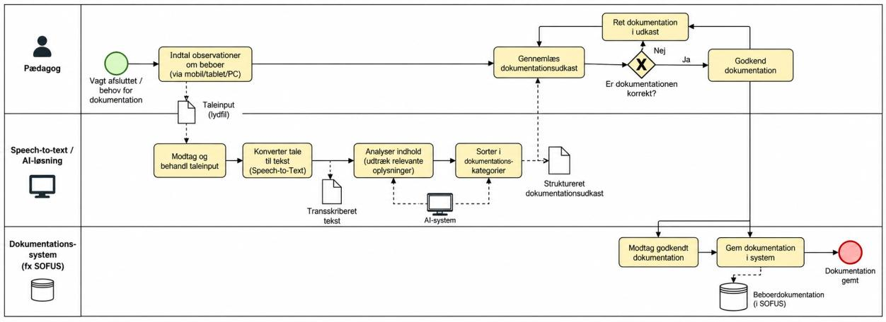

# Kravspecifikation – Speech-to-text dokumentationsværktøj til botilbud (Habitus)

> Konverteret til markdown fra `Kravspecifikation af prototype.pdf`. Tekst og figurer er gengivet som i originaldokumentet.

*The Template*

## Project Drivers – reasons and motivators for the project

### 1. The Purpose of the Project

*The reason for making the investment in building the product and the business advantage that you want to achieve by doing so*

At udvikle et speech-to-text-baseret dokumentationsværktøj til medhjælpere/pædagoger på botilbud, som automatisk genkender og forstår talens indhold, dokumenterer det korrekt, og sender det til de rette systemer/felter, for at reducere tidsforbrug på manuel dokumentation og frigøre mere tid til direkte borgerkontakt.

### 2. The Client, the Customer, and other Stakeholders

*The people with an interest in or an influence on the product*

Habitus er projektets kunde, med det pædagogiske personale på botilbuddene som det centrale afsæt for projektet. Løsningen udvikles i første omgang specifikt til Habitus, men kan på sigt potentielt udbredes til resten af branchen. Øvrige interessenter: pædagogisk personale/medhjælpere (primære brugere), beboerne (indirekte påvirket), ledelsen på botilbuddene, Socialtilsynet (dokumentationskrav), Datatilsynet (persondata).

### 3. Users of the Product

*The intended end users, and how they affect the product’s usability*

Pædagoger og medhjælpere på botilbuddene (primære brugere, optager/taler/bruger systemet i hverdagen).

## Functional Requirements – the functionality of the product

### 7. The Scope of the Work

*The business area or domain under study*

Det pædagogiske dokumentationsarbejde på botilbud, herunder løbende observationer, udviklingsdokumentation af beboere, og videreformidling mellem vagter.

### 8. The Scope of the Product

*A definition of the intended product boundaries and the product’s connections to adjacent systems*

Produktet er en prototype, der optages aktivt af medhjælperen via en start/stop-funktion og omdanner tale om beboeres observationer, udvikling og medicinhåndtering til struktureret dokumentation. Medicin-relateret information underlægges altid en obligatorisk manuel bekræftelse fra medhjælperen, før den gemmes, grundet de højere konsekvenser ved fejl på dette område. Produktet erstatter ikke Habitus' eksisterende journalsystem, men fungerer som et lag oveni, der fanger og strukturerer informationen, inden den sendes videre til det pågældende systems relevante felter.

### 9. Functional and Data Requirements

*The things the product must do and the data manipulated by the functions*

#### Optagelse

- Systemet skal kunne starte og stoppe lydoptagelse via en brugerinitieret handling (fx en fysisk eller digital knap)
- Systemet skal give en tydelig visuel/lydmæssig bekræftelse på, at optagelse er i gang, så medhjælperen aldrig er i tvivl

#### Transskription

- Systemet skal omdanne optaget tale til tekst
- Systemet skal kunne håndtere dansk talesprog, herunder almindelige dialektale variationer

#### Klassificering og forståelse

- Systemet skal automatisk kategorisere den transskriberede tekst (fx observation, udvikling, medicin)
- Systemet skal identificere, hvilken beboer optagelsen vedrører — enten ved at medhjælperen vælger/bekræfter beboeren før optagelse, eller ved at systemet foreslår det ud fra talens indhold til efterfølgende bekræftelse
- Systemet skal specifikt kunne genkende medicin-relateret indhold og markere det til obligatorisk godkendelse (jf. punkt 8)

#### Strukturering og godkendelse

- Systemet skal omdanne den klassificerede tekst til et struktureret udkast, der matcher feltstrukturen i det eksisterende journalsystem
- Medicin-relateret information skal altid vises til obligatorisk manuel bekræftelse, før den gemmes
- Øvrig information (observationer/udvikling) skal kunne gemmes med lettere/valgfrit gennemsyn, men medhjælperen skal altid kunne se, rette eller slette indholdet efterfølgende

#### Overførsel

- Systemet skal kunne overføre den godkendte dokumentation til det relevante felt i Habitus' eksisterende system — eller, hvis fuld integration ikke er teknisk muligt i prototypefasen, demonstrere princippet ved eksport/visning i tilsvarende format

#### Fejlhåndtering

- Systemet skal markere transskription eller klassificering, det er usikkert på, i stedet for at gætte stiltiende
- Systemet skal give medhjælperen mulighed for at rette eller forkaste forkert genkendt information

#### Input-data

- Lydoptagelse (råt lydsignal)
- Metadata: tidspunkt, medhjælper, bosted/afdeling, beboer

#### Afledt/behandlet data

- Transskriberet tekst
- Klassifikationstag (kategori: observation / udvikling / medicin)
- Konfidensscore for, hvor sikker systemet er på transskription og klassificering

#### Gemt/output-data

- Struktureret dokumentationspost, knyttet til beboerens journal
- Godkendelsesstatus (godkendt / afventer godkendelse)
- Tidsstempel for optagelse og for godkendelse

#### Data der bevidst ikke gemmes permanent

- Selve råoptagelsen bør kun opbevares midlertidigt, indtil transskription er godkendt, og derefter slettes

## Non-functional Requirements – the product’s qualities

### 10. Look and Feel Requirements

*The intended appearance*

- Vigtige funktioner som start, stop og pause skal være lette at finde.
- Brugergrænsefladen skal have et professionelt og roligt udtryk.
- Tekst og knapper skal være tydelige og nemme at aflæse.
- Systemet skal vise, hvornår det optager, behandler eller sender information.
- Enheden skal have et enkelt og overskueligt design.

### 11. Usability and Humanity Requirements

*What the product has to be if it is to be successfully used by its intended audience*

- Pædagogerne skal kunne lære at bruge løsningen med begrænset oplæring.
- Det skal være muligt at indtale information hurtigt.
- Systemet skal kunne bruges uden omfattende teknisk viden.
- Pædagogen skal kunne redigere teksten, før den godkendes.
- Systemet skal understøtte pædagogens arbejdsgang frem for at skabe flere administrative opgaver.
- Løsningen skal tage højde for, at medarbejdere har forskellige tekniske kompetencer.

### 12. Performance Requirements

*How fast, big, accurate, safe, reliable, robust, scalable, and long-lasting, and what capacity*

- **Hastighed:** Tale skal omdannes til tekst inden for en acceptabel tidsramme
- **Nøjagtighed:** Systemet skal kunne genkende dansk tale og relevant fagsprog med tilstrækkelig nøjagtighed.
- **Pålidelighed:** Systemet skal fungere stabilt i pædagogernes arbejdstid.
- **Kapacitet:** Systemet skal kunne håndtere flere medarbejdere og dokumentationsopgaver samtidig.
- **Skalerbarhed:** Løsningen skal kunne udvides til flere afdelinger eller botilbud.
- **Robusthed:** Systemet skal kunne håndtere afbrudte forbindelser eller midlertidige fejl.

### 13. Operational and Environmental Requirements

*The product’s intended operating environment*

- Løsningen skal kunne anvendes i pædagogernes daglige arbejdsmiljø.
- Enheden skal kunne anvendes både indendørs og eventuelt udendørs, hvis det er relevant.
- Systemet skal fungere sammen med de relevante IT-systemer.
- Løsningen skal kunne anvendes på de enheder og det netværk, som Habitus godkender.
- Batteriet skal kunne holde til en relevant arbejdsperiode, hvis der anvendes en mobil enhed.
- Systemet skal håndtere situationer med dårlig internetforbindelse, hvis offlinefunktion er nødvendig.

### 14. Maintainability and Support Requirements

*How changeable the product must be and what support is needed*

- Systemet skal kunne opdateres uden unødvendige afbrydelser i arbejdet.
- Der skal være en procedure for håndtering af tekniske fejl.
- Medarbejdere skal have adgang til support.
- Integrationer til Sofus og Outlook skal kunne vedligeholdes ved ændringer.
- Nye funktioner skal kunne tilføjes, hvis behovene ændrer sig.
- Der skal være en plan for oplæring af nye medarbejdere.

### 15. Security Requirements

*The security, confidentiality, and integrity of the product*

- Kun autoriserede medarbejdere skal kunne tilgå dokumentation.
- Oplysninger skal beskyttes under overførsel og opbevaring.
- Systemet skal kunne kontrollere, hvem der har adgang til hvilke data.
- Dokumentationen skal beskyttes mod uautoriserede ændringer.
- Der skal være procedurer for håndtering af fejl og sikkerhedshændelser.
- Optagelser og midlertidige tekstudkast skal håndteres efter fastlagte regler.

### 16. Cultural Requirements

*Human and sociological factors*

- Løsningen skal understøtte Habitus' pædagogiske værdier og arbejdsmetoder.
- Medarbejderne skal opleve, at teknologien hjælper dem frem for at erstatte deres faglige vurderinger.
- Implementeringen skal tage hensyn til medarbejdernes forskellige holdninger til teknologi.
- Pædagogerne skal inddrages i udvikling og afprøvning af løsningen.
- Systemet skal understøtte faglig dokumentation uden at skabe en oplevelse af, at medarbejdernes arbejde bliver upersonligt.

### 17. Legal Requirements

*Conformance to applicable laws*

- Databeskyttelsesforordningen (GDPR).
- Databeskyttelsesloven.
- Regler om behandling af personoplysninger.
- Krav til dokumentation inden for det sociale område.
- Eventuelle krav ved brug af leverandører og cloudtjenester.
- Regler om medarbejderinddragelse, hvis løsningen påvirker arbejdsforholdene.

## User journey map: Fra observation til dokumentation

Hvordan en pædagog i dag registrerer viden om en beboer — og hvordan en tale-til-tekst-løsning kunne ændre forløbet, fra kontakt til beboeren og frem til mere tid i det direkte samvær.

| # | Fase | Trin | Pædagogens handlinger | Udfordringer / behov |
|---|---|---|---|---|
| 1 | Nuværende proces | Kontakt med beboeren | Udfører pædagogiske og praktiske opgaver og observerer relevante forhold omkring beboeren. | Fokus skal være på beboeren — information, der skal dokumenteres senere, kan være svær at huske præcist. |
| 2 | Nuværende proces | Manuel dokumentation | Finder en computer eller anden enhed og skriver informationen ind i et system. | Tidsforbrug ved computerarbejde — arbejdet kan afbryde den direkte kontakt med beboerne. |
| 3 | Nuværende proces | Dobbelt dokumentation | Den samme information registreres i flere systemer, fx Sofus og Outlook, afhængigt af opgavens karakter. | Gentagende arbejde, risiko for fejl og unødvendigt tidsforbrug. |
| 4 | Fremtidig løsning | Tale-til-tekst | Indtaler relevante observationer og informationer via en godkendt enhed. | Løsningen skal være nem at anvende, hurtig og kunne bruges uden at skabe unødvendige afbrydelser. |
| 5 | Fremtidig løsning | Filtrering og fordeling | Systemet omdanner tale til tekst og identificerer, hvilke oplysninger der hører til i de forskellige systemer. | Kræver præcis kategorisering, høj datasikkerhed og kontrol, så oplysninger ikke placeres forkert. |
| 6 | Fremtidig løsning | Godkendelse | Gennemser, retter og godkender den genererede dokumentation, inden den gemmes eller sendes. | Pædagogen skal kunne stole på resultatet, men fortsat have ansvaret for, at dokumentationen er korrekt. |
| 7 | Ønsket resultat | Mere tid til beboerne | Mindre tid bruges på gentagen manuel indtastning, så der potentielt frigøres tid til direkte beboerkontakt. | Løsningen skal give en reel tidsbesparelse uden at gå på kompromis med dokumentationskvalitet eller borgernes sikkerhed. |

## BPMN

