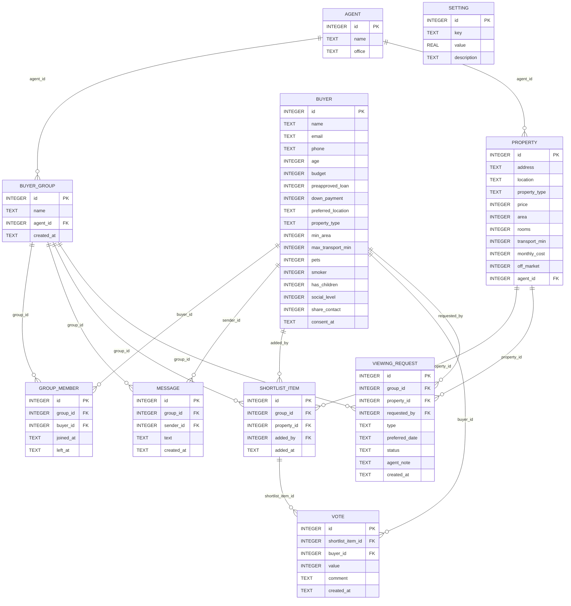
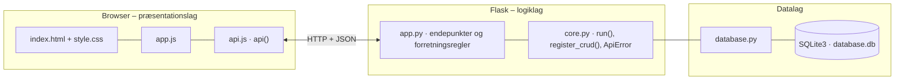

# &LIVING Buyer Matchmaking – dokumentation af prototypen

Købere, der ikke har råd til deres drømmebolig alene, kan finde **kompatible medkøbere** og **slå deres købekraft sammen**.
Systemet beregner en **matchscore** ud fra økonomisk kompatibilitet og livsstil. Matchede købere danner en **gruppe**, skriver sammen uden at dele kontaktoplysninger og finder **boliger inden for gruppens samlede købekraft**, også boliger, der ikke er offentligt annonceret (skuffesager).
Gruppen **stemmer** på en fælles shortlist og **anmoder om fremvisning**, og &LIVINGs mægler får **kvalificerede købergrupper**. Brugerfladen er på engelsk som kravspecifikationen.

Kravgrundlag: [`Requirement_Specifications.md`](Requirement_Specifications.md)

## Hvad kan prototypen

| Skærm | Funktion |
|---|---|
| **My profile** | Køberprofil med budget, forhåndsgodkendt lån, udbetaling, område, boligtype, mindste areal, maks. transporttid og livsstil (kæledyr, rygning, børn, social rytme). Valg om at dele kontaktoplysninger og samtykke til match, som kan trækkes tilbage |
| **Matches** | Købere med en score over grænsen, bedste først. Viser økonomi- og livsstilsscore, begrundelser, samlet købekraft og *Connect* / *Invite to our group* |
| **Our group** | Gruppens samlede købekraft, pladsbehov og medlemmer (kontakt kun, hvis delt), beskeder og *Leave group* |
| **Homes** | Boliger inden for købekraft og areal med match (fit), pris pr. køber, begrundelser, markering af skuffesager og *Save to shortlist* |
| **Shortlist & viewings** | Fælles shortlist med 👍/👎 og kommentarer, sorteret efter stemmer. Anmodning om åbent hus eller privat fremvisning og status på anmodningerne |
| **&LIVING agent** | Kvalificerede grupper (mindst 2 medlemmer) med købekraft og behov, fremvisninger der kan bekræftes eller afvises, og CRUD for boligporteføljen |

Køberen vælges i toppen (simuleret login).

## Fra krav til kode

| Krav (afsnit 9 m.fl.) | Implementering |
|---|---|
| Profiles: budget, lån, udbetaling, område, type, areal, transport, livsstil | Tabellen `buyer` og CRUD (`/api/buyers`) |
| Buyer matching: økonomisk kompatibilitet og livsstil | `match_score()`: økonomi (budgetlighed 60 % og udbetalingsandel 40 %, −30 % uden forhåndsgodkendt lån) og livsstil (område 25, type 20, rygning 15, transport 10, kæledyr 10, børn 10, social rytme 10). `GET /api/matches` |
| Property matching: samlet købekraft og pladsbehov | `group_power()`: sum af lån + udbetaling. Areal = største mindsteareal + 15 m² pr. ekstra medlem. `GET /api/groups/<id>/properties` |
| Skuffesager | `property.off_market` vises som *Off-market – only via &LIVING* |
| Messaging før deling af kontaktoplysninger | `POST /api/groups/<id>/messages`. `public_profile()` viser kun e-mail og telefon, hvis `share_contact = 1` |
| Shared shortlists: gem, stem og diskutér | `shortlist_item` og `vote` (én stemme pr. køber, en ny stemme erstatter den gamle) |
| Viewing requests via den fælles profil | `POST /api/groups/<id>/viewings`. Mægleren svarer med `PUT /api/viewings/<id>` |
| Qualified buyer groups til mægleren | `GET /api/agent/groups` |
| Missing: hvordan man danner og forlader en gruppe | `POST /api/groups` (connect/invite) og `POST /api/groups/<id>/leave`. Historikken bevares i `group_member.left_at` |
| Missing: vægte, grænser og gruppestørrelse | Tabellen `setting`: `financial_weight` 0,5, `min_match_score` 55, `max_group_size` 4 og `extra_area_per_member` 15 kan ændres uden ny kode |
| Security: samtykke, ingen deling af detaljer | `consent_at` skal være sat for at blive matchet og forbinde (403). Budget vises kun som interval (`budget_band`) |
| Usability: information samlet ét sted | Gruppesiden samler købekraft, behov, medlemmer og beskeder, og hver match og bolig viser begrundelser |

## Datamodel



## Eksempel på dataudveksling

Sofie søger match. Oliver passer bedst: samme område, boligtype, familiesituation og næsten samme budget:

```bash
curl http://localhost:5205/api/matches -H 'X-User-Id: 5'
```

Svar `200` (forkortet):

```json
{
  "min_score": 55,
  "matches": [
    {
      "buyer": { "id": 6, "name": "Oliver", "age": 33, "preferred_location": "Aarhus N", "property_type": "TOWNHOUSE", "budget_band": "3.00–3.25 m DKK" },
      "score": 94,
      "financial": 95,
      "lifestyle": 92,
      "reasons": ["Similar budgets", "Both want to live in Aarhus N", "Both look for a townhouse", "Similar commute tolerance",
                  "Same smoking habits", "Same family situation", "Similar social rhythm"],
      "in_group": false,
      "combined_power": 6050000
    }
  ]
}
```

## Kør prototypen

```bash
cd backend
python3 -m venv .venv && source .venv/bin/activate   # første gang
pip install -r requirements.txt                       # første gang
python app.py
```

Terminalen skriver ` * Åbn http://localhost:5205`. Åbn adressen i browseren. Flask serverer både API'et (`/api/...`) og frontenden.

- **Port:** Prototypen bruger port **5205** (5200 + projektnummer). Er porten optaget, vælger `run()` i `core.py` selv den næste ledige og skriver fx ` * Port 5205 er optaget – bruger port 5206 i stedet`. Du kan også vælge port selv med `PORT=5300 python app.py`.
- **Stop serveren** med `Ctrl` + `C` i terminalen, hvor den kører.
- **Kodeændringer:** Serveren kører i debug-tilstand og genstarter selv, når du gemmer en `.py`-fil. Den bliver på samme port. Ændringer i `frontend/` kræver kun, at du genindlæser siden.
- **Database:** `backend/database.db` oprettes med testdata ved første start. Nulstil den med `python database.py --reset`, mens serveren er stoppet.
- **Tjek at backenden svarer:** `curl http://localhost:5205/api/health`

### Fejlfinding

| Problem | Årsag | Løsning |
|---|---|---|
| ` * Port 5205 er optaget – bruger port …` | En anden proces, ofte en glemt server, bruger porten | Brug den adresse, der står i terminalen. Se hvad der optager porten med `lsof -nP -iTCP:5205 -sTCP:LISTEN`. En Flask-server i debug-tilstand er to processer, så stop dem begge med `lsof -t -iTCP:5205 -sTCP:LISTEN \| xargs kill` |
| `ModuleNotFoundError: No module named 'flask'` | Det virtuelle miljø er ikke aktiveret, eller Flask er ikke installeret | `source .venv/bin/activate` og `pip install -r requirements.txt` |
| Siden viser "Kan ikke hente data fra backenden" | Serveren kører ikke, eller `index.html` er åbnet direkte fra disken, mens serveren kører på en anden port | Start serveren og åbn adressen fra terminalen i stedet for filen |
| Tallene passer ikke efter mange tests | Databasen indeholder testdata fra tidligere afprøvninger | Stop serveren og kør `python database.py --reset` |
| `no such table …` | `database.db` er tom eller ødelagt | `python database.py --reset` |

## Arkitektur

Prototypen følger holdets fælles tre-lags struktur (se [`../README.md`](../README.md)):



| Fil | Lag | Indhold |
|---|---|---|
| `frontend/index.html` | Præsentation | Skærmbilleder som faneblade og formularer. Projektets farver og `data-api-port` |
| `frontend/app.js` | Præsentation | Henter data med `api()`, tegner dem i DOM'en og sender formularer |
| `frontend/api.js` | Præsentation | Fælles for alle prototyper: `api()` (fetch + JSON), `h()`, `renderTable()`, `fillSelect()`, `formToJson()`, `bindCrudForm()` og `toast()` |
| `frontend/style.css` | Præsentation | Fælles responsivt design |
| `backend/app.py` | Logik | Projektets forretningsregler og endepunkter |
| `backend/core.py` | Logik | Fælles: `create_app()` (Flask, CORS, JSON-fejl), `run()` (start på ledig port), `ApiError` og `register_crud()` |
| `backend/database.py` | Data | Fælles: forbindelse, `query_all/query_one/execute`, `transaction()` og `init_db()` |
| `backend/schema.sql` · `seed.sql` | Data | Tabeller og fiktive testdata |

Alle fejl returneres som JSON (`{"error": "…", "path": "/api/…"}`) med statuskode 400, 401, 403, 404 eller 409 og vises som en rød besked i frontenden.
Nederst på siden kan man åbne **"Seneste JSON-svar fra API'et"** og se den rå dataudveksling.
Den fulde endepunktsliste står i [`backend/README.md`](backend/README.md).

## Design og responsivitet

- Samme stylesheet i alle prototyper. Kun farverne (`--brand`, `--brand-dark`, `--brand-soft`) sættes i `index.html`.
- Layoutet virker fra mobil (375 px) til desktop uden vandret scroll. Kort lægger sig under hinanden på små skærme, og brede tabeller scroller inde i deres kort.
- Formularfelter kan ikke blive bredere end deres kort. En `<select>` med lange valgmuligheder skubber altså ikke formularen ud over kanten.
- Beskeder vises kort i toppen (grøn = gennemført, rød = fejl fra serveren).


## Testdata og testbrugere

| Køber | Område | Bemærkning |
|---|---|---|
| Freja og Jonas | Copenhagen NV | Allerede i gruppen *Freja & Jonas* med shortlist og beskeder. Freja deler sin kontakt |
| Aisha | Valby | Har kæledyr |
| Mikkel | Nørrebro | Ryger, lavt budget |
| Sofie og Oliver | Aarhus N | Familier, der matcher godt (94) |
| Laura | Copenhagen NV | Har ikke givet samtykke og kan ikke matches |

8 boliger i København og Aarhus, heraf 2 skuffesager. 2 mæglere.

## Afgrænsning

Intet rigtigt login, ingen kryptering, ingen verificering af lånetilsagn og ingen integration med &LIVINGs CRM eller boligdatabaser.
Beskeder er almindelige beskeder i gruppen, ikke end-to-end-krypterede. Lånegodkendelse, ejerskabskontrakter og handel er uden for MVP'en (jf. afsnit 8).
