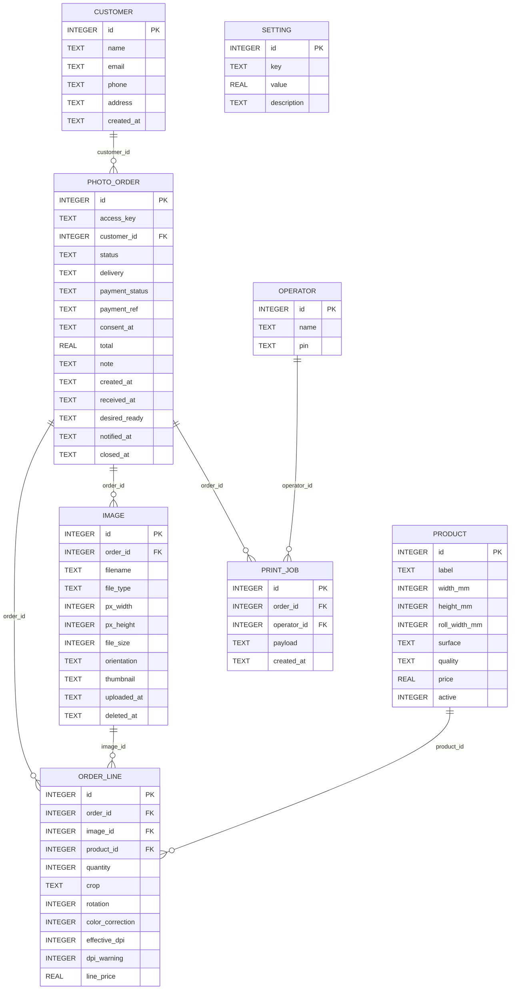
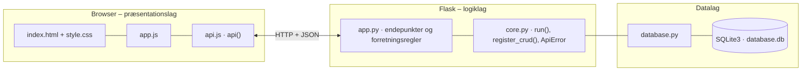

# Fotohuset Click – Bestil print – dokumentation af prototypen

Fotohuset Clicks **egen bestillingsplatform**, der erstatter den eksterne platformspartner. Kunden **uploader** billeder, **vælger format**, overflade, kvalitet og beskæring,
ser **live pris** og får en **advarsel, hvis opløsningen er for lav** til det valgte format. Kunden vælger afhentning eller forsendelse og **betaler** hos betalingsudbyderen. Ordren lander direkte i butikkens **produktionskø**.
Operatøren udskriver en **ordreseddel** grupperet efter papirrullebredde, afleverer **printjobbet til C8**, skifter status, og kunden får besked. Billedfiler **slettes automatisk** efter opbevaringsfristen.

Kravgrundlag: [`Kravspecifikation.md`](Kravspecifikation.md)

## Hvad kan prototypen

| Skærm | Funktion |
|---|---|
| **Bestil print** | Fem trin (§11): **1 Upload** (JPEG/PNG/TIFF med miniature, filstørrelse og pixelmål, eller *Brug eksempelbilleder*) → **2 Vælg format** (størrelse, overflade, kvalitet, beskæring, rotation i trin på 90° og antal med live DPI og pris) → **3 Kurv** → **4 Oplysninger og betaling** (afhentning/forsendelse, samtykke og simuleret betaling, der kan afvises) → **5 Kvittering** |
| **Min ordre** | Find ordren med ordrenummer og adgangsnøgle, se status og indhold (indsigt) og *Slet mine billeder* (sletning på anmodning) |
| **Ordrekø (operatør)** | Log ind med PIN. Køen er sorteret efter ønsket færdigdato og kan filtreres på papirrullebredde. *Ordreseddel* grupperet efter rulle, *Frigiv til print* (printjob til C8), *Markér klar* (kunden får besked) og *Afhentet*. Ordresedlen kan udskrives |
| **Produktkatalog** | CRUD for produkter (format, mål, papirrulle, overflade, kvalitet, pris), indstillinger (DPI-tærskel, opbevaring, fragt, produktionsdage) og de mest bestilte formater |

## Fra krav til kode

| Krav | Implementering |
|---|---|
| FK1 Upload JPEG, TIFF og PNG | `POST /api/orders/<id>/images` afviser andre filtyper. Browseren aflæser pixelmål og laver miniaturen |
| FK2 Miniature og filstørrelse | `image.thumbnail` og `image.file_size`. Vises i trin 1 |
| FK3 Størrelser 89 × 127 til 305 × 1.219 mm | `product` med `CHECK`-grænser. 10 størrelser i kataloget |
| FK4/FK5 Blank/silke og standard/høj kvalitet | `product.surface` og `product.quality`. Høj kvalitet koster 50 % mere i testdata |
| FK6/FK7 Beskæring og rotation i 90°-trin | `order_line.crop` (fyld, tilpas med kant, helt til kant) og `order_line.rotation` |
| FK8 Effektiv DPI og advarsel under tærsklen | `effective_dpi()` følger procesbeskrivelsen 2.4.3 (mm → tommer, pixels ÷ tommer, laveste akse). Tærsklen `dpi_threshold` (150) er en indstilling. Advarslen blokerer ikke og forklarer konsekvensen |
| FK9 Pris pr. ordrelinje og samlet | `validate_line()` og `POST /api/quote` til live pris. `order_view()` giver subtotal, fragt og total |
| FK10/FK11 Levering, navn, e-mail og telefon | `POST /api/orders/<id>/checkout` (adresse kræves ved forsendelse) |
| FK12/FK13 Betalingsbekræftelse og produktionskø | `POST /api/orders/<id>/payment` (simuleret udbyder). Godkendt → `MODTAGET` med `desired_ready` |
| FK14/FK15 Kø sorteret efter færdigdato og filter på rulle | `GET /api/queue?roll_width=` |
| FK16/FK17 Ordreseddel grupperet efter papirrullebredde | `GET /api/orders/<id>/slip` med stregkode, kunde og `roll_groups` (færre rulleskift) |
| FK18 Printjob til C8 | `POST /api/orders/<id>/release` gemmer et JSON-printjob i `print_job`. Formatet er et antaget forslag, fordi det er et åbent punkt (§18) |
| FK19/FK20 Status modtaget → i produktion → klar → afhentet | `PUT /api/orders/<id>/status`, ét trin ad gangen |
| FK21 Underret kunden, når ordren er klar | Statusskift til `KLAR` giver en besked og sætter `notified_at` |
| FK22 Automatisk sletning efter opbevaringsperioden | `purge_images()` (hændelse 10) kører hver gang køen åbnes og kan køres manuelt |
| FK23 Indehaveren redigerer priser og formater | CRUD `/api/products` og `/api/settings`, uden kodeændring (§14) |
| §15 Billeder kun via ordre-id + tilfældig nøgle, operatørlogin, ingen kortdata | `customer_order()` kræver `?key=` (403). `current_operator()` kræver login (401). Betalingen sker hos udbyderen |
| §17 Samtykke, oplyst opbevaring, indsigt og sletning | `consent_at`, teksten i trin 4, *Min ordre* og `DELETE /api/orders/<id>/images` |

**Effektiv DPI (2.4.3):** `dpi = min(px_lang / (mm_lang / 25,4), px_kort / (mm_kort / 25,4))`, afrundet.
Printet vendes efter billedet, så lang side møder lang side. Et telefonbillede på 1.080 × 1.350 px giver fx kun 75 dpi i 30 × 45 cm.

## Datamodel



## Eksempel på dataudveksling

Live kontrol, mens kunden vælger 30 × 45 cm til et billede på 1.080 × 1.350 px:

```bash
curl -X POST http://localhost:5206/api/quote \
  -H 'Content-Type: application/json' \
  -d '{"px_width": 1080, "px_height": 1350, "product_id": 33, "quantity": 1}'
```

Svar `200`:

```json
{
  "effective_dpi": 75,
  "dpi_warning": "Billedet har kun 75 dpi i 30 × 45 cm (anbefalet mindst 150). Printet kan blive uskarpt. Vælg et mindre format for et skarpere billede.",
  "unit_price": 99.0,
  "line_price": 99.0
}
```

## Kør prototypen

```bash
cd backend
python3 -m venv .venv && source .venv/bin/activate   # første gang
pip install -r requirements.txt                       # første gang
python app.py
```

Terminalen skriver ` * Åbn http://localhost:5206`. Åbn adressen i browseren. Flask serverer både API'et (`/api/...`) og frontenden.

- **Port:** Prototypen bruger port **5206** (5200 + projektnummer). Er porten optaget, vælger `run()` i `core.py` selv den næste ledige og skriver fx ` * Port 5206 er optaget – bruger port 5207 i stedet`. Du kan også vælge port selv med `PORT=5300 python app.py`.
- **Stop serveren** med `Ctrl` + `C` i terminalen, hvor den kører.
- **Kodeændringer:** Serveren kører i debug-tilstand og genstarter selv, når du gemmer en `.py`-fil. Den bliver på samme port. Ændringer i `frontend/` kræver kun, at du genindlæser siden.
- **Database:** `backend/database.db` oprettes med testdata ved første start. Nulstil den med `python database.py --reset`, mens serveren er stoppet.
- **Tjek at backenden svarer:** `curl http://localhost:5206/api/health`

### Fejlfinding

| Problem | Årsag | Løsning |
|---|---|---|
| ` * Port 5206 er optaget – bruger port …` | En anden proces, ofte en glemt server, bruger porten | Brug den adresse, der står i terminalen. Se hvad der optager porten med `lsof -nP -iTCP:5206 -sTCP:LISTEN`. En Flask-server i debug-tilstand er to processer, så stop dem begge med `lsof -t -iTCP:5206 -sTCP:LISTEN \| xargs kill` |
| `ModuleNotFoundError: No module named 'flask'` | Det virtuelle miljø er ikke aktiveret, eller Flask er ikke installeret | `source .venv/bin/activate` og `pip install -r requirements.txt` |
| Siden viser "Kan ikke hente data fra backenden" | Serveren kører ikke, eller `index.html` er åbnet direkte fra disken, mens serveren kører på en anden port | Start serveren og åbn adressen fra terminalen i stedet for filen |
| Tallene passer ikke efter mange tests | Databasen indeholder testdata fra tidligere afprøvninger | Stop serveren og kør `python database.py --reset` |
| `no such table …` | `database.db` er tom eller ødelagt | `python database.py --reset` |

## Arkitektur

Prototypen følger holdets fælles tre-lags struktur (se [`../README.md`](../README.md)):



| Fil | Lag | Indhold |
|---|---|---|
| `frontend/index.html` | Præsentation | Skærmbilleder som faneblade og formularer. Projektets farver og `data-api-port` |
| `frontend/app.js` | Præsentation | Henter data med `api()`, tegner dem i DOM'en og sender formularer |
| `frontend/api.js` | Præsentation | Fælles for alle prototyper: `api()` (fetch + JSON), `h()`, `renderTable()`, `fillSelect()`, `formToJson()`, `bindCrudForm()` og `toast()` |
| `frontend/style.css` | Præsentation | Fælles responsivt design |
| `backend/app.py` | Logik | Projektets forretningsregler og endepunkter |
| `backend/core.py` | Logik | Fælles: `create_app()` (Flask, CORS, JSON-fejl), `run()` (start på ledig port), `ApiError` og `register_crud()` |
| `backend/database.py` | Data | Fælles: forbindelse, `query_all/query_one/execute`, `transaction()` og `init_db()` |
| `backend/schema.sql` · `seed.sql` | Data | Tabeller og fiktive testdata |

Alle fejl returneres som JSON (`{"error": "…", "path": "/api/…"}`) med statuskode 400, 401, 403, 404 eller 409 og vises som en rød besked i frontenden.
Nederst på siden kan man åbne **"Seneste JSON-svar fra API'et"** og se den rå dataudveksling.
Den fulde endepunktsliste står i [`backend/README.md`](backend/README.md).

## Design og responsivitet

- Samme stylesheet i alle prototyper. Kun farverne (`--brand`, `--brand-dark`, `--brand-soft`) sættes i `index.html`.
- Layoutet virker fra mobil (375 px) til desktop uden vandret scroll. Kort lægger sig under hinanden på små skærme, og brede tabeller scroller inde i deres kort.
- Formularfelter kan ikke blive bredere end deres kort. En `<select>` med lange valgmuligheder skubber altså ikke formularen ud over kanten.
- Beskeder vises kort i toppen (grøn = gennemført, rød = fejl fra serveren).


## Testdata og testbrugere

40 produkter (10 størrelser × blank/silke × standard/høj). Operatører: **Martin (indehaver)** med PIN `1234` og **Deltidsansat** med PIN `0000`.
To betalte ordrer i køen: ordre 1 (Grethe, afhentning, nøgle `demo-grethe`) og ordre 2 (Ali, forsendelse, i produktion, nøgle `demo-ali`).
*Brug eksempelbilleder* uploader tre billeder, hvoraf det ene har for lav opløsning til store formater.

## Afgrænsning

Selve billedfilen gemmes ikke. Prototypen gemmer metadata og en lille miniature (i virkeligheden filstorage med reference fra `image`).
TIFF-miniaturer vises kun i browsere, der kan læse TIFF (Safari). Betaling, SMS/e-mail og aflevering til C8/DL600 er simuleret, og C8-formatet er et åbent punkt.
Operatørlogin er en simpel PIN uden sessioner. Ingen kundekonto (§26 Waiting room).
