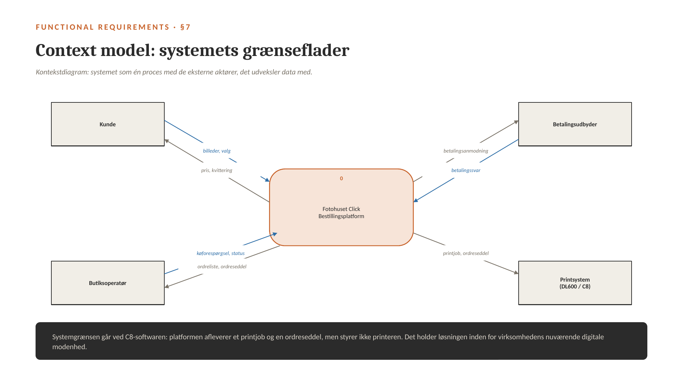
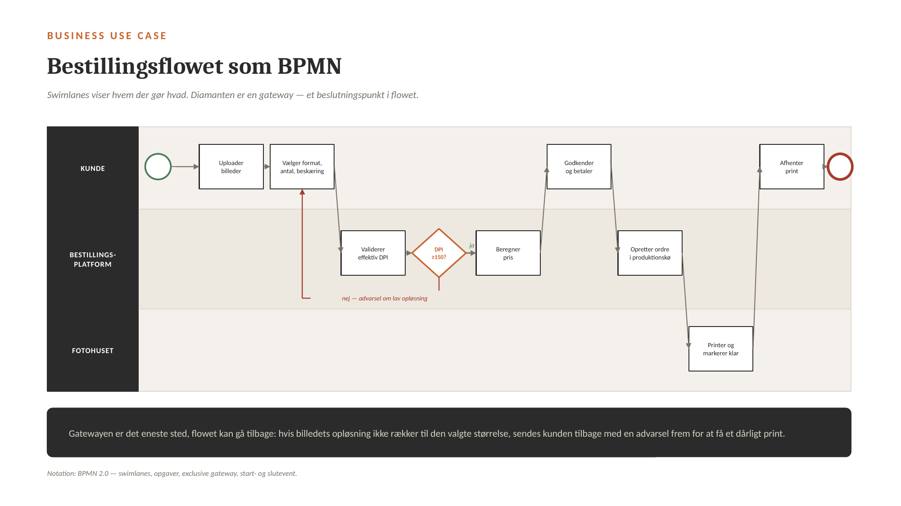
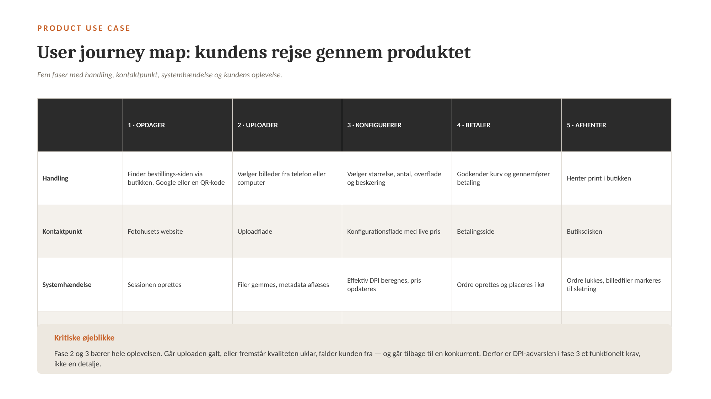
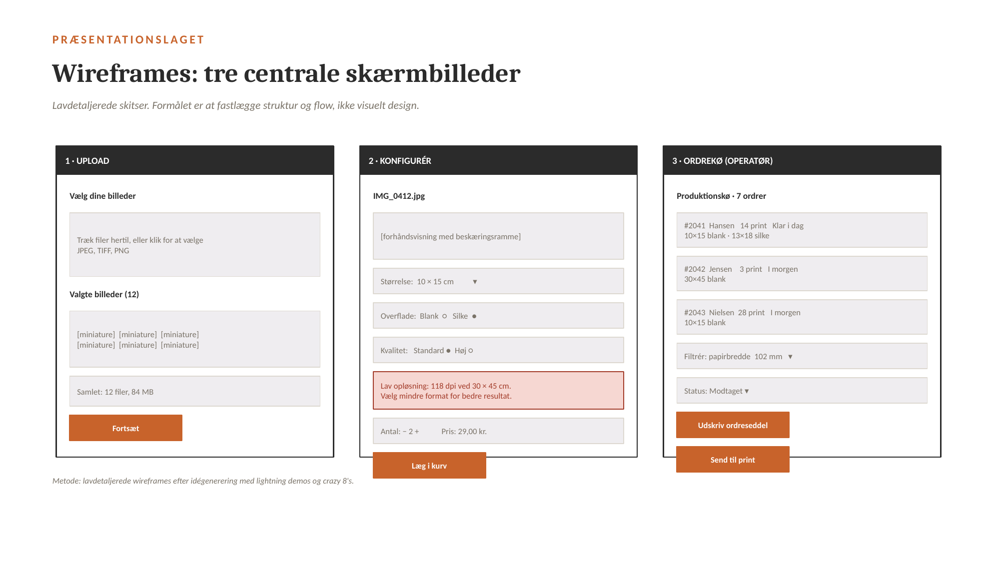
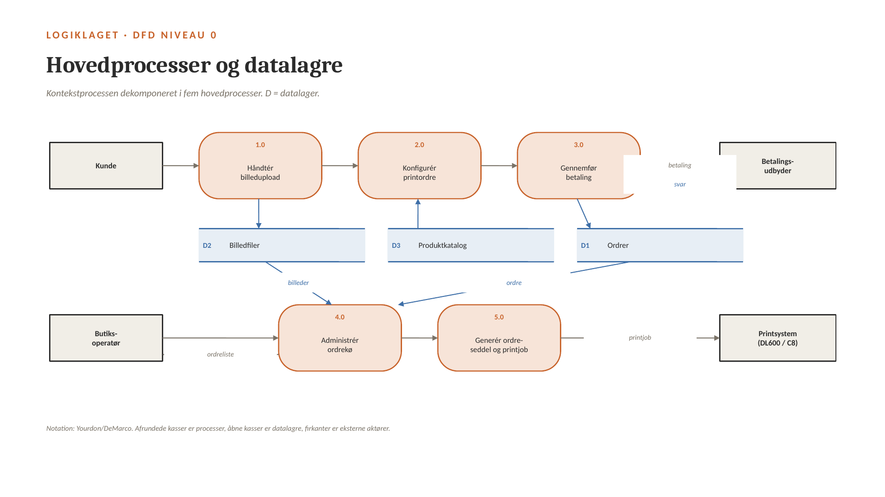
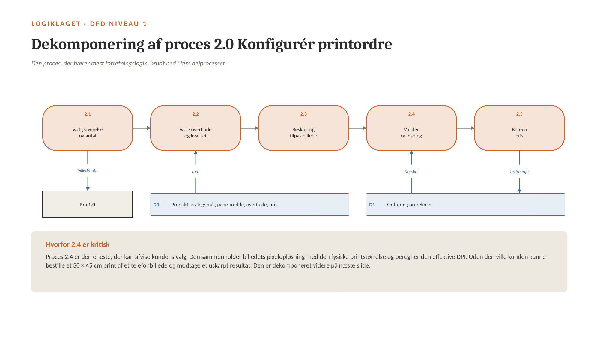
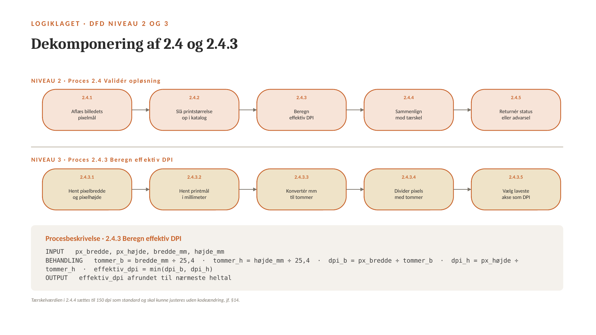
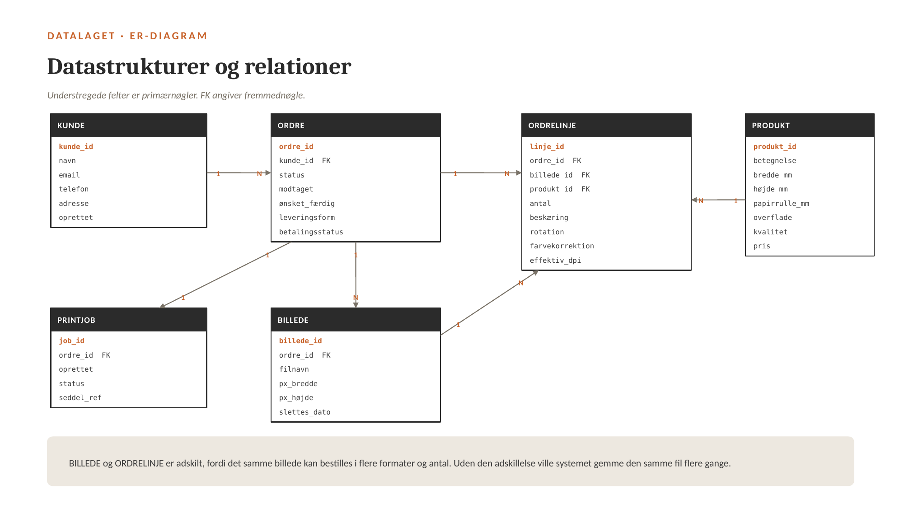

# Kravspecifikation – Fotohuset Click Bestillingsplatform

> Konverteret til markdown fra `Kravspecifikation_Fotohuset_Click.pdf`. Tekst og figurer er gengivet som i originaldokumentet.

En digital bestillingsplatform, hvor kunden selv sammensætter sin printordre, og hvor ordren lander direkte i butikkens produktionskø.

Forløb 3.1 · Erhvervsakademi København · 25. september 2026

Struktureret efter The Template — Volere Requirements Specification Template (Robertson & Robertson). Prototypen er dokumenteret med traditional approach: BPMN, user journey map, dataflowdiagrammer på kontekst-, 0-, 1-, 2- og 3-niveau, procesbeskrivelse, event-tabel, dataflow-definitioner og ER-diagram.

## Læsevejledning

Dokumentet er en kravspecifikation for den prototype, gruppen har udviklet i Forløb 3.1. Indholdet følger The Template, hvor paragrafnumrene (§1–§27) refererer direkte til skabelonens afsnit. Modelleringen følger traditional approach og er organiseret efter tre-lags arkitekturen, så hver model er placeret i det lag, den beskriver.

| Lag | Modeller i dette dokument | Afsnit |
|---|---|---|
| Præsentationslaget | Lightning demos, crazy 8's, wireframes | 6.1 |
| Logiklaget | DFD kontekst, niveau 0, 1, 2 og 3, procesbeskrivelse, event storming, event-tabel, dataflow-definitioner | 6.2 |
| Datalaget | ER-diagram med primær- og fremmednøgler | 6.3 |

Forretningsprocessen er beskrevet som business use case i BPMN (afsnit 4), og produktet set fra kundens side som product use case i et user journey map (afsnit 5). Funktionelle krav findes i afsnit 7, non-funktionelle krav i afsnit 8.

> **Kort om casen:** Fotohuset Clicks nuværende onlinebestilling af billedprint kører på en ekstern platformspartner, som opsiger samarbejdet inden for få måneder. Billedbestilling er et af butikkens primære forretningsben. Prototypen er virksomhedens egen bestillingsplatform, som skal være i drift, før partneren lukker.

## 1. Project drivers

### §1 Formålet med projektet

**Baggrund**

Fotohuset Clicks nuværende bestillingsflade drives af en ekstern platformspartner, som opsiger samarbejdet inden for få måneder. Billedbestilling er en af virksomhedens primære indtægtskilder med gode marginer. Uden en løsning forsvinder et helt forretningsben. En ny partner kan vælges, men koster opstartsgebyr og 10 % af al omsætning gennem kanalen.

**Forretningsmæssig fordel**

Virksomheden ejer selv kundefladen og undgår opstartsgebyr samt 10 % af omsætningen til en ekstern udbyder.

**Strategisk fordel**

Kunderelationen og ordredata flyttes fra partner til virksomhed. Data om hvad der bestilles, hvornår og i hvilke formater kan bruges til at styre indkøb og prissætning.

**Målbart succeskriterium**

Platformen er i drift, før partneren lukker, og håndterer samme ordrevolumen uden tab af kunder.

*Kilde: opfølgende interview med indehaver Martin Nielsen, september 2026.*

### §2 Interessenter

| Rolle | Interessent | Interesse i produktet |
|---|---|---|
| Klient | Martin Nielsen, indehaver | Beslutningstager og budgetansvarlig |
| Brugere | Privatkunder | Bestiller print via kundefladen |
| Brugere | Butiksoperatør: indehaver og deltidsansat | Arbejder dagligt i ordrekøen |
| Leverandører | Fujifilm — DL600-printer og C8-software | Teknisk grænseflade til produktionen |
| Leverandører | Betalingsudbyder | Gennemfører og bekræfter betaling |
| Leverandører | Hosting- og domæneudbyder | Drift og tilgængelighed |
| Øvrige | photocenter.no — afgående platformspartner | Overgang og eventuel datamigrering |
| Øvrige | Datatilsynet | Tilsyn med behandling af personoplysninger |
| Øvrige | Konkurrerende platformsudbydere | Alternativ løsning, jf. §19 |

> Den afgående partner er interessent, fordi overgangen — herunder eventuel migrering af kundedata og ordrehistorik — afhænger af dem.

### §3 Brugere af produktet

Brugergrupperne er udledt af målgruppeanalysen i eksamensforudsætning 2 (n = 50). Karakteristikaene er styrende for kravene til brugervenlighed i §11.

| Brugergruppe | Teknologikendskab | Brugsfrekvens | Kritiske behov |
|---|---|---|---|
| Privatkunde, 25–45 år | Højt — vant til webshops | Få gange om året | Hurtigt flow, mobilvenligt, tydelig pris |
| Privatkunde, 60+ år | Lavt til middel | Sjældent | Få trin, stor skrift, mulighed for hjælp i butikken |
| Hobbyfotograf / semi-pro | Højt | Regelmæssigt | Kontrol over beskæring, overflade og kvalitet |
| Butiksoperatør | Middel — kender C8 og DL600 | Dagligt | Overblik over kø, hurtig ordreseddel, statusstyring |

**Konsekvens for kravene**

- Den ældre brugergruppe er dimensionerende for brugervenligheden: flowet skal kunne gennemføres uden vejledning.
- Operatørfladen er en selvstændig brugergrænseflade med andre krav end kundefladen. Den bruges dagligt og skal være hurtig frem for pædagogisk.

## 2. Project constraints

### §4 Kravbegrænsninger

- Løsningen skal fungere sammen med den eksisterende Fujifilm Frontier DL600 og C8-softwaren.
- Løsningen må ikke kræve integration til kassesystemet.
- Løsningen skal være i drift, før platformspartneren lukker.
- Løsningen skal kunne vedligeholdes af en virksomhed med to ansatte.
- Budgetrammen er ikke fastlagt af klienten.

### §5 Navnekonventioner og definitioner

| Begreb | Definition |
|---|---|
| Ordre | Samlet bestilling fra én kunde |
| Ordrelinje | Ét billede i ét format i ét antal |
| Produkt | Kombination af størrelse, overflade og kvalitet |
| Printjob | Ordre frigivet til produktion |
| Effektiv DPI | Billedets pixelopløsning divideret med den fysiske printstørrelse i tommer |
| Ordreseddel | Udskrift, der følger ordren fysisk gennem produktionen |
| Papirrullebredde | Bredden på den papirrulle i DL600, et format skal printes fra |

### §6 Relevante fakta og antagelser

**Fakta**

- Fujifilm Frontier DL600 printer fra 127 × 89 mm til 305 × 1.219 mm på rullepapir i bredderne 102, 127, 152, 203, 210, 254 og 305 mm.
- Understøttede overflader er blank (glossy) og silke (luster).
- Opløsning er 720 × 720 dpi i standardtilstand og 1.440 × 1.440 dpi i højkvalitetstilstand.
- DPOF-standarden for fotobestilling specificerer antal kopier, papirstørrelse, orientering, billedtitel, kontaktoplysninger og kontaktark. Den dækker ikke beskæring, rotation, kanter eller farvekorrektion — de felter skal defineres selv.

**Antagelser**

- C8-softwaren kan modtage en ordre i et defineret filformat. Formatet er endnu ikke afklaret og står som åbent punkt i §18.
- Kunderne har deres billeder i digital form og kan uploade dem fra telefon eller computer.
- Betaling kan håndteres af en ekstern udbyder, så kortoplysninger aldrig passerer systemet.

*Kilder: Fujifilm, Frontier DL600 Specifications; DPOF-specifikationen; opfølgende interview med indehaveren.*

## 3. Produktets omfang

### §7 Context model

Kontekstmodellen viser systemet som én proces med de fire eksterne aktører, det udveksler data med. Modellen er samtidig dataflowdiagrammets kontekstniveau og er udgangspunktet for dekomponeringen i afsnit 6.2.



*Figur 1. Kontekstmodel / DFD kontekstniveau. Notation: Yourdon/DeMarco.*

> Systemgrænsen går ved C8-softwaren: platformen afleverer et printjob og en ordreseddel, men styrer ikke printeren. Det holder løsningen inden for virksomhedens nuværende digitale modenhed og fjerner behovet for integration i printerens eget workflow.

### §8 Produktets afgrænsning

| Inden for afgrænsningen | Uden for afgrænsningen |
|---|---|
| Kundevendt bestillingsflade: upload, valg af format, beskæring, kurv | Styring af selve printeren — håndteres fortsat af C8 |
| Prisberegning og validering af opløsning | Integration til kassesystem og bogføring |
| Betalingsflow mod ekstern udbyder | Lagerstyring af papir og blæk |
| Ordrekø med statusstyring for operatøren | Salg af udstyr og øvrige forretningsben |
| Generering af ordreseddel og printjob | Kundekonto med login — se §26 |
| Automatisk sletning af billedfiler efter opbevaringsfrist | Certificeret brugt udstyr — se §26 |

> Afgrænsningen er bevidst snæver: prototypen skal erstatte det, der forsvinder, ikke bygge alt på én gang.

## 4. Business use case: BPMN

Forretningsprocessen er modelleret i BPMN 2.0 med tre swimlanes, så det fremgår hvem der udfører hvilken aktivitet: kunden, bestillingsplatformen og Fotohuset. Diagrammet indeholder startevent, opgaver, en exclusive gateway og slutevent.



*Figur 2. Business use case. Notation: BPMN 2.0 — swimlanes, opgaver, exclusive gateway, start- og slutevent.*

**Procesforløb**

1. Kunden uploader billeder.
2. Kunden vælger format, antal og beskæring.
3. Platformen validerer den effektive DPI for hver ordrelinje.
4. Gateway: er effektiv DPI mindst 150? Hvis nej, sendes kunden tilbage til formatvalget med en advarsel om lav opløsning. Hvis ja, fortsætter flowet.
5. Platformen beregner prisen.
6. Kunden godkender kurven og betaler.
7. Platformen opretter ordren i produktionskøen.
8. Fotohuset printer ordren og markerer den klar.
9. Kunden afhenter printene i butikken.

> Gatewayen er det eneste sted, flowet kan gå tilbage. Hvis billedets opløsning ikke rækker til den valgte størrelse, sendes kunden tilbage med en advarsel frem for at få et dårligt print. Det er en forretningsregel, ikke en teknisk detalje: butikkens omdømme hænger på printkvaliteten.

## 5. Product use case: user journey map

Produktet set fra kundens side. Rejsen er opdelt i fem faser med handling, kontaktpunkt, systemhændelse og kundens oplevelse i hver fase.



*Figur 3. User journey map for privatkunden.*

**Kritiske øjeblikke**

Fase 2 og 3 bærer hele oplevelsen. Går uploaden galt, eller fremstår kvaliteten uklar, falder kunden fra og går tilbage til en konkurrent. Derfor er DPI-advarslen i fase 3 et funktionelt krav (FK8), ikke en detalje.

**Kobling til kravene**

| Fase | Systemhændelse | Krav |
|---|---|---|
| 1 · Opdager | Sessionen oprettes | §10 look and feel, §23 risiko for at kunderne ikke finder siden |
| 2 · Uploader | Filer gemmes, metadata aflæses | FK1, FK2 |
| 3 · Konfigurerer | Effektiv DPI beregnes, pris opdateres | FK3–FK9 |
| 4 · Betaler | Ordre oprettes og placeres i kø | FK10–FK13 |
| 5 · Afhenter | Ordre lukkes, billedfiler markeres til sletning | FK19, FK21, FK22 |

## 6. Tre-lags arkitektur

Arkitekturen er opdelt i tre lag, så brugerflade, forretningslogik og datalagring kan ændres uafhængigt af hinanden. Opdelingen er et konkret svar på kravbegrænsningen om, at løsningen skal kunne vedligeholdes i en virksomhed med to ansatte: et skifte af betalingsudbyder eller en ændring af produktkataloget rører ikke brugerfladen.

| Lag | Indhold |
|---|---|
| Præsentationslaget | Kundeflade: upload, konfiguration, kurv, betaling, kvittering. Operatørflade: ordrekø, ordredetalje, statusskift, udskrift af ordreseddel. |
| Logiklaget | Prisberegning, validering af effektiv DPI, beskæringslogik, køstyring og statusmaskine, generering af ordreseddel og printjob, integration mod betalingsudbyder, automatisk sletning efter frist. |
| Datalaget | Relationsdatabase med kunde, ordre, ordrelinje, billede, produkt og printjob. Filstorage til billedfiler med reference fra billedtabellen. |

### 6.1 Præsentationslaget: visuelt design

#### 6.1.1 Lightning demos

Inden skitseringen gennemgik gruppen eksisterende løsninger for at se, hvad der allerede fungerer, og hvor der er huller. Hver løsning blev gennemgået på få minutter, og de elementer, der var værd at låne, blev noteret.

| Løsning | Element værd at låne | Hul |
|---|---|---|
| Nuværende partnerløsning | Kendt flow for butikkens egne kunder | Fotohuset ejer hverken flade eller data |
| Store europæiske onlineprintudbydere | Miniature-grid, live pris, kurvmetafor | Ingen afhentning i butik, ingen rådgivning |
| Danske kædeløsninger til fotoprint | Få trin, tydelig afhentningsdato | Begrænset udvalg af formater og overflader |
| Print fra telefonens egen fotoapp | Meget lav friktion ved billedvalg | Ingen kontrol over beskæring og kvalitet |

Fællestræk: ingen af de gennemgåede løsninger advarer kunden, når opløsningen er for lav til det valgte format. Det blev udpeget som mulighed for differentiering og indgår som FK8.

#### 6.1.2 Crazy 8's

Hver deltager skitserede otte løsningsforslag på otte minutter. Formålet var mængde og variation, ikke kvalitet. Efter runden blev skitserne hængt op og de bærende idéer udvalgt ved prikafstemning.

- Ét langt flow på én side kontra en trinvis wizard.
- Træk-og-slip af filer kontra et miniature-grid med afkrydsning.
- Mobil-først med direkte import fra kamerarullen.
- Konfiguration pr. billede kontra masseredigering af alle billeder på én gang.
- Advarsel om lav opløsning som blokerende dialog kontra ikke-blokerende advarsel i konteksten.
- Operatørkøen som liste sorteret efter frist kontra kanban med statuskolonner.
- Ordreseddel med stregkode til opslag ved disken.
- QR-kode på ordresedlen, så kunden selv kan se status.

Udvalgt til wireframes: trinvis wizard, miniature-grid, konfiguration pr. billede med masseredigering som senere udvidelse, ikke-blokerende advarsel og operatørkø som sorteret liste. QR-kode og stregkode blev parkeret i §27.

#### 6.1.3 Wireframes

De udvalgte idéer blev omsat til lavdetaljerede wireframes. Formålet er at fastlægge struktur og flow, ikke visuelt design.



*Figur 4. Wireframes for upload, konfiguration og operatørens ordrekø.*

### 6.2 Logiklaget: forretningslogik

Logiklaget er modelleret med dataflowdiagrammer i Yourdon/DeMarco-notation. Kontekstniveauet er vist i afsnit 3 (figur 1) og dekomponeres herunder i niveau 0, 1, 2 og 3. Afrundede kasser er processer, åbne kasser er datalagre (D), og firkanter er eksterne aktører.

#### 6.2.1 DFD niveau 0

Kontekstprocessen dekomponeret i fem hovedprocesser og tre datalagre.



*Figur 5. DFD niveau 0.*

| Proces | Navn | Ansvar |
|---|---|---|
| 1.0 | Håndtér billedupload | Modtager filer, aflæser metadata, gemmer i D2, danner miniaturer |
| 2.0 | Konfigurér printordre | Formatvalg, beskæring, validering af opløsning og prisberegning |
| 3.0 | Gennemfør betaling | Sender betalingsanmodning og modtager svar fra betalingsudbyderen |
| 4.0 | Administrér ordrekø | Viser og sorterer køen, styrer ordrestatus |
| 5.0 | Generér ordreseddel og printjob | Danner ordresedlen og afleverer printjobbet til C8 |

| Datalager | Indhold |
|---|---|
| D1 | Ordrer og ordrelinjer |
| D2 | Billedfiler med metadata |
| D3 | Produktkatalog: mål, papirbredde, overflade, kvalitet, pris |

#### 6.2.2 DFD niveau 1: dekomponering af 2.0 Konfigurér printordre

Proces 2.0 bærer mest forretningslogik og er derfor dekomponeret først.



*Figur 6. DFD niveau 1 — proces 2.0 brudt ned i fem delprocesser.*

| Proces | Navn |
|---|---|
| 2.1 | Vælg størrelse og antal |
| 2.2 | Vælg overflade og kvalitet |
| 2.3 | Beskær og tilpas billede |
| 2.4 | Validér opløsning |
| 2.5 | Beregn pris |

Proces 2.4 er den eneste, der kan afvise kundens valg. Den sammenholder billedets pixelopløsning med den fysiske printstørrelse og beregner den effektive DPI. Uden den ville kunden kunne bestille et 30 × 45 cm print af et telefonbillede og modtage et uskarpt resultat. Den er derfor dekomponeret videre på niveau 2.

#### 6.2.3 DFD niveau 2 og 3: dekomponering af 2.4 og 2.4.3



*Figur 7. DFD niveau 2 (proces 2.4) og niveau 3 (proces 2.4.3).*

| Niveau | Proces | Navn |
|---|---|---|
| 2 | 2.4.1 | Aflæs billedets pixelmål |
| 2 | 2.4.2 | Slå printstørrelse op i katalog |
| 2 | 2.4.3 | Beregn effektiv DPI |
| 2 | 2.4.4 | Sammenlign mod tærskel |
| 2 | 2.4.5 | Returnér status eller advarsel |
| 3 | 2.4.3.1 | Hent pixelbredde og pixelhøjde |
| 3 | 2.4.3.2 | Hent printmål i millimeter |
| 3 | 2.4.3.3 | Konvertér millimeter til tommer |
| 3 | 2.4.3.4 | Divider pixels med tommer |
| 3 | 2.4.3.5 | Vælg laveste akse som effektiv DPI |

#### 6.2.4 Procesbeskrivelse: 2.4.3 Beregn effektiv DPI

```text
INPUT
   px_bredde, px_højde, bredde_mm, højde_mm
BEHANDLING
   tommer_b     = bredde_mm / 25,4
   tommer_h     = højde_mm / 25,4
   dpi_b        = px_bredde / tommer_b
   dpi_h        = px_højde / tommer_h
   effektiv_dpi = min(dpi_b, dpi_h)
OUTPUT
   effektiv_dpi afrundet til nærmeste heltal
```

Tærskelværdien i proces 2.4.4 sættes til 150 dpi som standard og skal kunne justeres uden kodeændring, jf. §14. Den laveste akse vælges, fordi det er den akse, der bestemmer den synlige skarphed i printet.

#### 6.2.5 Event storming

Før event-tabellen blev hændelserne fundet i en event storming-session. Domænehændelserne blev skrevet i datid på gule sedler og lagt på en tidslinje. Derefter blev det for hver hændelse afklaret, hvem eller hvad der udløser den, og hvilke hændelser der er hotspots — steder med uafklaret logik.

Hændelsestidslinje:

> Billeder uploadet → Format valgt → Overflade valgt → Billede beskåret → Opløsning valideret → [Advarsel udsendt] → Pris beregnet → Kurv godkendt → Betaling gennemført → Ordre oprettet → Ordre sat i produktionskø → Ordreseddel udskrevet → Printjob afleveret → Print gennemført → Kunde underrettet → Ordre afhentet → Billedfiler slettet

Hotspots identificeret i sessionen:

- „Printjob afleveret“ — formatet, C8 accepterer, er ukendt. Står som åbent punkt i §18 og som FK18.
- „Billedfiler slettet“ — opbevaringsperioden er ikke fastlagt og skal afvejes mod reklamationer, jf. §17.
- „Kunde underrettet“ — kanalen er ikke valgt (e-mail eller SMS) og er derfor prioriteret som bør-krav FK21.

Hændelserne blev derefter samlet i event-tabellen, hvor hver hændelse kobles til den proces i dataflowdiagrammet, der behandler den. Tabellen er grundlaget for de funktionelle krav.

#### 6.2.6 Event-tabel

| # | Hændelse | Udløser | Input | Proces | Output |
|---|---|---|---|---|---|
| 1 | Billeder uploades | Kunde | Billedfiler | 1.0 | Miniaturer og metadata |
| 2 | Format og antal vælges | Kunde | Produktvalg | 2.1 / 2.2 | Opdateret ordrelinje |
| 3 | Opløsning er utilstrækkelig | System | Pixelmål og printmål | 2.4 | Advarsel til kunde |
| 4 | Kurv godkendes | Kunde | Ordrekurv | 3.0 | Betalingsanmodning |
| 5 | Betaling godkendes | Betalingsudbyder | Betalingssvar | 3.0 / 4.0 | Ordre oprettet i kø |
| 6 | Ordrekø åbnes | Operatør | Forespørgsel | 4.0 | Ordreliste sorteret efter frist |
| 7 | Ordre frigives til print | Operatør | Ordre-ID | 5.0 | Ordreseddel og printjob |
| 8 | Print gennemført | Operatør | Statusskift | 4.0 | Ordre markeret klar |
| 9 | Ordre afhentes | Operatør | Ordre-ID | 4.0 | Ordre lukket |
| 10 | Opbevaringsfrist udløber | Tidsstyret | Ordredato | 1.0 | Billedfiler slettet |

> Hændelse 10 er ikke brugerudløst, men tidsstyret. Den er afgørende for GDPR-kravet i §17 om, at billedfiler ikke opbevares længere end nødvendigt.

#### 6.2.7 Dataflow-definitioner

Notation: = betyder „sammensat af“, + betyder „og“, { } betyder gentagelser, ( ) betyder valgfrit felt.

```text
billedmetadata = billede_id + filnavn + sti + px_bredde + px_højde +
                 filstørrelse + orientering + uploadet

produkt        = produkt_id + betegnelse + bredde_mm + højde_mm +
                 papirrulle_mm + overflade + kvalitet + pris

ordrelinje     = linje_id + billede_id + produkt_id + antal + beskæring +
                 rotation + farvekorrektion + effektiv_dpi + (linjenote)

ordre          = ordre_id + kunde_id + {ordrelinje} + status + modtaget +
                 ønsket_færdig + leveringsform + betalingsstatus + (ordrenote)

kunde          = kunde_id + navn + email + telefon + (adresse) + oprettet

ordreseddel    = ordre_id + kunde + {ordrelinje sorteret efter
                 papirrulle_mm} + totalpris + ønsket_færdig + stregkode

printjob       = job_id + ordre_id + {billedfil + produkt + antal} +
                 oprettet + status
```

> Ordresedlen er defineret med ordrelinjerne sorteret efter papirrullebredde. Det er et bevidst valg: det minimerer antallet af rulleskift på DL600 og dermed operatørens tidsforbrug. Felterne beskæring, rotation og farvekorrektion er tilføjet, fordi DPOF-standarden ikke dækker dem, men et fotolab-workflow kræver dem.

### 6.3 Datalaget: ER-diagram

Datastrukturen er modelleret som et ER-diagram med seks entiteter. Det første felt i hver entitet er primærnøgle, og FK angiver fremmednøgle.



*Figur 8. ER-diagram med primær- og fremmednøgler samt kardinaliteter.*

| Relation | Kardinalitet | Begrundelse |
|---|---|---|
| KUNDE – ORDRE | 1:N | En kunde kan have flere ordrer over tid |
| ORDRE – ORDRELINJE | 1:N | En ordre består af flere ordrelinjer |
| ORDRE – BILLEDE | 1:N | Billederne hører til den ordre, de er uploadet under |
| BILLEDE – ORDRELINJE | 1:N | Samme billede kan bestilles i flere formater og antal |
| PRODUKT – ORDRELINJE | 1:N | Samme produkt kan optræde på mange ordrelinjer |
| ORDRE – PRINTJOB | 1:1 | Én ordre frigives som ét printjob |

BILLEDE og ORDRELINJE er adskilt, fordi det samme billede kan bestilles i flere formater og antal. Uden den adskillelse ville systemet gemme den samme fil flere gange og gøre sletning efter opbevaringsfristen upålidelig.

## 7. Funktionelle krav (§9)

Kravene er nummereret FK1–FK23 og koblet til den proces i dataflowdiagrammet, der realiserer dem. Prioritet M betyder skal (must), B betyder bør (should). Prioriteringen afgør, hvad der indgår i en MVP, før partneren lukker.

### 7.1 Kundefladen

| ID | Krav | Proces | Pri. |
|---|---|---|---|
| FK1 | Systemet skal lade kunden uploade billedfiler i JPEG, TIFF og PNG | 1.0 | M |
| FK2 | Systemet skal vise en miniature og filstørrelse for hvert uploadet billede | 1.0 | M |
| FK3 | Systemet skal tilbyde printstørrelser fra produktkataloget i intervallet 89 × 127 mm til 305 × 1.219 mm | 2.1 | M |
| FK4 | Systemet skal tilbyde overfladerne blank og silke | 2.2 | M |
| FK5 | Systemet skal tilbyde standardkvalitet (720 dpi) og højkvalitet (1.440 dpi) | 2.2 | B |
| FK6 | Systemet skal lade kunden vælge beskæring: fyld, tilpas med kant, eller helt til kant | 2.3 | M |
| FK7 | Systemet skal lade kunden rotere billedet i trin på 90 grader | 2.3 | B |
| FK8 | Systemet skal beregne effektiv DPI og vise en advarsel under den fastsatte tærskel | 2.4 | M |
| FK9 | Systemet skal beregne og vise pris pr. ordrelinje og samlet for ordren | 2.5 | M |
| FK10 | Systemet skal lade kunden vælge afhentning i butik eller forsendelse | 3.0 | M |
| FK11 | Systemet skal registrere navn, e-mail og telefon på kunden | 3.0 | M |
| FK12 | Systemet skal modtage og registrere betalingsbekræftelse fra betalingsudbyderen | 3.0 | M |

Størrelsesintervallet i FK3 følger specifikationen for Fujifilm Frontier DL600.

### 7.2 Operatørfladen og systemet

| ID | Krav | Proces | Pri. |
|---|---|---|---|
| FK13 | Systemet skal placere betalte ordrer i en produktionskø | 4.0 | M |
| FK14 | Systemet skal vise operatøren ordrekøen sorteret efter ønsket færdigdato | 4.0 | M |
| FK15 | Systemet skal lade operatøren filtrere køen efter påkrævet papirrullebredde | 4.0 | B |
| FK16 | Systemet skal generere en ordreseddel med ordre-ID, kundeoplysninger og alle ordrelinjer | 5.0 | M |
| FK17 | Systemet skal gruppere ordrelinjer på ordresedlen efter papirrullebredde | 5.0 | B |
| FK18 | Systemet skal aflevere et printjob i et format, C8-softwaren kan indlæse | 5.0 | M |
| FK19 | Systemet skal understøtte ordrestatus: modtaget, i produktion, klar, afhentet | 4.0 | M |
| FK20 | Systemet skal lade operatøren skifte ordrestatus manuelt | 4.0 | M |
| FK21 | Systemet skal kunne underrette kunden, når ordren er klar til afhentning | 4.0 | B |
| FK22 | Systemet skal slette billedfiler automatisk efter den fastsatte opbevaringsperiode | 1.0 | M |
| FK23 | Systemet skal lade indehaveren redigere produktkatalogets priser og formater | — | M |

> FK18 er kravet med størst usikkerhed: formatet, C8 accepterer, er endnu ikke afklaret og står som åbent punkt i §18. Det er den første tekniske afklaring, der skal foretages, fordi svaret afgør, om afleveringen til produktionen kan automatiseres eller kræver et manuelt indlæsningstrin.

## 8. Non-funktionelle krav (§10–§17)

### §10 Look and feel

- Løsningen skal følge Fotohuset Clicks visuelle identitet og fremstå som butikkens egen, ikke som en generisk webshop.
- Løsningen skal fungere på mobil, tablet og desktop.

### §11 Usability and humanity

- En kunde over 60 år skal kunne gennemføre en bestilling uden vejledning.
- Der må maksimalt være fem trin fra upload til gennemført betaling.
- Sproget skal være dansk, og mindste skriftstørrelse i kundefladen er 16 px.
- Advarsler skal forklare konsekvensen, ikke kun konstatere fejlen.

### §12 Performance

- Upload af 20 billeder à 10 MB skal kunne gennemføres på under to minutter ved 50 Mbit/s.
- Prisberegning og DPI-validering skal vises inden for ét sekund.
- Ordrekøen skal opdateres inden for fem sekunder efter en ny ordre.

### §13 Operational and environmental

- Drift skal ske på hostet webserver uden lokal serverinstallation i butikken.
- Løsningen skal være tilgængelig mindst 99 % af butikkens åbningstid.
- Løsningen skal fungere i Chrome, Safari og Edge i de to seneste versioner.

### §14 Maintainability and support

- Produktkatalog, priser og DPI-tærskel skal kunne ændres uden kodeændring.
- Indehaveren skal kunne tilføje et nyt printformat på under fem minutter.
- Systemet skal kunne overtages af en ekstern udvikler ud fra denne specifikation.

### §15 Security

- Uploadede billeder må kun være tilgængelige via ordre-ID kombineret med en tilfældig adgangsnøgle.
- Al datatransport skal ske over HTTPS.
- Kortoplysninger må ikke lagres i systemet, men håndteres af betalingsudbyderen.
- Operatørfladen skal kræve login.

### §16 Cultural

- Dansk er standardsprog.
- Dato, klokkeslæt og pris vises i danske formater.
- Formater angives i centimeter over for kunden og i millimeter internt.

### §17 Legal

- GDPR: der skal indhentes udtrykkeligt samtykke ved upload af billeder.
- Opbevaringsperioden skal oplyses, og sletning skal ske automatisk, når den udløber.
- Kunden skal have ret til indsigt og sletning på anmodning.
- Der skal indgås databehandleraftale med hosting- og betalingsudbyder.

GDPR-ansvaret flytter fra platformspartneren til Fotohuset Click, når løsningen tages hjem. Det er et nyt problem, som løsningen selv skaber, jf. §20.

## 9. Project issues (§18–§27)

### §18 Åbne punkter

1. Hvilket filformat og hvilken protokol accepterer C8-softwaren ved ordreimport?
2. Kan DL600-workflowet modtage jobs automatisk, eller kræves manuel indlæsning?
3. Hvad er den præcise omsætning på billedbestilling? Grundlaget for business casen mangler.
4. Hvornår lukker platformspartneren præcist? Deadline er kun kendt som „et par måneder“.
5. Kan eksisterende kundedata og ordrehistorik migreres fra partneren?
6. Hvilken opbevaringsperiode for billedfiler er rimelig i forhold til reklamationer?

### §19 Off-the-shelf-alternativer

| Alternativ | Fordel | Ulempe |
|---|---|---|
| Ny platformspartner | Kendt løsning, hurtig at tage i brug | Opstartsgebyr, 10 % af omsætningen og samme afhængighed som i dag |
| Standard webshop med plugin | Lavere udviklingsomkostning | Ikke bygget til printworkflow, papirbredder eller DPI-validering |
| Egenudviklet løsning | Fuld kontrol, fuld margin og egne data | Højere engangsinvestering og eget driftsansvar |

> **Anbefaling:** egenudviklet løsning, fordi den er den eneste, der fjerner afhængigheden og flytter kundedata hjem. Alternativet med ny partner holdes som nødplan, hvis tiden bliver for knap.

### §20 Nye problemer, som løsningen selv skaber

- Virksomheden får selv driftsansvar for en kundevendt platform — et ansvar, partneren bar før.
- GDPR-ansvaret for billedopbevaring flytter fra partner til Fotohuset Click.
- Eksisterende kunder skal informeres om en ny bestillingsadresse, ellers mistes de.

### §21 Opgaver frem mod drift

1. Afklar den tekniske grænseflade til C8 og DL600.
2. Fastlæg produktkatalog med mål, papirbredder og priser.
3. Byg MVP med must-kravene.
4. Test med indehaveren og en pilotgruppe fra målgruppen.
5. Aftal betalingsudbyder og hosting.

### §22 Migrering fra nuværende løsning

1. Afklar om kundedata kan eksporteres fra partneren.
2. Informér eksisterende kunder i butikken og via e-mail.
3. Omdirigér fra den gamle adresse i en overgangsperiode.
4. Kør parallelt indtil partneren lukker.
5. Afslut aftalen formelt.

### §23 Risici og håndtering

| Risiko | Konsekvens | Håndtering |
|---|---|---|
| Kunderne finder ikke den nye side | Tab af omsætning på et hovedforretningsben | Skiltning i butik, omdirigering fra gammel adresse, QR-kode på ordresedler |
| Løsningen er ikke klar, før partneren lukker | Periode uden onlinebestilling | MVP-scope med kun must-krav, midlertidig manuel bestilling via e-mail som nødplan |
| Vedligehold overstiger kapaciteten | Platformen forfalder og fejler | Letvægtsløsning, ekstern supportaftale, katalog redigerbart uden kode |
| Brud på GDPR | Bøde og tab af tillid | Automatisk sletning, minimal datalagring, databehandleraftaler |

### §24 Omkostninger

Engangsudgifter til udvikling og opsætning. Løbende udgifter til hosting, domæne, betalingsgebyr og vedligehold. Beløbene modregnes sparet opstartsgebyr og 10 % af omsætningen på strømmen. Præcise tal kræver afklaring af de åbne punkter i §18.

### §26 Waiting room

- Certificeret brugt udstyr med digitalt kvalitetsbevis.
- Bestilling af digitalisering af gamle medier.
- Kundekonto med ordrehistorik og genbestilling.
- Abonnementsløsning for institutionskunder.

Waiting room rummer de idéer fra idégenereringen, der blev forkastet nu, men ikke forkastet for altid.

### §27 Løsningsidéer, vi ikke vil miste

- QR-kode på ordresedlen til statusopslag.
- SMS-besked når ordren er klar til afhentning.
- Automatisk gruppering af printjobs efter papirbredde.
- Genbestil-knap ud fra tidligere ordrer.
