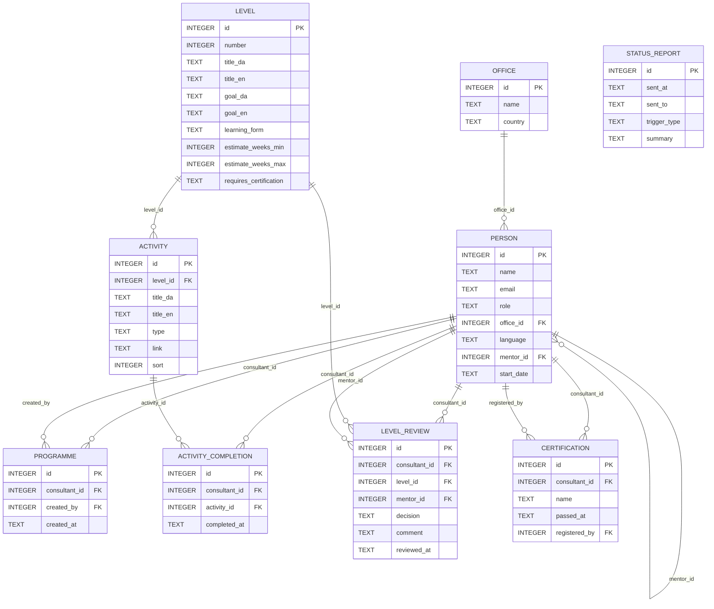
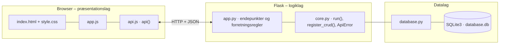

# DYNACAP Academy – dokumentation af prototypen

En portal til DYNACAPs **fælles oplæringsstruktur i seks niveauer**, så nye konsulenter hurtigere kommer ud på kundeprojekter, og alle kontorer arbejder efter samme metode.
**HR** opretter et forløb for hver ny konsulent. **Konsulenten** ser sit niveau, næste skridt og hvad der mangler, og markerer aktiviteter som gennemført.
**Vejlederen** godkender eller afviser niveauet med kommentar, og en godkendelse låser op for næste niveau. **Ledelsen** får en statusrapport pr. kontor.
Indholdet er ens i Danmark og Norge og findes på dansk og engelsk.

Kravgrundlag: [`Kravspecifikation.md`](Kravspecifikation.md)

## Hvad kan prototypen

| Skærm | Rolle | Funktion |
|---|---|---|
| **Min oplæring** | Konsulent | Niveaubar (1–6), aktuelt niveau, *næste skridt*, fremdrift i procent, *følger planen* / *bagud*, tjekliste over aktiviteter (Trailhead-links), låste niveauer, vejlederens vurderinger og registrering af certificeringer |
| **Konsulenter** | Vejleder, HR, ledelse | Oversigt over de konsulenter, man må se, med niveau, fremdrift og *afventer godkendelse*. *Åbn* viser konsulentens forløb. Vejlederen kan *Godkend niveau* / *Afvis* med kommentar |
| **Forløb og indhold** | HR | Opret ny konsulent med forløb og ret niveauer (titel, "kan"-mål på dansk og engelsk, læringsform, estimat, certificeringskrav) og aktiviteter |
| **Statusrapport** | Ledelse, HR | Status pr. kontor (DK og NO): antal konsulenter, gns. niveau, fordeling på niveauer, fuldt oplærte, på kundeprojekt og bagud. *Send statusrapport nu* og log over sendte rapporter |

Brugeren vælges i toppen (simuleret DYNACAP-login), og fanebladene vises efter rolle. *Dansk / English* skifter sproget på alle skærmbilleder.

## Fra krav til kode

| Krav | Implementering |
|---|---|
| F1 Opret forløb med de seks niveauer uden udvikler | `POST /api/consultants` (kun HR) opretter konsulenten og et `programme`. De seks niveauer gælder automatisk |
| F2 Aktuelt niveau, fremdrift og hvad der mangler | `progress()` → `current_level`, `percent`, `next_step` og `missing` pr. niveau. Vises på forsiden efter login |
| F3 Markér aktiviteter som gennemført | `POST /api/consultants/<id>/activities/<id>/toggle` (kun konsulenten selv og kun på det aktuelle niveau) |
| F4 Godkend eller afvis med kommentar | `POST /api/consultants/<id>/levels/<id>/review` gemmer `mentor_id`, `decision`, `comment` og `reviewed_at`. Afvisning kræver en kommentar |
| F5 Næste niveau låses op efter godkendelse | Et niveau er `LÅST`, indtil det forrige har en seneste vurdering `GODKENDT`. Godkendelse kræver, at alle aktiviteter er gennemført |
| F6 Samme indhold og krav på alle kontorer | Niveauer og aktiviteter har intet kontor. Rapporten sammenligner DK og NO på de samme niveauer |
| F7 Statusrapport til ledelsen pr. kontor med fast interval | `GET /api/reports/status` og `POST /api/reports/send`. Intervallet (14 dage) og næste automatiske afsendelse vises. Afsendte rapporter logges i `status_report` |
| F8 Registrér Salesforce-certificeringer | `POST /api/consultants/<id>/certifications`. Niveau 5 kan først godkendes, når *Salesforce Administrator* er registreret |
| 11 Konsulenten ser niveau og næste skridt uden vejledning | Niveaubar og et fremhævet *næste skridt* øverst |
| 14 HR ændrer indhold uden udvikler | CRUD `/api/levels` og `/api/activities`. `only_hr_changes_content()` kræver rollen HR (403) |
| 15 Rollebaseret adgang – konsulenter ser kun egne vurderinger | `can_see()`: konsulent = sig selv, vejleder = egne konsulenter, HR og ledelse = alle. Kun konsulentens egen vejleder kan godkende |
| 16 Dansk og engelsk | `title_da/en` og `goal_da/en` i databasen (`?lang=en`) og `TEXT.da/en` i `app.js` |
| 1 Målbare effekter | `expected_level()` sammenligner med estimaterne (maks. uger ved ca. 20 t/uge), og `on_track` samt *bagud* vises for konsulent og ledelse |

## Datamodel



## Eksempel på dataudveksling

Emma har gennemført de sidste to aktiviteter på niveau 3, og vejlederen Peter godkender niveauet. Svaret er Emmas opdaterede forløb, hvor niveau 4 nu er låst op:

```bash
curl -X POST http://localhost:5207/api/consultants/5/levels/3/review \
  -H 'Content-Type: application/json' -H 'X-User-Id: 3' \
  -d '{"decision": "GODKENDT", "comment": "Flot dokumentation efter standarden."}'
```

Svar `201` (forkortet):

```json
{
  "consultant": { "id": 5, "name": "Emma", "office_id": 1, "mentor_id": 3, "start_date": "2026-06-01" },
  "current_level": 4,
  "approved_levels": 3,
  "expected_level": 4,
  "on_track": true,
  "next_step": "Næste skridt: Første kundeopgave med gennemgang",
  "levels": [
    { "number": 3, "title": "DYNACAP-metoden", "status": "GODKENDT",
      "latest_review": { "decision": "GODKENDT", "comment": "Flot dokumentation efter standarden.", "mentor_name": "Peter (vejleder)" } },
    { "number": 4, "title": "Projekt under supervision", "status": "AKTUEL", "missing": ["Første kundeopgave med gennemgang", "Tre afgrænsede opgaver godkendt af vejleder"] },
    { "number": 5, "title": "Selvstændige opgaver", "status": "LÅST" }
  ]
}
```

Hvis ikke alle aktiviteter er gennemført, svarer serveren `400` med listen over det, der mangler.

## Kør prototypen

```bash
cd backend
python3 -m venv .venv && source .venv/bin/activate   # første gang
pip install -r requirements.txt                       # første gang
python app.py
```

Terminalen skriver ` * Åbn http://localhost:5207`. Åbn adressen i browseren. Flask serverer både API'et (`/api/...`) og frontenden.

- **Port:** Prototypen bruger port **5207** (5200 + projektnummer). Er porten optaget, vælger `run()` i `core.py` selv den næste ledige og skriver fx ` * Port 5207 er optaget – bruger port 5208 i stedet`. Du kan også vælge port selv med `PORT=5300 python app.py`.
- **Stop serveren** med `Ctrl` + `C` i terminalen, hvor den kører.
- **Kodeændringer:** Serveren kører i debug-tilstand og genstarter selv, når du gemmer en `.py`-fil. Den bliver på samme port. Ændringer i `frontend/` kræver kun, at du genindlæser siden.
- **Database:** `backend/database.db` oprettes med testdata ved første start. Nulstil den med `python database.py --reset`, mens serveren er stoppet.
- **Tjek at backenden svarer:** `curl http://localhost:5207/api/health`

### Fejlfinding

| Problem | Årsag | Løsning |
|---|---|---|
| ` * Port 5207 er optaget – bruger port …` | En anden proces, ofte en glemt server, bruger porten | Brug den adresse, der står i terminalen. Se hvad der optager porten med `lsof -nP -iTCP:5207 -sTCP:LISTEN`. En Flask-server i debug-tilstand er to processer, så stop dem begge med `lsof -t -iTCP:5207 -sTCP:LISTEN \| xargs kill` |
| `ModuleNotFoundError: No module named 'flask'` | Det virtuelle miljø er ikke aktiveret, eller Flask er ikke installeret | `source .venv/bin/activate` og `pip install -r requirements.txt` |
| Siden viser "Kan ikke hente data fra backenden" | Serveren kører ikke, eller `index.html` er åbnet direkte fra disken, mens serveren kører på en anden port | Start serveren og åbn adressen fra terminalen i stedet for filen |
| Tallene passer ikke efter mange tests | Databasen indeholder testdata fra tidligere afprøvninger | Stop serveren og kør `python database.py --reset` |
| `no such table …` | `database.db` er tom eller ødelagt | `python database.py --reset` |

## Arkitektur

Prototypen følger holdets fælles tre-lags struktur (se [`../README.md`](../README.md)):



| Fil | Lag | Indhold |
|---|---|---|
| `frontend/index.html` | Præsentation | Skærmbilleder som faneblade og formularer. Projektets farver og `data-api-port` |
| `frontend/app.js` | Præsentation | Henter data med `api()`, tegner dem i DOM'en og sender formularer |
| `frontend/api.js` | Præsentation | Fælles for alle prototyper: `api()` (fetch + JSON), `h()`, `renderTable()`, `fillSelect()`, `formToJson()`, `bindCrudForm()` og `toast()` |
| `frontend/style.css` | Præsentation | Fælles responsivt design |
| `backend/app.py` | Logik | Projektets forretningsregler og endepunkter |
| `backend/core.py` | Logik | Fælles: `create_app()` (Flask, CORS, JSON-fejl), `run()` (start på ledig port), `ApiError` og `register_crud()` |
| `backend/database.py` | Data | Fælles: forbindelse, `query_all/query_one/execute`, `transaction()` og `init_db()` |
| `backend/schema.sql` · `seed.sql` | Data | Tabeller og fiktive testdata |

Alle fejl returneres som JSON (`{"error": "…", "path": "/api/…"}`) med statuskode 400, 401, 403, 404 eller 409 og vises som en rød besked i frontenden.
Nederst på siden kan man åbne **"Seneste JSON-svar fra API'et"** og se den rå dataudveksling.
Den fulde endepunktsliste står i [`backend/README.md`](backend/README.md).

## Design og responsivitet

- Samme stylesheet i alle prototyper. Kun farverne (`--brand`, `--brand-dark`, `--brand-soft`) sættes i `index.html`.
- Layoutet virker fra mobil (375 px) til desktop uden vandret scroll. Kort lægger sig under hinanden på små skærme, og brede tabeller scroller inde i deres kort.
- Formularfelter kan ikke blive bredere end deres kort. En `<select>` med lange valgmuligheder skubber altså ikke formularen ud over kanten.
- Beskeder vises kort i toppen (grøn = gennemført, rød = fejl fra serveren).


## Testdata og testbrugere

| Bruger | Rolle | Kontor | Status |
|---|---|---|---|
| Anne | HR | København | Kan oprette forløb og rette indhold |
| Lars | Ledelse | København | Ser statusrapporten |
| Peter | Vejleder | København | Vejleder for Emma og Noah |
| Ingrid | Vejleder (engelsk) | Oslo | Vejleder for Sigrid og Magnus |
| Emma | Konsulent | København | Niveau 3, mangler to aktiviteter |
| Noah | Konsulent | Aarhus | Niveau 1, mangler én aktivitet |
| Sigrid | Konsulent (engelsk) | Oslo | Niveau 5, alle aktiviteter er gennemført, men certificeringen mangler |
| Magnus | Konsulent (engelsk) | Oslo | Niveau 1 er klar til godkendelse |

## Afgrænsning

Ingen Salesforce-platform, Trailhead-integration, e-mail eller rigtigt DYNACAP-login. Statusrapporten "sendes" ved at blive logget, og den automatiske afsendelse vises som næste dato.
Varighederne er prototype-estimater, som skal valideres med HR (åbent punkt 18).
