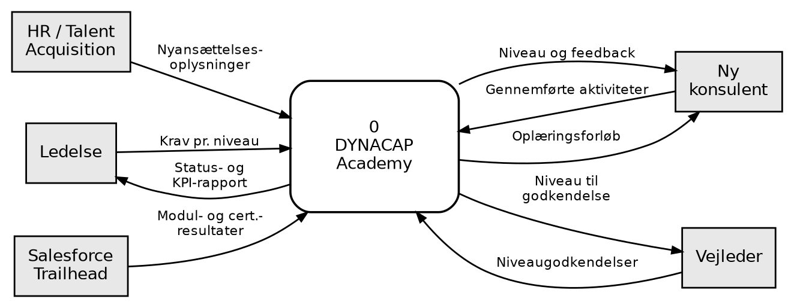

# DYNACAP Academy – kravspecifikation efter The Template (1–27)

> Konverteret til markdown fra `Template_1-27_DYNACAP_Academy_v3.docx`. Tekst og figurer er gengivet som i originaldokumentet.

*Prototype på en oplæringsstruktur og -portal til nye konsulenter hos DYNACAP A/S · Økonomi og IT, 3. semester, EK · Gruppe [nr.] · 25. september 2026*

*Læsevejledning: Fakta har en kilde (se kildelisten). Varigheder er prototype-estimater, der valideres i et kommende interview med HR. Fit criteria er gruppens egne krav til prototypen.*

## Project Drivers

### 1. The Purpose of the Project

DYNACAP ansætter primært studerende som konsulenter [3]. Studerende er billigere i løn end erfarne konsulenter, og det er en væsentlig årsag til virksomhedens høje marginer [6]. Forudsætningen er, at de studerende hurtigt bliver i stand til at arbejde på kundeprojekter.

Gruppens interviews og spørgeskemaundersøgelse i virksomheden viser, at der er en strukturel mangel, når det gælder oplæring [4][5]. Oplæringen afhænger af, hvem man sidder ved siden af, og der er ingen fælles plan for, hvad en ny konsulent skal kunne hvornår.

Derudover har DYNACAP etableret sig i Norge [2], og gruppens analyse peger på, at etableringen er udfordret [6]. Når konsulenterne i Danmark og Norge oplæres forskelligt, arbejder de også forskelligt.

**Formål:** En fælles oplæringsstruktur i seks niveauer, som (1) får nye konsulenter hurtigere og bedre ud på projekter, og (2) sikrer, at alle konsulenter – uanset kontor – arbejder efter samme metode og tænker ens.

**Målbare effekter (baseline fra spørgeskemaet, målniveau fastsættes med DYNACAP):** tid fra ansættelse til første projektopgave · tid til fuldt oplært (niveau 6) · konsulenternes egen vurdering af oplæringen · ensartethed mellem kontorer i Danmark og Norge.

### 2. The Client, the Customer and other Stakeholders

**Klient:** DYNACAP’s ledelse, som skal godkende og finansiere løsningen. **Kunde:** DYNACAP selv – løsningen er et internt værktøj. **Øvrige interessenter:** HR/Talent Acquisition, erfarne konsulenter, der vejleder og godkender niveauer, det norske kontor og indirekte DYNACAP’s kunder, som møder konsulenterne på projekterne.

### 3. Users of the Product

| Brugergruppe | Kendetegn | Betydning for produktet |
|---|---|---|
| Ny konsulent (Technology Analyst) | Studerende, ca. 20 t/uge, ny i Salesforce [3] | Skal kunne se sit niveau og næste skridt uden hjælp |
| Vejleder | Erfaren konsulent, der arbejder på kundeprojekter | Godkendelse af niveau skal være hurtig |
| HR / programansvarlig | Ejer oplæringsstrukturen | Skal kunne ændre indhold uden udvikler |
| Ledelse (DK og NO) | Har brug for overblik på tværs af kontorer | Kort statusrapport pr. kontor |

## Project Constraints

### 4. Requirements Constraints

- **Platform:** Løsningen bygges på Salesforce, fordi DYNACAP er Salesforce-partner og har kompetencerne internt [2].
- **Eksisterende indhold:** Salesforce Trailhead genbruges til den tekniske del af niveau 2–5.
- **Sprog:** Oplæringen skal fungere på både dansk og engelsk, så den kan bruges i Norge.
- **Lovgivning:** Vurderinger af medarbejdere er personoplysninger og skal behandles efter GDPR.

### 5. Naming Conventions and Definitions

| Begreb | Betydning |
|---|---|
| Konsulent / Technology Analyst | Nyansat studerende, som gennemgår oplæringsstrukturen [3] |
| Niveau | Et af seks trin i oplæringen. Hvert niveau har et klart “kan”-mål |
| Niveaugodkendelse | Vejlederens bekræftelse af, at konsulenten opfylder niveauets mål |
| Vejleder | Erfaren konsulent, der følger og godkender en ny konsulent |
| Projektorienteret læring | Læring gennem rigtige opgaver på kundeprojekter, under supervision |
| Fuldt oplært | Niveau 6: arbejder selvstændigt og kan selv vejlede nye |

### 6. Relevant Facts and Assumptions

**Fakta:** DYNACAP havde i gennemsnit 27 ansatte i 2024/25 [1] og har kontorer i København, Aarhus og Oslo [2]. Interviews og spørgeskema viser en strukturel mangel på oplæring [4][5].

**Antagelser (skal valideres):** Varigheden af de seks niveauer er et prototype-estimat, der tager udgangspunkt i, at konsulenten arbejder ca. 20 timer om ugen [3]. Estimatet valideres i interview med HR.

## Functional Requirements

### 7. The Scope of the Work – oplæringsstrukturen

Arbejdsområdet er oplæringen fra første arbejdsdag til fuldt oplært konsulent. Rekruttering og løn er uden for scope. Strukturen bevæger sig fra viden om virksomheden (niveau 1) mod projektorienteret læring (niveau 4–6).

| Niveau | Fokus | Konsulenten kan efter niveauet … | Læringsform | Estimat |
|---|---|---|---|---|
| 1. Virksomheden | DYNACAP’s forretning, værdier, ydelser og arbejdsmetode | forklare DYNACAP’s ydelser og egen rolle og bruge de interne værktøjer | Introforløb, fælles for DK og NO | 1–2 uger |
| 2. Salesforce-grundlag | Platformens grundbegreber og datamodel | navigere i Salesforce og lave simple opsætninger i et testmiljø | Trailhead + intern øvelse | 3–4 uger |
| 3. DYNACAP-metoden | Projektmetode, krav og dokumentation | dokumentere krav og løsninger efter DYNACAP’s standard | Intern case | 3–4 uger |
| 4. Projekt under supervision | Første kundeprojekt | løse afgrænsede opgaver, som en vejleder gennemgår | Projektorienteret | 6–8 uger |
| 5. Selvstændige opgaver | Specialisering og certificering | løse opgaver selvstændigt og bestå Salesforce Administrator-certificeringen | Projektorienteret + certificering | 8–10 uger |
| 6. Fuldt oplært | Ansvar og videndeling | tage ansvar for et delområde og vejlede nye konsulenter på niveau 1–2 | Projektorienteret | Afsluttes ved statussamtale |

\* *Prototype-estimat ved ca. 20 t/uge: første projektopgave efter ca. 2 måneder, fuldt oplært efter ca. 6 måneder. Valideres i interview med HR.*

*Figur 1: Kontekstdiagram for arbejdsområdet*

**Forretningshændelser (BUC):** BUC 1 En ny konsulent starter · BUC 2 En konsulent afslutter en aktivitet · BUC 3 En vejleder godkender et niveau · BUC 4 En konsulent består en certificering · BUC 5 Ledelsen ændrer kravene til et niveau · BUC 6 Periodisk statusrapport.

### 8. The Scope of the Product

Produktet understøtter planlægning, fremdrift, niveaugodkendelse og opfølgning. Selve læringen foregår i introforløb, Trailhead og på kundeprojekter.

| Product use case (PUC) | Bruger | Nabosystem |
|---|---|---|
| PUC 1: Opret oplæringsforløb | HR / programansvarlig | – |
| PUC 2: Vis niveau og næste skridt | Konsulent | – |
| PUC 3: Markér aktivitet som gennemført | Konsulent | Salesforce Trailhead |
| PUC 4: Godkend niveau | Vejleder | – |
| PUC 5: Send statusrapport pr. kontor | (tidsbestemt) | E-mail |

### 9. Functional and Data Requirements

| ID | Krav: produktet skal … | Fit criterion | MoSCoW |
|---|---|---|---|
| F1 | oprette et forløb med de seks niveauer for hver ny konsulent | Forløb oprettes uden udvikler | Must |
| F2 | vise konsulentens aktuelle niveau, fremdrift og hvad der mangler til næste niveau | Vises på forsiden efter login | Must |
| F3 | lade konsulenten markere aktiviteter som gennemført | Status opdateres med det samme | Must |
| F4 | lade vejlederen godkende eller afvise et niveau med kommentar | Godkendelse gemmes med dato og vejleder | Must |
| F5 | låse op for næste niveau, når et niveau er godkendt | Næste niveau bliver synligt efter godkendelse | Must |
| F6 | give samme indhold og samme niveaukrav på alle kontorer | Samme forløb vises for DK og NO | Must |
| F7 | sende statusrapport til ledelsen fordelt på kontor | Sendes automatisk med fast interval | Should |
| F8 | registrere Salesforce-certificeringer | Certificering kan registreres manuelt | Should |

**Datakrav:** konsulenter, kontorer, niveauer, aktiviteter, niveaugodkendelser, vejledere og certificeringer.

## Non-functional Requirements

| Nr. | Type | Krav | Fit criterion |
|---|---|---|---|
| 10 | Look and Feel | Følger DYNACAP’s visuelle identitet | Godkendt af DYNACAP |
| 11 | Usability and Humanity | En ny konsulent kan se sit niveau og næste skridt uden vejledning | Flertallet af testpersoner i brugertest klarer opgaven uden hjælp |
| 12 | Performance | Siderne svarer hurtigt nok til daglig brug | Ingen testpersoner oplever ventetid som et problem |
| 13 | Operational and Environmental | Virker i browser på pc og mobil | Testet på pc og mobil |
| 14 | Maintainability and Support | HR kan ændre indhold og krav i et niveau uden udvikler | Demonstreret i test |
| 15 | Security | Log ind med DYNACAP-konto og rollebaseret adgang; konsulenter ser kun egne vurderinger | Adgang testet for hver rolle |
| 16 | Cultural | Dansk og engelsk, så forløbet kan bruges ens i Danmark og Norge | Alle skærmbilleder findes på begge sprog |
| 17 | Legal | Overholder GDPR: vurderinger bruges kun til oplæring og gemmes ikke længere end nødvendigt | Formål og slettefrist er beskrevet og godkendt af DYNACAP |

## Project Issues

### 18. Open Issues

- Hvor lang tid skal hvert niveau tage? Afklares i interview med HR.
- Hvem ejer oplæringsstrukturen, og hvem kan være vejledere?
- Skal det norske kontor have lokale tilpasninger, eller skal alt være ens?
- Hvordan hænger strukturen sammen med det “Technical Foundations Academy”, der nævnes på karrieresiden [2]?

### 19. Off-the-Shelf Solutions

Et standard-LMS (learning management system) er et alternativ. Gruppen foreslår at bygge på Salesforce, fordi DYNACAP i forvejen arbejder på platformen, og fordi Trailhead kan dække den tekniske del. Niveau 1 og 3 skal DYNACAP selv udvikle, da de handler om virksomhedens egen forretning og metode.

### 20. New Problems

- Vejlederne får en fast opgave med at godkende niveauer, som tager tid fra projektarbejde.
- Faste niveauer kan føles rigide for konsulenter, der lærer hurtigere end planlagt.
- Indholdet i niveau 1 og 3 skal vedligeholdes, når DYNACAP’s metode ændrer sig.

### 21. Tasks

| Fase | Opgave |
|---|---|
| 1. Afklaring | Interview med HR om varighed; fastlæg “kan”-mål for hvert niveau med ledelsen |
| 2. Indhold | Udvikl introforløb (niveau 1) og DYNACAP-metoden (niveau 3) |
| 3. Prototype | Byg portalen og test den med nye konsulenter og vejledere |
| 4. Pilot | Afprøv med et hold i Danmark og et i Norge; mål effekterne fra afsnit 1 |

### 22. Migration to the New Product

Der findes ikke et eksisterende system, der skal erstattes. Konsulenter, der allerede er ansat, indplaceres på det niveau, der passer til deres kompetencer, efter en samtale med en vejleder.

### 23. Risks

| Risiko | Håndtering |
|---|---|
| Vejledere nedprioriterer niveaugodkendelser til fordel for kundearbejde | Gør godkendelsen kort og tydelig i portalen |
| Estimaterne for varighed holder ikke | Validér med HR og justér efter pilot |
| Det norske kontor bruger ikke strukturen | Inddrag det norske kontor i piloten |
| Indholdet bliver forældet, fordi Salesforce ændrer sig | Fast gennemgang af niveau 2–5 |

### 24. Costs

Et beløb kan ikke estimeres, før afsnit 18 er afklaret. Omkostningerne består af: udvikling af portalen, udvikling af indhold til niveau 1 og 3, eventuelle Salesforce-licenser og vejledernes tid. Over for det står gevinsten ved, at nye konsulenter hurtigere kommer ud på fakturerbare projekter.

### 25. User Documentation and Training

Hjælpetekster i portalen, en kort introduktion på niveau 1, en guide til vejledere om niveaugodkendelse og en vejledning til HR om at ændre indhold.

### 26. Waiting Room

Badges og gamification, AI-assistent til spørgsmål om indholdet, kobling til ressourceplanlægning samt forløb for andre roller end nye konsulenter.

### 27. Ideas for Solutions

Niveaubar på forsiden (1–6), “næste skridt”-kort, tjekliste over “kan”-mål pr. niveau, fælles velkomstforløb for Danmark og Norge og mulighed for at booke møde med vejlederen direkte i portalen.

## Kilder

[1] DYNACAP A/S, årsrapport 2024/25 (CVR 41846046), via Proff.dk og CVR.

[2] dynacap.com – forside og karriereside (Join).

[3] DYNACAP, jobopslag “Technology Analyst”, The Hub.

[4] Gruppens interviews med medarbejdere i DYNACAP, september 2026.

[5] Gruppens spørgeskemaundersøgelse blandt medarbejdere i DYNACAP, september 2026.

[6] Gruppens virksomheds- og markedsanalyse af DYNACAP, september 2026.
