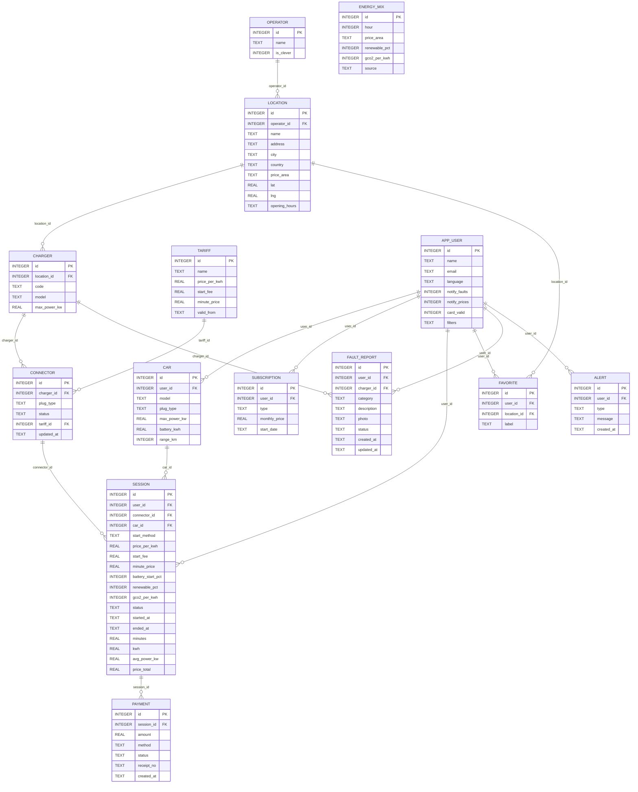
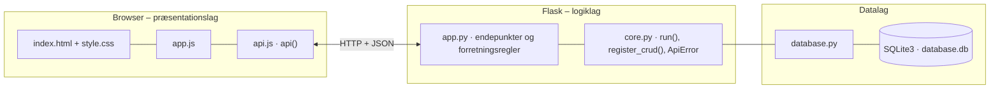

# Clever – Opladning der bare virker – dokumentation af prototypen

En prototype på den forbedrede **Clever-app**, hvor opladning **bare virker**, er **gennemsigtig i pris** og **dokumenteret grøn**.
Appen viser **realtidsstatus** og antal ledige udtag og viser **prisen før start** med advarsel, hvis den er markant højere end normalt.
Den starter via **automatisk genkendelse, QR-kode eller stander-ID** og viser **live effekt, kWh og pris** med forklaring, når effekten falder. Kvitteringen kommer med det samme.
Desuden: **faste stop** med push-advarsler, **fejlrapport uden at ringe**, **ruteplan med ladestop** i Danmark, Sverige, Norge og Tyskland og et **forbrugsoverblik** pr. måned.
Designet følger Clevers identitet (Clever Grøn `#003732`, mint `#B9FDB3`, sand `#F2F1E5` og pilleformede knapper).

Kravgrundlag: [`Readme.MD`](Readme.MD)

## Hvad kan prototypen

| Skærm | Use case | Funktion |
|---|---|---|
| **Find stander** | UC-1 | Lokationer sorteret efter afstand til *Min position* med ledige/total, effekt, pris, stik, grøn status og status pr. udtag (farve **og** tekst) med tidspunkt. Filtre (stik, effekt, maks. pris, operatør, kun ledige) gemmes på profilen. *Gem som fast stop* og *Oplad her* |
| **Opladning** | UC-2 – UC-4 | *Jeg står ved standeren* (automatisk genkendelse) eller QR/stander-ID → prisen vises med pris-trafiklys, prisadvarsel og grøn status → *Bekræft pris og start*. Live-visning (opdateres hvert 2. sekund) med effekt, kWh, pris, batteri, grøn status og *Hvorfor lader bilen langsommere?*. *Stop opladning* giver kvittering med betalingsstatus |
| **Faste stop** | UC-6 | Advarsler (fx *ude af drift – nærmeste ledige …*) og de faste stop med status |
| **Planlæg tur** | UC-7 | Rute fra Sjælland til Odense, Aarhus, Padborg, Hamburg, Malmö, Göteborg eller Oslo med ladestop (ankomst-%, ladetid, pris, ledige og roaming) og *Send til bilens skærm* |
| **Rapportér fejl** | UC-5 | Vælg problem, følg fejlfindingsguiden, skriv beskrivelse, vedhæft evt. foto og send. *Mine sager* viser sagsstatus |
| **Forbrug** | UC-8 | kWh, pris, CO₂ og grøn andel pr. måned (12 måneder), gns. pris pr. kWh og vurdering af abonnementet |
| **Drift** | – | Fejlrapporter (status ændres, og brugeren får besked) og standere, der kan sættes ude af drift eller i drift (simuleret OCPP) |

## Fra krav til kode

| Krav | Implementering |
|---|---|
| FR-1 Realtidsstatus pr. udtag | `connector.status` (`LEDIG`/`OPTAGET`/`UDE_AF_DRIFT`) og `updated_at`. Start og stop ændrer status med det samme |
| FR-2 Antal ledige pr. lokation | `location_summary()` → `free` / `total` |
| FR-3 Pris før start, som skal bekræftes | `POST /api/quote` viser pris, startgebyr og tidspris. `POST /api/sessions` afviser uden `price_confirmed`, og med 409, hvis prisen er ændret siden visningen. Pris og strømmix låses på `session` |
| FR-4 Start via automatisk genkendelse, QR eller ID | `find_connector()`: `AUTO` = nærmeste ledige udtag med bilens stik inden for 150 m. `QR`/`ID` = stander-kode |
| FR-5 Kvittering med betalingsstatus straks | `POST /api/sessions/<id>/stop` opretter `payment` og returnerer `receipt`. Fejlet betaling giver en konkret næste handling (UH-4) |
| FR-6 Live effekt, kWh og pris | `simulate()` beregner ladekurven minut for minut. Frontenden henter hvert 2. sekund |
| FR-7 Forklaring ved effektfald | `explanation`: batteri over 80 %, delt effekt med nabo-udtaget eller bilens maks. effekt (vises ved fald over 30 %) |
| FR-8 Grøn status med kilde | `green_status()` fra `energy_mix` pr. time og prisområde (DK1/DK2) med `source`. Udlandet viser "ingen dokumenteret strømdata" i stedet for et udokumenteret grønt udsagn (CO-3) |
| FR-9 Favoritter | `POST /api/my/favorites` (gem fra kortet med navn, fx "Hallen") |
| FR-10 Push, når en favorit går ude af drift | `PUT /api/chargers/<id>/status` opretter en `alert` til brugere med lokationen som fast stop, inkl. nærmeste ledige alternativ |
| FR-11 Prisadvarsel over 25 % | `user_average_price()` (seneste 30 dage) og `PRICE_WARNING_FACTOR`. Pris-trafiklys grøn/gul/rød (idé fra afsnit 27) |
| FR-12 Fejlrapport via guide uden at ringe | `POST /api/fault-reports` med kategori, beskrivelse og foto. Sagsstatus i *Mine sager*. Drift opdaterer via `PUT /api/fault-reports/<id>` |
| FR-13 Rute med ladestop, også i udlandet | `GET /api/route` følger vejforløb (`CORRIDORS`). Hvert stop er den lynlader længst fremme på ruten, der nås med mindst 15 % batteri. Roaming markeres |
| FR-14 Send til bilens navigation | `POST /api/route/send-to-car` (simuleret) |
| FR-15 Månedligt forbrugsoverblik og abonnement | `GET /api/my/overview` |
| FR-16 Filtre, der bevares | `GET /api/locations?plug=&min_power=&max_price=&operator_id=&only_free=` og `PUT /api/users/<id>/filters` |
| SE-5 Kun brugeren, der startede, kan stoppe | `stop_session()` og `get_session()` giver 403 for andre brugere |
| LF-2/LF-3/LF-5 Mint som accent, faste statusfarver, pilleknapper | Farver og knapper i `index.html`. Status vises altid som farve **og** tekst/ikon |

## Datamodel



## Eksempel på dataudveksling

Mikkel scanner IONITY-standeren i Kolding. Prisen er markant over hans normale pris, så appen advarer, før han starter:

```bash
curl -X POST http://localhost:5208/api/quote \
  -H 'Content-Type: application/json' -H 'X-User-Id: 1' \
  -d '{"method": "QR", "code": "ION-7001"}'
```

Svar `200` (forkortet):

```json
{
  "connector": { "id": 16, "code": "ION-7001", "plug_type": "CCS", "status": "LEDIG", "max_power_kw": 350.0,
                 "location_name": "Kolding Vest", "operator": "IONITY", "is_clever": 0 },
  "price_per_kwh": 5.99,
  "start_fee": 0.0,
  "your_average": 3.82,
  "price_level": "RØD",
  "price_warning": "Prisen er 5,99 kr./kWh – 57 % over din normale pris på 3,82 kr./kWh.",
  "green": { "renewable_pct": 50, "gco2_per_kwh": 230, "source": "Energinet Energi Data Service (simuleret)", "price_area": "DK1" },
  "can_start": true,
  "problems": [],
  "expected_power_kw": 240.0
}
```

Grøn status afhænger af timen, så tallene i `green` skifter hen over døgnet.

## Kør prototypen

```bash
cd backend
python3 -m venv .venv && source .venv/bin/activate   # første gang
pip install -r requirements.txt                       # første gang
python app.py
```

Terminalen skriver ` * Åbn http://localhost:5208`. Åbn adressen i browseren. Flask serverer både API'et (`/api/...`) og frontenden.

- **Port:** Prototypen bruger port **5208** (5200 + projektnummer). Er porten optaget, vælger `run()` i `core.py` selv den næste ledige og skriver fx ` * Port 5208 er optaget – bruger port 5209 i stedet`. Du kan også vælge port selv med `PORT=5300 python app.py`.
- **Stop serveren** med `Ctrl` + `C` i terminalen, hvor den kører.
- **Kodeændringer:** Serveren kører i debug-tilstand og genstarter selv, når du gemmer en `.py`-fil. Den bliver på samme port. Ændringer i `frontend/` kræver kun, at du genindlæser siden.
- **Database:** `backend/database.db` oprettes med testdata ved første start. Nulstil den med `python database.py --reset`, mens serveren er stoppet.
- **Tjek at backenden svarer:** `curl http://localhost:5208/api/health`

### Fejlfinding

| Problem | Årsag | Løsning |
|---|---|---|
| ` * Port 5208 er optaget – bruger port …` | En anden proces, ofte en glemt server, bruger porten | Brug den adresse, der står i terminalen. Se hvad der optager porten med `lsof -nP -iTCP:5208 -sTCP:LISTEN`. En Flask-server i debug-tilstand er to processer, så stop dem begge med `lsof -t -iTCP:5208 -sTCP:LISTEN \| xargs kill` |
| `ModuleNotFoundError: No module named 'flask'` | Det virtuelle miljø er ikke aktiveret, eller Flask er ikke installeret | `source .venv/bin/activate` og `pip install -r requirements.txt` |
| Siden viser "Kan ikke hente data fra backenden" | Serveren kører ikke, eller `index.html` er åbnet direkte fra disken, mens serveren kører på en anden port | Start serveren og åbn adressen fra terminalen i stedet for filen |
| Tallene passer ikke efter mange tests | Databasen indeholder testdata fra tidligere afprøvninger | Stop serveren og kør `python database.py --reset` |
| `no such table …` | `database.db` er tom eller ødelagt | `python database.py --reset` |

## Arkitektur

Prototypen følger holdets fælles tre-lags struktur (se [`../README.md`](../README.md)):



| Fil | Lag | Indhold |
|---|---|---|
| `frontend/index.html` | Præsentation | Skærmbilleder som faneblade og formularer. Projektets farver og `data-api-port` |
| `frontend/app.js` | Præsentation | Henter data med `api()`, tegner dem i DOM'en og sender formularer |
| `frontend/api.js` | Præsentation | Fælles for alle prototyper: `api()` (fetch + JSON), `h()`, `renderTable()`, `fillSelect()`, `formToJson()`, `bindCrudForm()` og `toast()` |
| `frontend/style.css` | Præsentation | Fælles responsivt design |
| `backend/app.py` | Logik | Projektets forretningsregler og endepunkter |
| `backend/core.py` | Logik | Fælles: `create_app()` (Flask, CORS, JSON-fejl), `run()` (start på ledig port), `ApiError` og `register_crud()` |
| `backend/database.py` | Data | Fælles: forbindelse, `query_all/query_one/execute`, `transaction()` og `init_db()` |
| `backend/schema.sql` · `seed.sql` | Data | Tabeller og fiktive testdata |

Alle fejl returneres som JSON (`{"error": "…", "path": "/api/…"}`) med statuskode 400, 401, 403, 404 eller 409 og vises som en rød besked i frontenden.
Nederst på siden kan man åbne **"Seneste JSON-svar fra API'et"** og se den rå dataudveksling.
Den fulde endepunktsliste står i [`backend/README.md`](backend/README.md).

## Design og responsivitet

- Samme stylesheet i alle prototyper. Kun farverne (`--brand`, `--brand-dark`, `--brand-soft`) sættes i `index.html`.
- Layoutet virker fra mobil (375 px) til desktop uden vandret scroll. Kort lægger sig under hinanden på små skærme, og brede tabeller scroller inde i deres kort.
- Formularfelter kan ikke blive bredere end deres kort. En `<select>` med lange valgmuligheder skubber altså ikke formularen ud over kanten.
- Beskeder vises kort i toppen (grøn = gennemført, rød = fejl fra serveren).


## Testdata og testbrugere

| Bruger | Bil | Abonnement | Bemærkning |
|---|---|---|---|
| Mikkel (Bekvemmelighedsfamilien) | Kia EV6, CCS, 240 kW | Clever One | Faste stop "Hallen" og "Arbejde". Lynladeren ved Hallen er ude af drift, og der er en advarsel |
| Freja (urban pendler) | VW ID.3, CCS, 120 kW | Ingen | Gemte filtre: maks. 4,50 kr./kWh, kun ledige |
| Christian | Renault Zoe, Type 2, 22 kW | Clever Box | Udløbet kort, så betalingen fejler og viser næste handling |

16 lokationer (Clever og roaming: IONITY, Allego og Eviny) i DK, SE, NO og DE, 23 standere og 26 udtag. Strømmix er en simuleret døgnprofil for DK1 og DK2.
*Min position* i toppen styrer afstand og automatisk genkendelse. Vælg fx *Ved Greve Midtby Center* og tryk *Jeg står ved standeren*.

## Afgrænsning

Ingen rigtig OCPP, betaling, push-tjeneste, kort-API, CarPlay/Android Auto eller Energinet-integration. Alt er simuleret med de samme datastrukturer.
Ladekurven er en forenklet model. Ruteplanen bruger faste vejforløb fra Sjælland og luftlinjeafstande × 1,15 i stedet for et rigtigt vejnet.
Login er simuleret, og drift-siden har ingen adgangskontrol. Kun dansk sprog (CU-1/CU-2 er ikke implementeret).
