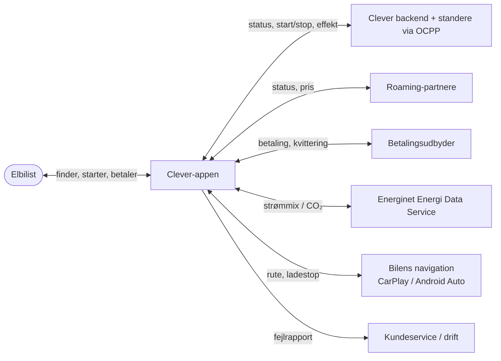
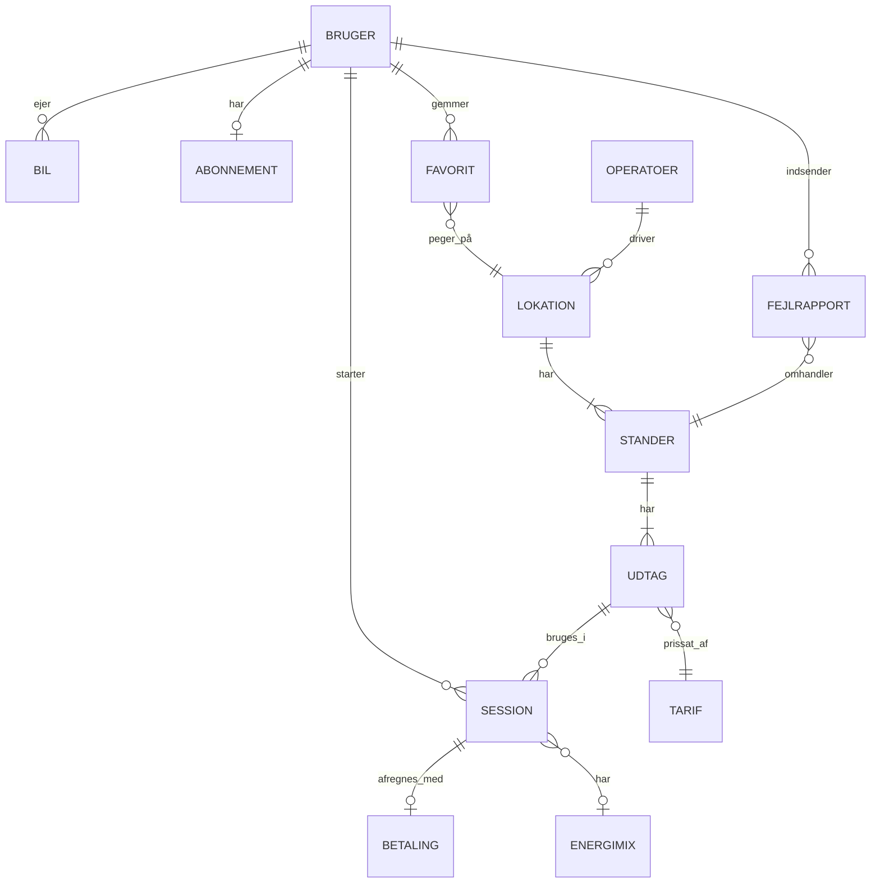

# Clever – Kravspecifikation

Kravspecifikation for vores forbedring af **Clever-appen**. Strukturen følger **Volere-skabelonen** (27 sektioner fordelt på 5 kapitler).

> **Problemformulering:** Hvordan kan Clever gennem innovation af Clever-appen skabe øget værdi for kunderne og styrke sin position inden for bæredygtig omstilling?

Projektgruppe: Kasper, Andreas, Asbjørn & Villads · Grundlag: analyser og dataindsamling i [Docs/](Docs/)

---

## Indholdsfortegnelse

**I. Projektets drivkræfter**
1. [Projektets formål](#1-projektets-formål)
2. [Interessenter](#2-interessenter)

**II. Projektets begrænsninger**

3. [Obligatoriske begrænsninger](#3-obligatoriske-begrænsninger)
4. [Navngivning og terminologi](#4-navngivning-og-terminologi)
5. [Relevante fakta og antagelser](#5-relevante-fakta-og-antagelser)

**III. Funktionelle krav**

6. [Arbejdets omfang](#6-arbejdets-omfang)
7. [Forretningsdatamodel og dataordbog](#7-forretningsdatamodel-og-dataordbog)
8. [Produktets omfang](#8-produktets-omfang)
9. [Funktionelle krav](#9-funktionelle-krav)

**IV. Ikke-funktionelle krav**

10. [Look and feel](#10-look-and-feel)
11. [Brugervenlighed og menneskelige faktorer](#11-brugervenlighed-og-menneskelige-faktorer)
12. [Ydeevne](#12-ydeevne)
13. [Drift og miljø](#13-drift-og-miljø)
14. [Vedligeholdelse og support](#14-vedligeholdelse-og-support)
15. [Sikkerhed](#15-sikkerhed)
16. [Kulturelle krav](#16-kulturelle-krav)
17. [Compliance (lovkrav)](#17-compliance-lovkrav)

**V. Projektforhold**

18. [Åbne spørgsmål](#18-åbne-spørgsmål)
19. [Færdige løsninger (off-the-shelf)](#19-færdige-løsninger-off-the-shelf)
20. [Nye problemer](#20-nye-problemer)
21. [Opgaver](#21-opgaver)
22. [Overgang til det nye produkt](#22-overgang-til-det-nye-produkt)
23. [Risici](#23-risici)
24. [Omkostninger](#24-omkostninger)
25. [Brugerdokumentation og træning](#25-brugerdokumentation-og-træning)
26. [Venteværelset](#26-venteværelset)
27. [Idéer til løsninger](#27-idéer-til-løsninger)

---

# I. Projektets drivkræfter

## 1. Projektets formål

### 1.1 Baggrund
Clever A/S er Danmarks største ladeoperatør (stiftet 2009, ejet 94,9 % af Andel) med ca. 31,8 % af de offentlige ladeudtag og over 60.000 ladepunkter. Markedet vokser hurtigt (694.800 elbiler i DK, august 2026), men konkurrencen skærpes (Norlys, Circle K, OK, Q8 m.fl.), og fra 2027 kræver AFIR kortbetaling og prisoplysning ved alle offentlige standere. Det betyder, at app- og abonnementsløsninger mister deres bindende effekt, og konkurrencen flytter sig mod **pris, pålidelighed og appoplevelse**.

Vores dataindsamling viser, at appen er Clevers svage led:

| Kilde | Fund |
|---|---|
| Spørgeskema (28 elbilister) | Gns. tilfredshed med det digitale produkt **3,5 / 5**. Vigtigst ved valg af udbyder: **bekvemmelighed (16)**, bæredygtighed (10), app (9), hastighed (7), pris (5), placering (5). |
| Interviews (5 elbilister) | App finder ikke bilen ved standeren · stander viser "optaget" men er ledig · betaling fejler / uvished om opladning er registreret · uklar pris før opladning · effekten falder uden forklaring · ønske om "grøn status" og integration med bilens navigation. |
| SWOT | Svaghed: *små funktionalitetsfejl i appen*. Trussel: kortbetaling og prisoplysning fra 2027. Mulighed: dokumentationskrav til grønne udsagn fra 27. sep. 2026. |
| VPC (Bekvemmelighedsfamilien) | Pains: uvished om standeren virker, spildt tid på fejlfinding med børn i bilen. Gains: tryghed for at det virker hver gang. |

### 1.2 Mål
Forbedre Clever-appen, så opladning **bare virker**, er **gennemsigtig i pris** og **dokumenteret grøn**.

| ID | Mål | Måles ved |
|---|---|---|
| M-1 | Øget kundetilfredshed med appen | Gns. tilfredshed fra 3,5 til ≥ 4,2 / 5 |
| M-2 | Færre mislykkede opladninger | Andel sessioner, der fejler ved start, halveres |
| M-3 | Gennemsigtige priser | 100 % af sessioner viser pris pr. kWh før start |
| M-4 | Dokumenteret bæredygtighed | Grøn status vises for 100 % af sessioner på Clevers eget net |
| M-5 | Færre henvendelser til kundeservice | Henvendelser om "stander virker ikke/betaling" reduceres med 30 % |

## 2. Interessenter

| Interessent | Rolle / interesse |
|---|---|
| **Clever A/S** | Produktejer. Fastholde markedsposition og abonnementskunder. |
| **Andel** (94,9 % ejer) | Investeringer i ladeinfrastruktur, grøn profil. |
| **Bekvemmelighedsfamilien** – *primær målgruppe* | Persona **Mikkel, 42**, parcelhus i Greve, Clever-ladeboks, Clever One. Vil have, at det bare virker og en fast, forudsigelig pris. |
| **Den urbane pendler** – *sekundær målgruppe* | Persona **Freja, 29**, lejlighed, ingen ladeboks. Prisbevidst, sammenligner udbydere, afhænger af offentlige standere. |
| Erhvervskunder (Clever One Business) | Firmabilister (fx interview 4: Casper) – hastighed og pålidelighed. |
| Kundeservice | Færre fejlhenvendelser, bedre fejldata. |
| Drift/teknikere | Hurtig besked om defekte standere. |
| Roaming-partnere | IONITY, Allego, Eviny, APCOA, EWII, Stella, By&Havn (jf. BMC). |
| Bilforhandlere | Kia, Volvo, Renault, Lexus, XPeng – formidler Clever One ved bilkøb. |
| Myndigheder | Konkurrence- og Forbrugerstyrelsen, Færdselsstyrelsen (prisindberetning), Datatilsynet. |
| Energinet | Data om strømmens oprindelse (grøn status). |
| Projektgruppen | Kasper, Andreas, Asbjørn & Villads. |

# II. Projektets begrænsninger

## 3. Obligatoriske begrænsninger

| ID | Begrænsning |
|---|---|
| C-1 | Løsningen er en videreudvikling af den **eksisterende Clever-app** (iOS og Android) – ikke en ny app. |
| C-2 | Skal integrere med Clevers eksisterende ladenetværk, kundekonti og abonnementer (Clever One / Clever Box). |
| C-3 | Standere kommunikeres via branchestandarden **OCPP**; roaming via partneraftaler. |
| C-4 | Skal overholde **AFIR** (pris før opladning, kortbetaling fra 2027), **GDPR** og **markedsføringsloven** (grønne udsagn). |
| C-5 | Skal følge Clevers visuelle identitet (se [afsnit 10](#10-look-and-feel)). |
| C-6 | Projektet er et studieprojekt – leverancen er kravspecifikation og prototype, ikke produktion. |

## 4. Navngivning og terminologi

| Begreb | Betydning |
|---|---|
| **Ladepunkt / udtag** | Ét stik, hvor én bil kan lade. |
| **Stander** | Fysisk ladestander med ét eller flere udtag. |
| **Lokation** | Adresse med én eller flere standere. |
| **Lynlader** | DC-lader, typisk 150–1.000 kW. |
| **Session** | Én opladning fra start til stop. |
| **Clever One** | Fastprisabonnement med hjemme- og udeopladning. |
| **Roaming** | Opladning på en partners netværk via Clever-appen. |
| **Grøn status** | Andel vedvarende energi i strømmen under en session. |
| **OCPP** | Open Charge Point Protocol – standard for kommunikation med standere. |
| **AFIR** | EU-forordning om infrastruktur for alternative drivmidler. |
| **kWh / kW** | Energimængde / ladeeffekt. |
| **SMP / VPC / BMC** | Segmentering-Målgruppe-Positionering / Value Proposition Canvas / Business Model Canvas. |

## 5. Relevante fakta og antagelser

**Fakta**
- 694.800 elbiler i DK (aug. 2026); 85,6 % af nye personbiler er elbiler.
- Clever: ca. 31,8 % af offentlige ladeudtag, > 70 % af hurtigladerudtag, > 60.000 ladepunkter.
- 7 ud af 10 vil helst lade hjemme; 38 % er bekymrede for at kunne lade, når behovet opstår (FDM).
- Konkurrencen sker primært på pris, netværk, **appoplevelse** og brand – ikke teknik.
- Clever One er kritiseret af KFST (2023) for manglende prisgennemsigtighed.
- Energinet stiller offentlige data om elproduktion og CO₂ til rådighed (Energi Data Service).

**Antagelser**
- A-1: Clever kan levere realtidsstatus fra egne standere via OCPP-backend.
- A-2: Roaming-partnere leverer status og pris i mindst samme kvalitet som i dag.
- A-3: Brugerne har smartphone med mobildata og placeringstjenester.
- A-4: Spørgeskema og interviews er et lille, ikke-repræsentativt udsnit (32 + 5 respondenter), men peger i samme retning.

# III. Funktionelle krav

## 6. Arbejdets omfang

### 6.1 Nuværende situation
I dag bruger elbilisten appen til at finde, starte, stoppe og betale opladning (BMC: værditilbud). Problemerne opstår i overgangene: status på kortet er ikke altid retvisende, start fejler, pris og kvittering er uklare, og fejl opdages først ved standeren.

### 6.2 Kontekstdiagram

### 6.3 Forretningshændelser

| ID | Hændelse | Input / output |
|---|---|---|
| BE-1 | Elbilist planlægger opladning | Placering/rute → ledige standere, pris, grøn status |
| BE-2 | Elbilist ankommer til stander | Stander-ID → bekræftelse af pris og start |
| BE-3 | Opladning kører | Effekt, kWh, pris → live-visning |
| BE-4 | Opladning afsluttes | Sessionsdata → kvittering og betalingsstatus |
| BE-5 | Stander går i fejl | OCPP-fejl → status "ude af drift" + advarsel |
| BE-6 | Elbilist rapporterer fejl | Beskrivelse/foto → sag hos drift |
| BE-7 | Pris ændres | Ny tarif → opdateret pris i app |
| BE-8 | Strømmix ændres | Energinet-data → opdateret grøn status |
| BE-9 | Elbilist planlægger langtur/ferie | Destination → rute med ladestop (DK + udland) |

## 7. Forretningsdatamodel og dataordbog

| Entitet | Centrale attributter |
|---|---|
| **Bruger** | id, navn, email, sprog, notifikationsindstillinger |
| **Bil** | id, bruger_id, model, stiktype, maks_effekt_kW |
| **Abonnement** | id, bruger_id, type (Clever One, Box, ingen), månedspris, startdato |
| **Operatør** | id, navn, er_clever (bool) – roaming-partnere |
| **Lokation** | id, operatør_id, navn, adresse, lat, lng, åbningstider |
| **Stander** | id, lokation_id, model, maks_effekt_kW, status (ledig/optaget/ude af drift), sidst_opdateret |
| **Udtag** | id, stander_id, stiktype, status, tarif_id |
| **Tarif** | id, pris_pr_kWh, startgebyr, tidspris, gyldig_fra |
| **Session** | id, bruger_id, udtag_id, start, slut, kWh, gns_effekt_kW, pris_i_alt, status |
| **Betaling** | id, session_id, beløb, metode, status (gennemført/fejlet), kvittering_url |
| **Energimix** | id, tidspunkt, prisområde (DK1/DK2), andel_vedvarende_pct, gCO2_pr_kWh, kilde |
| **Favorit** | id, bruger_id, lokation_id, label (fx "Hallen") |
| **Fejlrapport** | id, bruger_id, stander_id, kategori, beskrivelse, foto, status, oprettet |

## 8. Produktets omfang

### 8.1 Produktgrænse
**Inden for:** kort med realtidsstatus, prisvisning og -advarsel, start/stop, kvittering, grøn status, selvbetjent fejlfinding, notifikationer, ruteplan med ladestop, integration med bilens navigation.
**Uden for:** hardware på standerne, ændring af abonnementspriser, fakturasystem, drift af partnernes netværk.

### 8.2 Use cases

| ID | Use case | Aktør | Kort beskrivelse |
|---|---|---|---|
| UC-1 | Find ledig stander | Elbilist | Ser kort/liste med realtidsstatus, antal ledige udtag, effekt og pris. |
| UC-2 | Start opladning | Elbilist | Vælger stander (auto via placering, QR eller ID), ser pris og bekræfter. |
| UC-3 | Følg opladning | Elbilist | Ser live effekt, kWh, pris og grøn status – og forklaring, hvis effekten falder. |
| UC-4 | Afslut og få kvittering | Elbilist | Stopper og modtager straks kvittering med betalingsstatus. |
| UC-5 | Rapportér fejl | Elbilist | Følger en fejlfindingsguide og indsender rapport uden at ringe. |
| UC-6 | Modtag advarsel | Elbilist | Får push, hvis en favoritstander går i fejl, eller prisen er markant højere end normalt. |
| UC-7 | Planlæg tur med ladestop | Elbilist | Indtaster destination (også udland) og får rute med ladestop, sendt til bilens skærm. |
| UC-8 | Se forbrugsoverblik | Elbilist | Ser forbrug, pris og CO₂ pr. måned samt om abonnementet kan betale sig. |

### 8.3 User journey – Mikkel (Bekvemmelighedsfamilien)

| Fase | Planlæg | Kør til stander | Start | Lad | Afslut |
|---|---|---|---|---|---|
| **Handling** | Tjekker standeren ved hallen, inden børnene hentes | Kører mod hallen | Parkerer og vil starte hurtigt | Venter med børn i bilen | Kører hjem |
| **I dag (pain)** | Status er ikke altid retvisende | Opdager først fejl ved standeren | Appen finder ikke bilen – genstarter 2× | Uvished om effekt | Uklart om betaling gik igennem |
| **Forbedring** | Realtidsstatus + favorit "Hallen" | Push: *"Standeren ved hallen er ude af drift – nærmeste ledige: 400 m"* | Auto-genkendelse af stander, én knap | Live effekt + grøn status | Kvittering straks |
| **Følelse** | 😐 → 🙂 | 😠 → 🙂 | 😠 → 😀 | 😐 → 🙂 | 😟 → 😀 |

## 9. Funktionelle krav

Prioritet efter MoSCoW: **M** = Must, **S** = Should, **C** = Could.

| ID | Krav | Begrundelse (kilde) | Fit-kriterie | Pri. |
|---|---|---|---|---|
| FR-1 | Appen skal vise realtidsstatus (ledig / optaget / ude af drift) for hvert udtag. | Hanne: "optaget" men tom; spørgeskema | Status afviger ≤ 60 sek. fra standerens faktiske status | M |
| FR-2 | Appen skal vise antal ledige udtag pr. lokation. | Spørgeskema: "vises ikke altid hvor mange ledige" | Tallet vises på kort og liste for 100 % af Clever-lokationer | M |
| FR-3 | Appen skal vise pris pr. kWh (samt evt. start- og tidsgebyr) før opladning, og brugeren skal bekræfte. | Christian; AFIR; KFST | Ingen session kan startes uden, at pris er vist | M |
| FR-4 | Appen skal kunne starte opladning via automatisk genkendelse af stander, QR-kode eller stander-ID. | Peter: appen fandt ikke bilen | ≥ 98 % af startforsøg lykkes i første forsøg | M |
| FR-5 | Appen skal sende kvittering med betalingsstatus straks efter afsluttet session. | Claus og Christian: betalingsfejl/uvished | Kvittering vises ≤ 30 sek. efter stop | M |
| FR-6 | Appen skal vise live effekt (kW), kWh og løbende pris under opladning. | Casper: effekten falder | Opdateres mindst hvert 10. sek. | M |
| FR-7 | Appen skal forklare årsagen, hvis effekten falder markant (fx batteriniveau, temperatur, delt effekt). | Casper: "aner ikke hvorfor" | Forklaring vises ved fald > 30 % | S |
| FR-8 | Appen skal vise "grøn status" – andel vedvarende energi og g CO₂/kWh – for sessionen. | Hanne; problemformulering; greenwashing-krav | Data med kildeangivelse for alle sessioner i DK | M |
| FR-9 | Brugeren skal kunne gemme favoritlokationer (faste stop). | VPC: "standere nær faste stop" | Maks. 2 tryk for at gemme | S |
| FR-10 | Appen skal sende push-advarsel, hvis en favoritstander går ude af drift. | Peter og Casper: "besked hurtigere" | Push ≤ 5 min. efter fejl registreres | M |
| FR-11 | Appen skal advare, hvis prisen på valgt stander er markant højere end brugerens normale pris. | Christian | Advarsel ved > 25 % over brugerens gns. seneste 30 dage | S |
| FR-12 | Brugeren skal kunne rapportere fejl via en guide med kategori og foto – uden at ringe. | VPC: "fejlfinding uden at ringe support" | Rapport indsendt på ≤ 60 sek.; sagsstatus synlig i app | M |
| FR-13 | Appen skal kunne planlægge en rute med ladestop, også i udlandet via roaming (ferieløsning). | Spørgeskema: rutevejledning; gruppeidé | Rute med ladestop beregnes for ture i DK, SE, NO og DE | S |
| FR-14 | Appen skal kunne sende rute og ledige standere til bilens navigation (Apple CarPlay / Android Auto). | Claus: skifte mellem apps | Fungerer i CarPlay og Android Auto | C |
| FR-15 | Appen skal vise månedligt forbrugsoverblik: kWh, pris, CO₂ og sammenligning af abonnement vs. forbrug. | KFST-kritik; brand-tillid | Overblik for de seneste 12 måneder | S |
| FR-16 | Appen skal kunne filtrere standere på effekt, stiktype, pris og operatør. | Freja/pendler; Casper: hastighed | Filtre bevares mellem sessioner | S |

# IV. Ikke-funktionelle krav

## 10. Look and feel
Designet skal følge Clevers visuelle identitet som på [clever.dk](https://clever.dk). Værdierne er aflæst direkte fra hjemmesidens stylesheet (september 2026).

### 10.1 Farvepalet

| Token | Hex | Brug |
|---|---|---|
| Clever Grøn (`green-100`) | `#003732` | Primærfarve: tekst, knapper, mørke flader |
| Grøn 80 | `#335F5B` | Sekundær tekst og ikoner på lys baggrund |
| Grøn 40 / 20 / 10 | `#99AFAD` / `#CCD7D6` / `#E6EBEB` | Rammer, deaktiverede elementer, lyse flader |
| Mint (`green-mint`) | `#B9FDB3` | Accent: primære CTA'er på mørk grøn, "grøn status" |
| Sand | `#F2F1E5` | Varm baggrundsflade til sektioner og kort |
| Signal | `#FFEB5A` | Advarsler og fremhævning (fx prisadvarsel) |
| Bekræftelse | `#4FC79B` | Ledig stander, gennemført betaling |
| Fejl | `#E2284D` | Ude af drift, fejlet betaling |
| Grå 1–4 | `#DFDFDF` / `#F5F5F5` / `#75757A` / `#86868A` | Skillelinjer, baggrunde, hjælpetekst |
| Hvid | `#FFFFFF` | Baggrund og tekst på mørk grøn |

### 10.2 Krav

| ID | Krav |
|---|---|
| LF-1 | Primærfarven er Clever Grøn `#003732`; hvid og sand bruges som baggrund. |
| LF-2 | Mint `#B9FDB3` bruges kun som accent – primær handling og grøn status. |
| LF-3 | Statusfarver er faste: ledig = `#4FC79B`, optaget = grå, ude af drift = `#E2284D`, advarsel = `#FFEB5A`. Status vises altid også med ikon/tekst (ikke kun farve). |
| LF-4 | Skrifttype er **CleverSans** (variabel font, vægt 100–800) med system-sans-serif som fallback. |
| LF-5 | Knapper er pilleformede (`border-radius: 9999px`); kort og paneler har afrundede hjørner på 12–16 px. |
| LF-6 | Layoutet er luftigt og minimalistisk med store overskrifter og rigelig whitespace, som på clever.dk. |
| LF-7 | Sektioner veksler mellem lys (hvid/sand) og mørk (Clever Grøn med hvid tekst) baggrund. |
| LF-8 | Ikoner er enkle linjeikoner i én farve. |
| LF-9 | Appen understøtter lys og mørk tilstand med samme farvetokens. |
| LF-10 | Grøn status skal vises som et tydeligt, genkendeligt badge i mint på alle sessions- og standerskærme. |

## 11. Brugervenlighed og menneskelige faktorer

| ID | Krav | Fit-kriterie |
|---|---|---|
| UH-1 | Opladning skal kunne startes hurtigt – "skal bare virke" (Peter). | Fra åben app til start på ≤ 3 tryk og ≤ 30 sek. |
| UH-2 | Appen skal være forståelig for alle aldersgrupper (spørgeskema: "appen er forvirrende", 50+). | 90 % af testpersoner gennemfører UC-1 til UC-4 uden hjælp |
| UH-3 | Appen skal opfylde **WCAG 2.1 AA** (kontrast, skriftstørrelse, skærmlæser). | Kontrast ≥ 4,5:1 for tekst; understøtter systemets tekststørrelse |
| UH-4 | Fejlbeskeder skal være i klart sprog med en konkret næste handling. | Ingen fejlkoder uden forklaring |
| UH-5 | Appen skal kunne betjenes med én hånd og store trykflader. | Trykflader ≥ 44 × 44 pt |

## 12. Ydeevne

| ID | Krav |
|---|---|
| PE-1 | Appen åbner på ≤ 2 sek. på en mellemklasse-telefon. |
| PE-2 | Standerstatus opdateres med ≤ 60 sek. forsinkelse. |
| PE-3 | Start af opladning bekræftes af standeren på ≤ 10 sek. |
| PE-4 | Kort med standere indlæses på ≤ 1,5 sek. ved god forbindelse. |
| PE-5 | Backend-tjenester har en oppetid på ≥ 99,5 %. |
| PE-6 | Systemet skal kunne håndtere vækst til 1 mio. elbiler i DK (2030-målsætning). |

## 13. Drift og miljø

| ID | Krav |
|---|---|
| OE-1 | Appen kører på iOS og Android (de to seneste hovedversioner). |
| OE-2 | Appen skal fungere ved dårlig dækning (fx parkeringskældre): kort og favoritter caches offline. |
| OE-3 | Integration med Apple CarPlay og Android Auto (FR-14). |
| OE-4 | Integration med Clevers backend (OCPP), roaming-partnere, betalingsudbyder og Energinet Energi Data Service. |
| OE-5 | Appen skal kunne bruges udendørs i sollys og kulde (høj kontrast, store knapper). |

## 14. Vedligeholdelse og support

| ID | Krav |
|---|---|
| MS-1 | Nye versioner må ikke kræve, at brugeren logger ind igen eller mister data. |
| MS-2 | Nedbrud og fejl logges automatisk (crash reporting) til udviklingsteamet. |
| MS-3 | Fejlrapporter fra brugere (FR-12) sendes automatisk til drift med stander-ID og placering. |
| MS-4 | Priser, tekster og partnerdata kan opdateres uden en ny app-udgivelse. |

## 15. Sikkerhed

| ID | Krav |
|---|---|
| SE-1 | Login med stærk autentificering; biometrisk login (Face ID / fingeraftryk) understøttes. |
| SE-2 | Betalinger overholder PSD2 / stærk kundeautentificering; kortdata gemmes ikke i appen. |
| SE-3 | Al kommunikation er krypteret (HTTPS/TLS). |
| SE-4 | Placeringsdata bruges kun med brugerens samtykke og kun til at finde standere og planlægge ruter. |
| SE-5 | En session kan kun startes og stoppes af den bruger, der startede den. |

## 16. Kulturelle krav

| ID | Krav |
|---|---|
| CU-1 | Appen er på dansk som standard og tilbyder engelsk. |
| CU-2 | Svensk og norsk understøttes, da Clever også opererer i Sverige og Norge. |
| CU-3 | Priser vises i lokal valuta inkl. moms; datoer og tal i lokalt format. |

## 17. Compliance (lovkrav)

| ID | Lov / regel | Betydning for appen |
|---|---|---|
| CO-1 | **AFIR** (i dansk ret fra 1. juli 2025) | Pris pr. kWh skal vises før opladning (FR-3); kortbetaling ved standere fra 2027. |
| CO-2 | **GDPR** | Samtykke, dataminimering, ret til indsigt og sletning – især placerings- og sessionsdata. |
| CO-3 | **Markedsføringsloven** (greenwashing, fra 27. sep. 2026) | Grøn status (FR-8) må kun vise dokumenterede data med kildeangivelse – ingen generiske "grøn"-udsagn. |
| CO-4 | **KFST's anbefalinger** (2023) | Gennemsigtighed i priser og abonnement (FR-15). |
| CO-5 | **WCAG 2.1 AA** / tilgængelighedskrav | Se UH-3. |

# V. Projektforhold

## 18. Åbne spørgsmål
- Kan vi få adgang til Clevers interne data (fejlrate ved start, antal henvendelser) som baseline for målene i 1.2?
- Leverer roaming-partnere realtidsstatus og pris i tilstrækkelig kvalitet?
- Hvilke årsager til effektfald (FR-7) kan standeren/bilen reelt oplyse?
- Skal grøn status bruge Energinets timedata eller Clevers egne oprindelsesgarantier?
- Hvordan håndteres "snyderi med abonnement" (nævnt i SWOT) – er det en del af scope?

## 19. Færdige løsninger (off-the-shelf)

| Løsning | Kan bruges til |
|---|---|
| Energinet Energi Data Service | Åbne data om strømmix og CO₂ (FR-8) |
| Apple CarPlay / Android Auto SDK | Integration med bilens skærm (FR-14) |
| Kortudbyder (fx Google Maps / Mapbox) | Kort og ruteberegning (FR-13) |
| Push-tjenester (APNs / Firebase) | Advarsler (FR-10, FR-11) |
| Inspiration: Tesla-appen, Monta, A Better Routeplanner | Stabil start, prisoverblik, ruteplan med ladestop |

## 20. Nye problemer
- Flere push-beskeder kan opleves som støj → brugerstyrede indstillinger.
- Prisadvarsler kan lede kunder væk fra dyrere Clever-lynladere.
- Grøn status kan vise lav andel vedvarende energi på visse tidspunkter og skade brandet på kort sigt.
- Øget afhængighed af datakvaliteten fra standere og partnere.

## 21. Opgaver
1. **Empathize** – Interviews og spørgeskema (✅ udført).
2. **Define** – SMP, VPC, SWOT og denne kravspecifikation (🔄 i gang).
3. **Ideate** – Idéudvikling og prioritering af krav (MoSCoW).
4. **Prototype** – Klikbar prototype af UC-1 til UC-6 i Clevers design.
5. **Test** – Brugertest med personer fra begge segmenter; justér krav.

## 22. Overgang til det nye produkt
- Funktionerne udrulles gradvist som opdateringer til den eksisterende app – ingen ny app.
- Eksisterende konti, abonnementer, favoritter og historik bevares.
- Nye funktioner introduceres med korte onboarding-skærme ved første opstart.
- Pilot med en mindre brugergruppe før fuld udrulning.

## 23. Risici

| Risiko | Sandsynlighed | Konsekvens | Håndtering |
|---|---|---|---|
| Upræcise statusdata fra standere | Middel | Høj | Vis tidspunkt for seneste opdatering; lad brugere rapportere fejl |
| Partnere leverer ikke realtidsdata | Høj | Middel | Markér partnerdata tydeligt; start med Clevers eget net |
| Greenwashing-kritik af grøn status | Lav | Høj | Kun dokumenterede data med kildeangivelse |
| AFIR-kortbetaling mindsker behovet for appen | Høj | Høj | Gør appen mere værdifuld end kortet (status, advarsler, overblik) |
| Lille datagrundlag i vores research | Middel | Middel | Valider med brugertest og Clevers interne data |

## 24. Omkostninger
Groft estimat (antagelse – skal valideres med Clever):

| Del | Estimat |
|---|---|
| UX/UI-design og prototype | 4–6 uger |
| Must-krav (FR-1 til FR-6, FR-8, FR-10, FR-12) | 3–4 måneder, lille udviklingsteam |
| Should/Could-krav | 2–3 måneder |
| Løbende drift | Datatjenester, push, kort-API og support |

## 25. Brugerdokumentation og træning
- Onboarding i appen ved nye funktioner (maks. 3 skærme).
- FAQ på clever.dk opdateres med grøn status, prisadvarsel og fejlrapportering.
- Kundeservice trænes i de nye fejlrapporter og sagsstatus.

## 26. Venteværelset
- Smart opladning, der lader, når strømmen er billigst/grønnest.
- V2G (bilen som batteri for elnettet).
- Reservation af stander på forhånd.
- Deling af bil og konto i husstanden (Christian deler bil med kæreste).
- Kø-system ved travle lokationer (spørgeskema: "alt for lang kø").

## 27. Idéer til løsninger
- **Ferieløsningen:** Bedre udlandsnetværk kombineret med rutevejledning, der viser hele turen med ladestop.
- **"Mine faste stop":** Favoritter med automatiske advarsler, fx "Hallen", "Arbejde" og "Hjem".
- **Grøn-badge:** Mint-farvet badge med % vedvarende energi, der også vises på kvitteringen.
- **Pris-trafiklys:** Grøn/gul/rød markering af pris i forhold til brugerens normale pris.
- **Én-knaps-start:** Appen genkender standeren ud fra placering, så brugeren kun trykker "Start".
