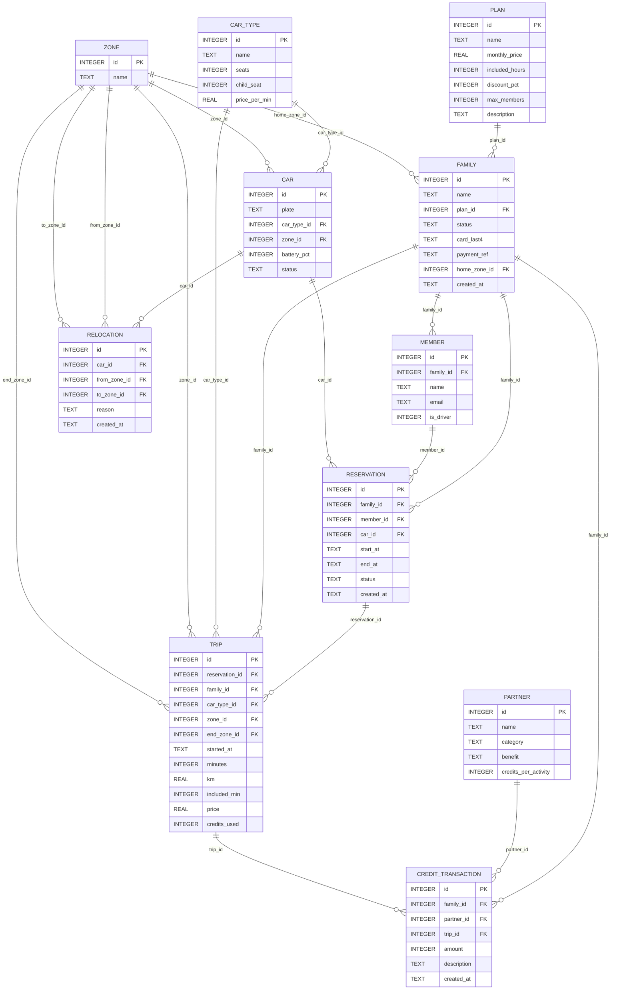
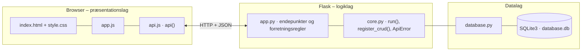

# GreenMobility FAMILY – dokumentation af prototypen

**Family-abonnementet** fra GreenMobility: familien tegner et månedligt abonnement, finder en bil efter **zone, tidspunkt og biltype** (fx med barnestol), reserverer og kører.
Efter kørslen logges **turdata**, som bruges i **datadrevet flådestyring**: Operations får et forecast pr. zone, biltype og tidspunkt og anbefalede flytninger af biler.
**Partneraktiviteter** udløser **GreenCredits**, og familien får **personlige forslag** ud fra sin historik (*Book igen*).

Kravgrundlag: [`Kravspecifikation.md`](Kravspecifikation.md)

## Hvad kan prototypen

Skærmene følger user journey map'et: Opdager → Tilmeld → Planlæg → Reserver → Kør → Belønnes → Book igen.

| Skærm | Fase | Funktion |
|---|---|---|
| **Opdag og tilmeld** | Opdager, Tilmeld | Abonnementer med pris og fordele, partnerfordele og biltyper. Tilmeldingen består af familiens navn, hjemmezone, medlemmer (fører ja/nej) og betalingskort. Medlemskabet er aktivt, når betalingen er valideret |
| **Vores familie** | Kør, Book igen | Plan, inkluderede timer tilbage denne måned, GreenCredits og medlemmer. *Book igen*-forslag ud fra historikken, kommende reservationer (*Afslut tur (simulér)*, *Annullér*) og seneste ture |
| **Book bil** | Planlæg, Reserver | Zone, biltype, tidsrum og fører → kapacitet (høj/ok/begrænset/lav) med forventet efterspørgsel, ledige biler i zonen og alternativer i andre zoner → *Reservér* |
| **GreenCredits og partnere** | Belønnes | Partneren registrerer familiens aktivitet (+credits), familiens saldo og historik og CRUD for partnere |
| **Operations** | BUC 2 | Nøgletal, forecast-tabel (forventede ture mod biler pr. zone og biltype) for valgt ugedag og tidsrum, anbefalede flytninger med *Flyt bil*, log over flytninger og flåden |

Familien vælges i toppen.

## Fra krav til kode

| Krav (BPMN og user journey) | Implementering |
|---|---|
| Opdager: pris, fordele og partnerfordele | `GET /api/offer` |
| Tilmeld: opret profil, vælg plan, betalingen valideres | `POST /api/families`. Betalingsservicen simuleres med Luhn-kontrol og udløbsdato (402 ved afvisning). Mindst én fører kræves, og antal medlemmer ≤ planens maks. Status `AKTIV` efter godkendelse |
| Planlæg: kapacitet og biltype (datadrevet availability) | `GET /api/availability` finder ledige biler uden overlappende reservationer, alternativer i andre zoner og `expected_demand` ud fra historikken |
| Reserver: bekræft reservation | `POST /api/reservations` tjekker aktivt medlemskab, fører med kørekort, bil klar, maks. 12 timer og ingen overlap (409) |
| Kør: turdata logges | `POST /api/reservations/<id>/complete` opretter `trip` (zone, slutzone, minutter, km, pris) og flytter bilen til slutzonen |
| Månedligt abonnement med inkluderede timer | Inkluderede minutter bruges først. Resten koster biltypens minutpris minus planens rabat |
| Belønnes: partneraktivitet → GreenCredits | `POST /api/partner-activities` → `credit_transaction`. Credits kan bruges på en tur (1 credit = 1 kr.) |
| Book igen: personlige tilbud ud fra historik | `dashboard_data()` finder familiens mest brugte zone, biltype og ugedag og foreslår næste tidspunkt. Knappen udfylder søgningen |
| BUC 2: forecast efter område, tidspunkt og biltype | `GET /api/forecast?weekday=&block=` = gennemsnit af de seneste 8 ugers ture for ugedagen og tidsrummet sammenholdt med biler i zonen |
| BUC 2: Operations planlægger bilernes placering | `recommended_moves` flytter en bil af samme type fra en zone med overskud til zonen med størst mangel. `POST /api/relocations` gemmer flytningen |

**Kapacitet:** `LAV` = ingen ledige biler i zonen. `BEGRÆNSET` = forventet efterspørgsel ≥ ledige biler. `HØJ` = mindst 2 ledige og lav efterspørgsel. Ellers `OK`.

## Datamodel



## Eksempel på dataudveksling

Familien Ali søger en 7-sæder på Amager en lørdag formiddag. Mange familier plejer at køre derfra på det tidspunkt:

```bash
curl "http://localhost:5209/api/availability?zone_id=4&car_type_id=3&start=2026-10-03T10:00&end=2026-10-03T13:00"
```

Svar `200` (forkortet):

```json
{
  "zone": { "id": 4, "name": "Amager" },
  "car_type": { "id": 3, "name": "7-sæder", "seats": 7, "child_seat": 1, "price_per_min": 5.5 },
  "cars": [ { "id": 10, "plate": "GM 30 001", "zone": "Amager", "battery_pct": 83 } ],
  "alternatives": [ { "id": 11, "plate": "GM 30 002", "zone": "Frederiksberg", "battery_pct": 67 } ],
  "expected_demand": 1.2,
  "capacity": "BEGRÆNSET",
  "message": "Mange familier plejer at booke på dette tidspunkt – book i god tid."
}
```

Forventet efterspørgsel og kapacitet afhænger af ugedag og tidspunkt, fordi turhistorikken oprettes i forhold til dagens dato.

## Kør prototypen

```bash
cd backend
python3 -m venv .venv && source .venv/bin/activate   # første gang
pip install -r requirements.txt                       # første gang
python app.py
```

Terminalen skriver ` * Åbn http://localhost:5209`. Åbn adressen i browseren. Flask serverer både API'et (`/api/...`) og frontenden.

- **Port:** Prototypen bruger port **5209** (5200 + projektnummer). Er porten optaget, vælger `run()` i `core.py` selv den næste ledige og skriver fx ` * Port 5209 er optaget – bruger port 5210 i stedet`. Du kan også vælge port selv med `PORT=5300 python app.py`.
- **Stop serveren** med `Ctrl` + `C` i terminalen, hvor den kører.
- **Kodeændringer:** Serveren kører i debug-tilstand og genstarter selv, når du gemmer en `.py`-fil. Den bliver på samme port. Ændringer i `frontend/` kræver kun, at du genindlæser siden.
- **Database:** `backend/database.db` oprettes med testdata ved første start. Nulstil den med `python database.py --reset`, mens serveren er stoppet.
- **Tjek at backenden svarer:** `curl http://localhost:5209/api/health`

### Fejlfinding

| Problem | Årsag | Løsning |
|---|---|---|
| ` * Port 5209 er optaget – bruger port …` | En anden proces, ofte en glemt server, bruger porten | Brug den adresse, der står i terminalen. Se hvad der optager porten med `lsof -nP -iTCP:5209 -sTCP:LISTEN`. En Flask-server i debug-tilstand er to processer, så stop dem begge med `lsof -t -iTCP:5209 -sTCP:LISTEN \| xargs kill` |
| `ModuleNotFoundError: No module named 'flask'` | Det virtuelle miljø er ikke aktiveret, eller Flask er ikke installeret | `source .venv/bin/activate` og `pip install -r requirements.txt` |
| Siden viser "Kan ikke hente data fra backenden" | Serveren kører ikke, eller `index.html` er åbnet direkte fra disken, mens serveren kører på en anden port | Start serveren og åbn adressen fra terminalen i stedet for filen |
| Tallene passer ikke efter mange tests | Databasen indeholder testdata fra tidligere afprøvninger | Stop serveren og kør `python database.py --reset` |
| `no such table …` | `database.db` er tom eller ødelagt | `python database.py --reset` |

## Arkitektur

Prototypen følger holdets fælles tre-lags struktur (se [`../README.md`](../README.md)):



| Fil | Lag | Indhold |
|---|---|---|
| `frontend/index.html` | Præsentation | Skærmbilleder som faneblade og formularer. Projektets farver og `data-api-port` |
| `frontend/app.js` | Præsentation | Henter data med `api()`, tegner dem i DOM'en og sender formularer |
| `frontend/api.js` | Præsentation | Fælles for alle prototyper: `api()` (fetch + JSON), `h()`, `renderTable()`, `fillSelect()`, `formToJson()`, `bindCrudForm()` og `toast()` |
| `frontend/style.css` | Præsentation | Fælles responsivt design |
| `backend/app.py` | Logik | Projektets forretningsregler og endepunkter |
| `backend/core.py` | Logik | Fælles: `create_app()` (Flask, CORS, JSON-fejl), `run()` (start på ledig port), `ApiError` og `register_crud()` |
| `backend/database.py` | Data | Fælles: forbindelse, `query_all/query_one/execute`, `transaction()` og `init_db()` |
| `backend/schema.sql` · `seed.sql` | Data | Tabeller og fiktive testdata |

Alle fejl returneres som JSON (`{"error": "…", "path": "/api/…"}`) med statuskode 400, 401, 403, 404 eller 409 og vises som en rød besked i frontenden.
Nederst på siden kan man åbne **"Seneste JSON-svar fra API'et"** og se den rå dataudveksling.
Den fulde endepunktsliste står i [`backend/README.md`](backend/README.md).

## Design og responsivitet

- Samme stylesheet i alle prototyper. Kun farverne (`--brand`, `--brand-dark`, `--brand-soft`) sættes i `index.html`.
- Layoutet virker fra mobil (375 px) til desktop uden vandret scroll. Kort lægger sig under hinanden på små skærme, og brede tabeller scroller inde i deres kort.
- Formularfelter kan ikke blive bredere end deres kort. En `<select>` med lange valgmuligheder skubber altså ikke formularen ud over kanten.
- Beskeder vises kort i toppen (grøn = gennemført, rød = fejl fra serveren).


## Testdata

3 abonnementer, 6 zoner i København, 3 biltyper og 11 biler (én til service). 4 familier med i alt 8 medlemmer, heraf 2 børn. 4 partnere.
420 historiske ture over de seneste 8 uger: hverdage mest bybiler om morgenen, weekender mest familiebiler til Amager og Østerbro, så forecastet viser et mønster.
Familien Hansen har en reservation i morgen. Testkort: `4242 4242 4242 4242`, udløb fx `12/28`.

## Afgrænsning

Ingen rigtig betalingsservice, GPS, app eller partnerintegration. Betalingen, kørslen (*Afslut tur (simulér)*) og partnerens registrering er simuleret.
Forecastet er et gennemsnit og ikke en statistisk model. Ingen opsigelse eller skift af abonnement i prototypen.
