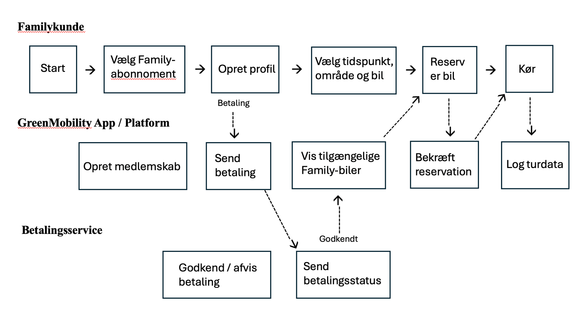
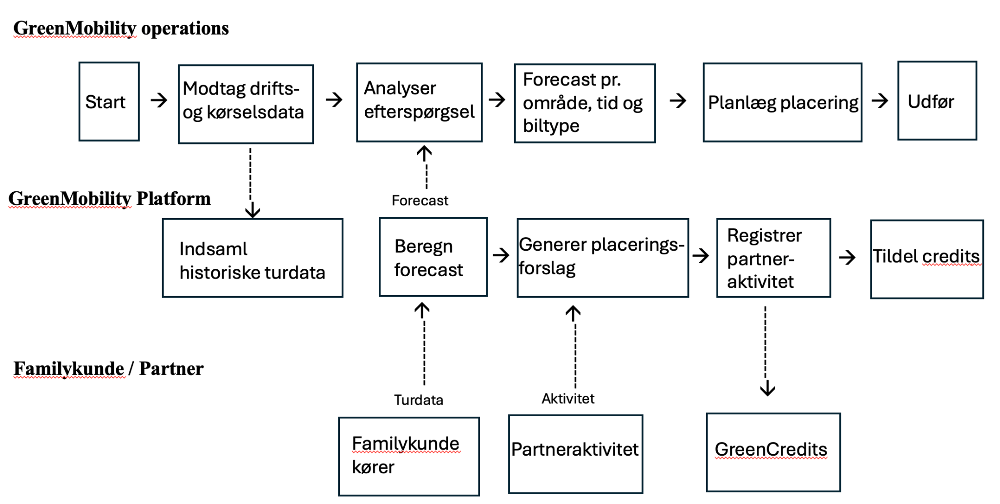
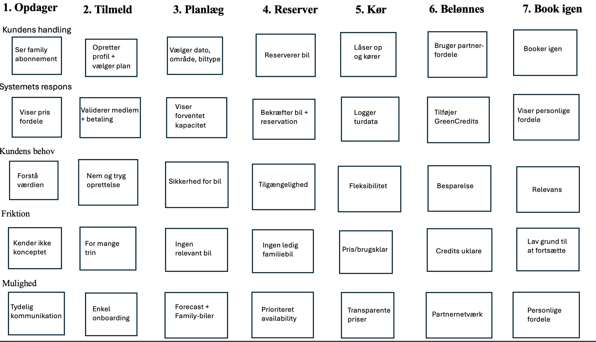

# Kravspecifikation: GreenMobility-FAMILY

> Konverteret til markdown fra `Prototype kravsspecifiktaion.docx`. Tekst og figurer er gengivet som i originaldokumentet.

Business use case (BPMN diagrammer) • Product use case (User journey map)

## 1. Business Use Case

Business Use Case beskriver, hvordan GreenMobility-Family fungerer som forretningsproces mellem familie-kunden, GreenMobilitys digitale platform, betalingsservice, operations og samarbejdspartnere. BPMN-diagrammerne fokuserer derfor på aktørernes handlinger og den rækkefølge, som processen gennemløber.

### 1.1 BPMN – Family-abonnement og booking

Business Use Case 1 - Family-abonnement og booking (BPMN)

Processen starter, når en familie vælger family-abonnementet. Kunden opretter profil og vælger plan, hvorefter betalingen valideres. Når medlemskabet er aktivt, kan kunden vælge tidspunkt, område og relevant biltype. Platformen viser tilgængelige biler og bekræfter reservationen. Efter kørslen registreres turdata, som senere kan anvendes i den datadrevne flådestyring.

### 1.2 BPMN – Datadrevet flådestyring og partnerfordele

Business Use Case 2 - Datadrevet flådestyring og partnerfordele (BPMN)

Processen viser den del af forretningsmodellen, der foregår bag kundens booking. GreenMobility anvender historiske kørsels- og driftsdata til at analysere efterspørgsel og udarbejde forecasts efter område, tidspunkt og biltype. Forecastet kan bruges af Operations til planlægning af bilernes placering. Samtidig kan partneraktiviteter registreres, hvorefter kvalificerende aktiviteter kan udløse GreenCredits til Family-medlemmet.

### 1.3 Business Use Case – aktører og værdi

| Aktør | Primær handling | Værdi i processen |
|---|---|---|
| Familykunde | Tilmelding, booking, kørsel og partneraktivitet | Fleksibel adgang til bil og medlemsfordele |
| GreenMobility Platform | Medlemskab, booking, data og credits | Automatiserer og understøtter kundeprocessen |
| GreenMobility Operations | Forecast og planlægning af flåde | Bedre grundlag for at placere biler efter forventet efterspørgsel |
| Betalingsservice | Godkender abonnement/betaling | Understøtter tilbagevendende betaling |
| Family-partner | Leverer partnerfordel/registrerer aktivitet | Skaber ekstra værdi og kontaktpunkter omkring Family-konceptet |

## 2. Product Use Case

Product Use Case beskriver løsningen fra brugerens perspektiv. Use Journey Map viser familiens samlede oplevelse fra første møde med GreenMobility-Family til gentagen brug. Fokus er på kundens handling, systemets respons, kundens behov, friktion og de funktioner, der kan understøtte en bedre oplevelse.

### 2.1 User Journey Map

Product Use Case - User Journey Map: GreenMobility Family

### 2.2 Journeyens centrale trin

| Fase | Kundens mål | Systemets funktion | GreenMobility Family-funktion |
|---|---|---|---|
| Opdager | Forstå om abonnementet giver værdi | Viser pris, fordele og partnerfordele | Family-abonnement |
| Tilmeld | Nem og tryg oprettelse | Validerer profil og betaling | Månedligt abonnement |
| Planlæg | Være sikker på at finde relevant bil | Viser kapacitet og biltype | Datadrevet availability |
| Reserver | Få adgang til bilen på det ønskede tidspunkt | Bekræfter reservation | Reservation af Family-bil |
| Kør | Fleksibel transport | Logger turdata | GreenMobility free-floating |
| Belønnes | Få ekstra økonomisk værdi | Registrerer partneraktivitet og credits | GreenCredits + partnerfordele |
| Book igen | Opleve relevans og bekvemmelighed | Bruger historik til relevante forslag | Personlige tilbud og gentagen brug |

### 2.3 Sammenhæng mellem Business og Product Use Case

Business Use Case viser, hvordan GreenMobility organisatorisk og teknisk understøtter Family-konceptet, mens Product Use Case viser, hvordan løsningen opleves af familien. De to perspektiver hænger sammen: Kundens booking og kørsel skaber data, data understøtter forecast og flådeplanlægning, og en bedre tilgængelighed kan understøtte en mere sammenhængende kundeoplevelse.
